# Modern Apps hands on lab (.NET)

## Overview

City Power & Light is a sample application that allows citizens to report "incidents" that have occurred in their community. It includes a landing screen, a dashboard, and a form for reporting new incidents with an optional photo. The application is implemented with several components:

* Front end web application contains the user interface and business logic. This component has been implemented three times in .NET, NodeJS, and Java.
* WebAPI is shared across the front ends and exposes the backend CosmosDB.
* CosmosDB is used as the data persistence layer.

In this lab, you will work with an existing API to connect to the web application front end. This will allow you perform CRUD operations for incidents. You will also configure additional Azure features for Redis Cache, Azure Storage Queues, and Azure Blob Storage.

> This guide use Visual Studio on Windows as the IDE. You can use [Visual Studio community Edition](https://www.visualstudio.com/post-download-vs/?sku=community&clcid=0x409&downloadrename=true).

## Objectives

In this hands-on-lab, you will learn how to:

* Use Visual Studio to connect to an API.
* Provision an Azure Web App to host the Web site.
* Modify a view to add caching.
* Modify code to add queuing and blob storage.

## Prerequisites

* The source for the starter app is located in the [start](start) folder. 
* The finished project is located in the [end](end) folder.
* Deployed the starter ARM Template in [HOL 1](../01-developer-environment).
* Established a development machine either on-premises or in Azure.

## Exercises

This hands-on-lab has the following exercises:
* [Exercise 1: Integrate the API](#ex1)
* [Exercise 2: Add a caching layer](#ex2)
* [Exercise 3: Write images to Azure Blob storage](#ex3)

### Note
> ***In the hands-on-labs you will be using Visual Studio Solutions. Please do not update the NuGet packages to the latest available, as we have not tested the labs with every potential combination of packages.*** 

---
## Exercise 1: Integrate the API<a name="ex1"></a>

1. You should have performed a `git clone` of the DevCamp repository in the previous hands-on lab. If you did not, please complete the developer workstation setup in that lab.

1. In your virtual machine open Visual Studio, select `File` -> `Open` -> `Project/Solution...` and navigate to the directory `C:\DevCamp\HOL\dotnet\02-modern-cloud-apps\start`.

    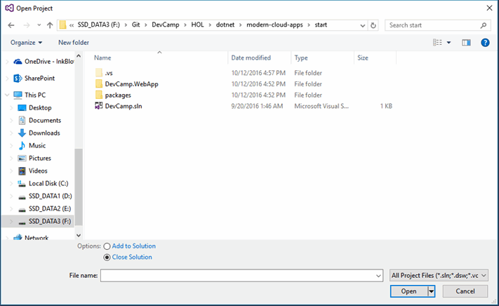

1. Open the `DevCamp.SLN` solution file.

1. Build the solution by right-clicking on the `DevCamp.WebApp` project and choosing `build`. This process should also pull the necessary packages from Nuget:

    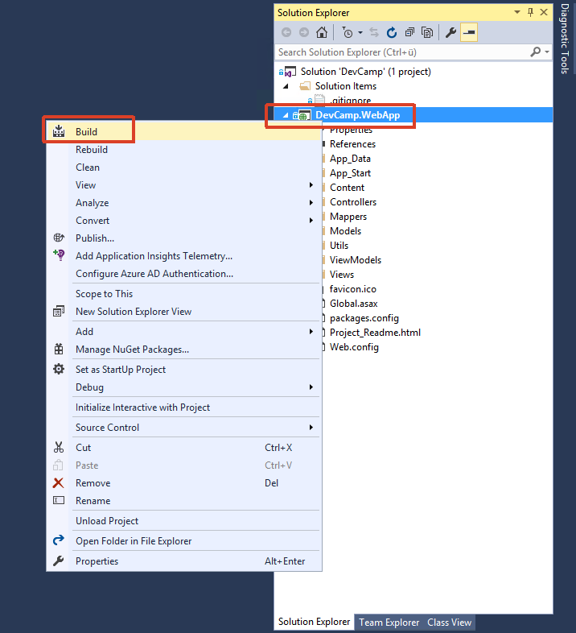

1. Once the build is complete, run the solution by typing `F5`. Visual Studio should run IIS Express and launch the application. You should see the home page of the running application:

    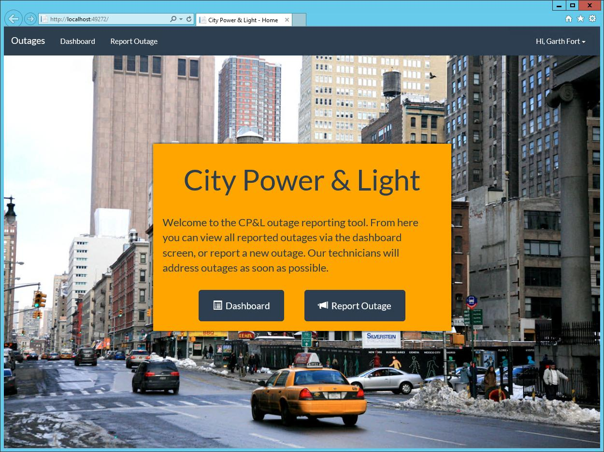

1. Click on `Dashboard` to see some sample incidents hard-coded in the solution:

    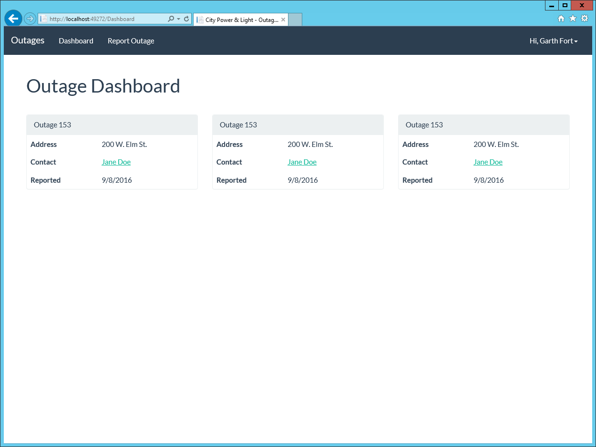
    
	As part of the original ARM template we deployed an ASP.NET WebAPI that queries a CosmosDB Collection. Let's integrate that API so that the incidents are dynamically pulled from a data store.

1. Close the browser, which will also stop the debugging process.

1. In the [Azure Portal](https://portal.azure.com) navigate to the resource group `DevCamp` that you created with the original ARM template. Resource groups can be found on the left hand toolbar.

    Select the API app that begins with the name `incidentapi` followed by a random string of characters.

    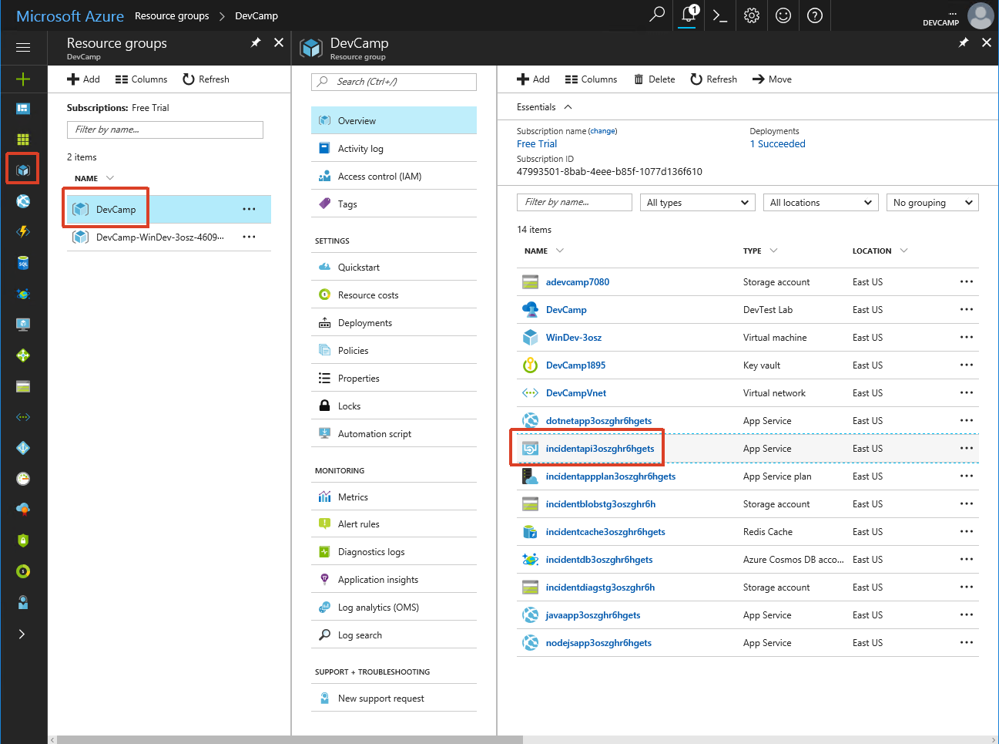

1. The window that slides out is called a **blade** and contains information and configuration options for the resource.  

    On the top toolbar, select `Browse` to open the API in a new browser window.

    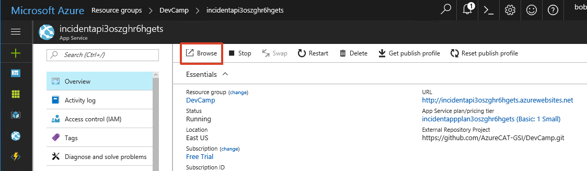

    You should be greeted by the default ASP.NET landing page:
    
    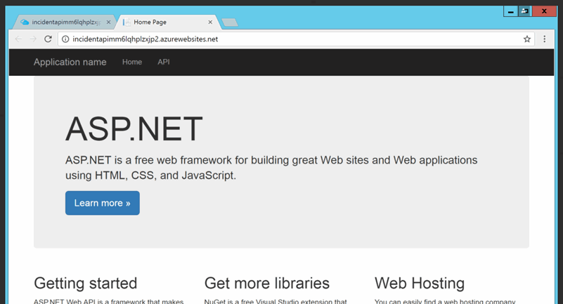

1. Since we provisioned a new instance of CosmosDB, there are no records in the database. We will generate some sample data using the shared API. It has a route that can be accessed at any time to create or reset the documents in your collection. In the browser, add the following to your API URL to generate sample documents.

    >
    > Add `/incidents/sampledata` to the end of your API URL. 
    >
    > The URL should look like the following:
    >  
    > `http://incidentapi[YOUR_RG_NAME].azurewebsites.net/incidents/sampledata`
    >
    > You can also do this using the swagger pages which will be available at this URL:
    >
    >`http://incidentapi[YOUR_RG_NAME].azurewebsites.net/swagger`

    > In Chrome you should see a JSON response directly in the browser tab, however in Internet Explorer you may be asked top Open or Download a file. If prompted, Open the file in Notepad or Visual Studio Code to see the return message.

1. After navigating to the `sampledata` route, let's verify that the documents were created in CosmosDB. In the Azure Portal, navigate to the Resource Group blade, select the `DevCamp` and then select the CosmosDB resource which starts with `incidentdb`.

    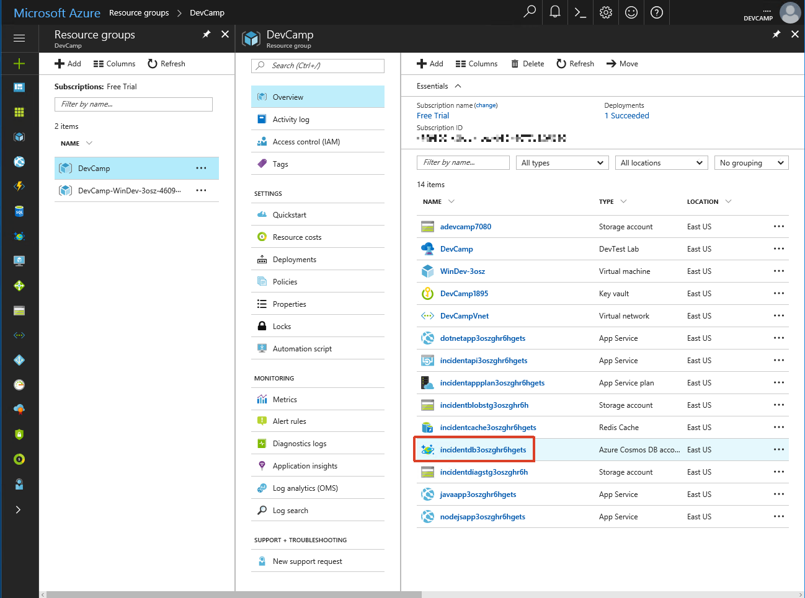

    Select the CosmosDB database. This will open the CosmosDB blade. Scroll to the Collections section.

    In the Collections section, select `Document Explorer`.
    
    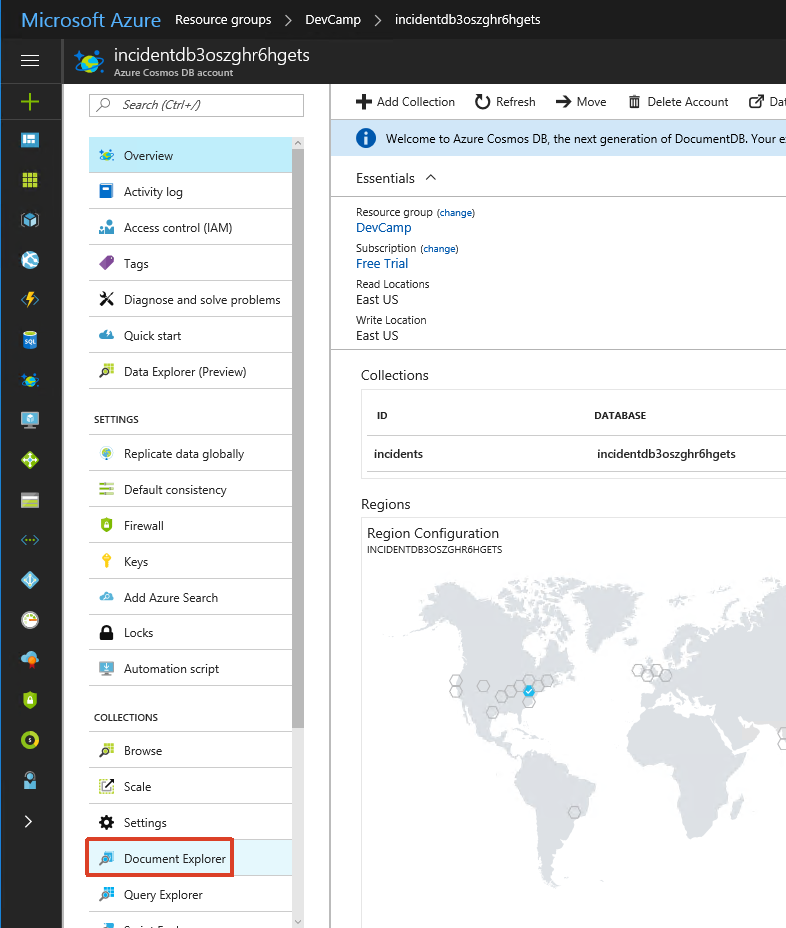

    The Document Explorer is an easy way to view the documents inside of a collection via the browser. Select the first record to see the JSON body of the document.

    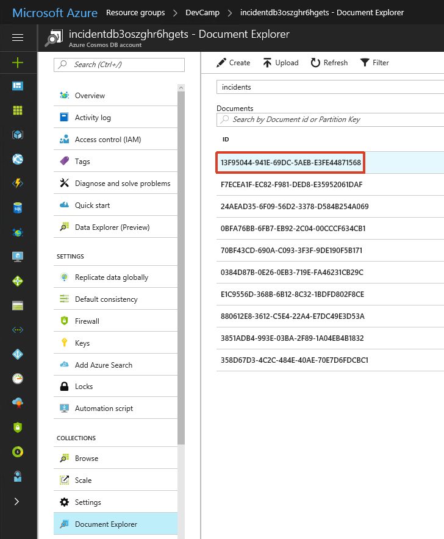

    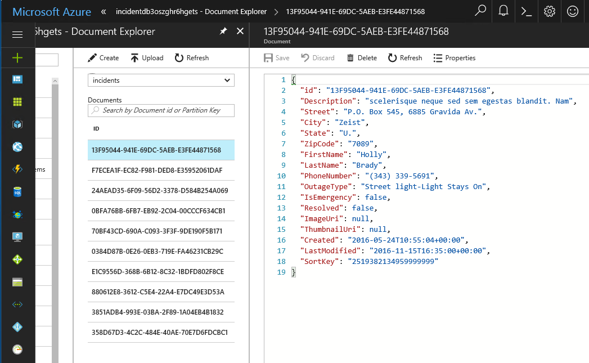

    We can see that several incidents have been created and are now available to the API.

1. Back to Visual Studio, use the Solution Explorer to open the Dashboard View located at `DevCamp.WebApp` -> `Views` -> `Dashboard` -> `Index.cshtml`:

    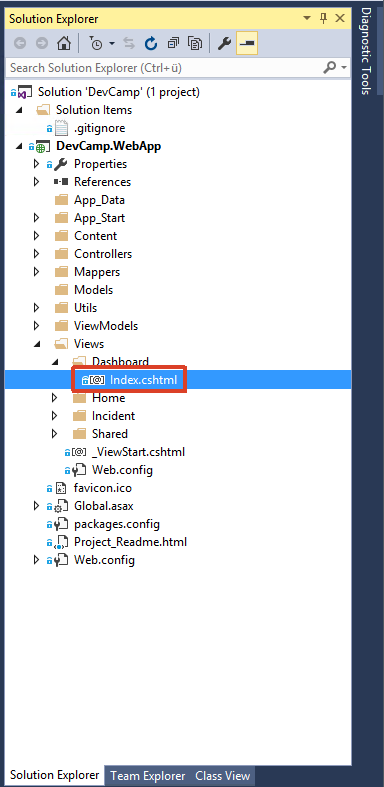

1. On the Dashboard page, notice how the static sample incidents are stubbed in between the  `<!--TEMPLATE CODE -->` comment block.   

    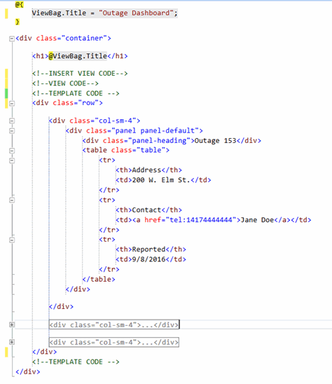

1. In Visual Studio, delete the entirety of the `<!--TEMPLATE CODE -->` comment block to remove the sample incidents.

1. Between the `<!--INSERT VIEW CODE -->` comment block paste the following. This block handles the display of the incident dashboard. It creates a HTML panel for each incident retrieved via the API and stored in the solution's model:

    ```csharp
   <!--VIEW CODE-->
   <div class="row">
        @if (Model.Count > 0)
        {
            foreach (IncidentAPI.Models.Incident item in Model)
            {
                <div class="col-sm-4">
                    <div class="panel panel-default">
                        <div class="panel-heading">Outage: @Html.ActionLink(string.Format("{0}", item.Id), "Details", "Incident", new { ID = item.Id }, new { })</div>
                        <table class="table">
                            <tr>
                                <th>Type</th>
                                <td>@item.OutageType</td>
                            </tr>
                            <tr>
                                <th>Address</th>
                                <td>@item.Street</td>
                            </tr>
                            <tr>
                                <th>Contact</th>
                                <td><a href="tel:@item.PhoneNumber">@string.Format("{0} {1}", item.FirstName, item.LastName)</a></td>
                            </tr>
                            <tr>
                                <th>Reported</th>
                                <td>
                                    @if (item.Created != null)
                                    {
                                        @item.Created.Value.ToString("MM/dd/yyyy, hh:mm");
                                    }
                            </td>
                            </tr>
                        </table>
                    </div>
                </div>
            }
        }
        else
        {
            <div><h2>No incidents reported</h2></div>
        }
    </div>
    <!--VIEW CODE-->
    ```

1. We need to add a reference to the Web API project. Get the URL by navigating to Azure and copying from the overview blade of the `incidentapi...`:
    
    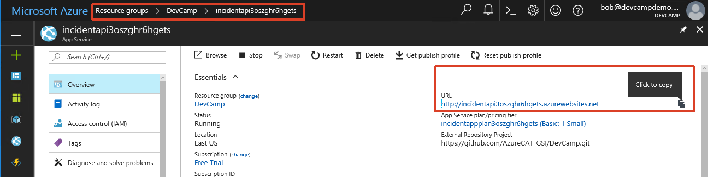

1. Copy the URL of the API app to the clipboard.

1. Add the URL to the 'INCIDENT_API_URL' setting in the `Web.config` located at `DevCamp.WebApp` -> `Web.config`:

    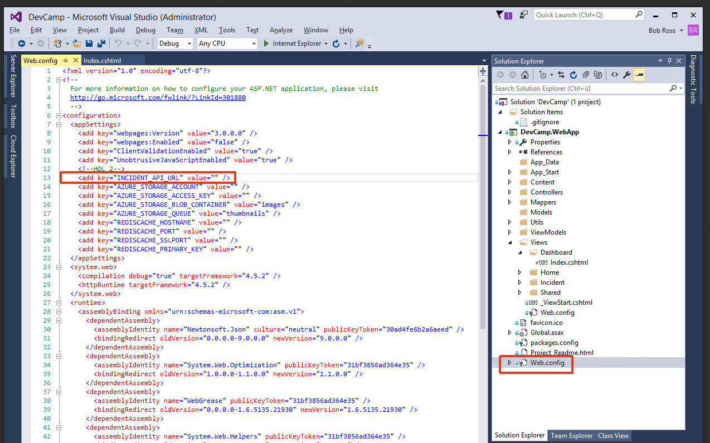

    ```xml
    <add key="INCIDENT_API_URL" value="PASTE URL HERE" />

    // Example
    <add key="INCIDENT_API_URL" value="http://incidentapi32csxy6h3s7bku.azurewebsites.net" />
    ```

    > The URL should not have a `/` on the end!

1. To use the API in our application, right click on the `DevCamp.WebApp` project in the Solution Explorer, select `Add` -> `REST API Client`.

    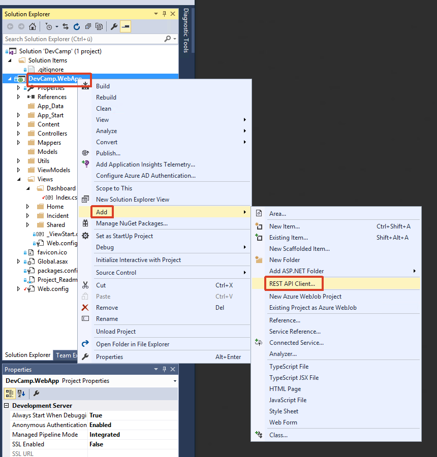

> ***If you do not see `REST API Client` but `Azure API` please use the `end` folder for this HOL which has the REST API already configured.*** 

1. In the Swagger URL field paste the value for the `INCIDENT_API_URL`, appending `/swagger/docs/v1` to the end of the URL.

1. For the Client Namespace, enter `IncidentAPI` and click `OK`. 

    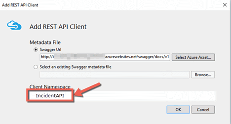

    This will download the definition for the API and install NuGet packages for Microsoft.Rest. It will also create the IncidentAPI client proxy classes and models.

    > ***DO NOT Update the NuGet package for 'Microsoft.Rest.ClientRuntime'. There is a dependency issue with the updated package.***

    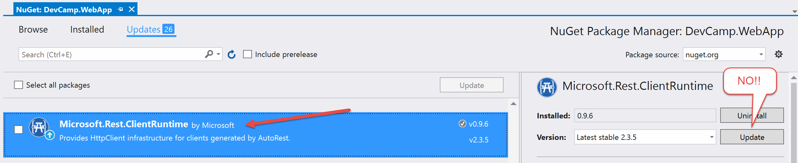
	
    > ***Should you encounter problems in the dev environment you may have to downgrade the 'Newtonsoft.Json' package to version 7.0.1.***
    >
    > From Visual Studio, go to `Tools` -> `Nuget Package Manager` -> `Nuget Package Manager Console`.
    >
    > From the command line prompt, type: `install-package Newtonsoft.Json -Version 7.0.1`

    > Copy the Newtonsoft.Json.DLL from `C:\DevCamp\HOL\dotnet\02-modern-cloud-apps\start\packages\Newtonsoft.Json.7.0.1\lib\net45` to `C:\Program Files (x86)\Microsoft Visual Studio 14.0\Common7\IDE`
    >
    > Restart Visual Studio and continue.

1. The `Settings.cs` holds our static variables and constants for the application. It is located at `DevCamp.WebApp` -> `Utils` -> `Settings.cs`:

    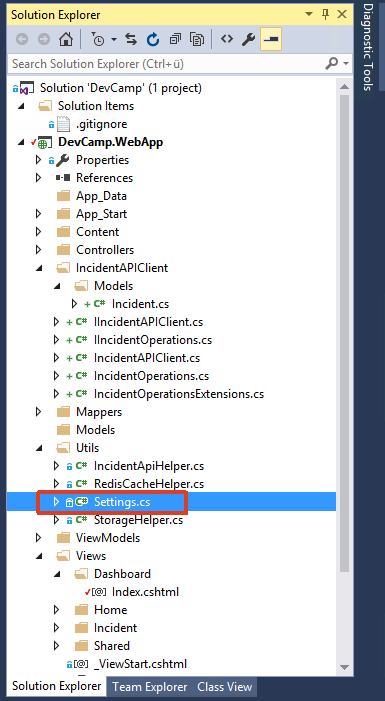

1. In the `Settings.cs` file, paste the following inside the body of the `Settings` class definition:

    ```csharp
    //####    HOL 2    ######
    public static string INCIDENT_API_URL = ConfigurationManager.AppSettings["INCIDENT_API_URL"];
    public static string AZURE_STORAGE_ACCOUNT = ConfigurationManager.AppSettings["AZURE_STORAGE_ACCOUNT"];
    public static string AZURE_STORAGE_KEY = ConfigurationManager.AppSettings["AZURE_STORAGE_ACCESS_KEY"];
    public static string AZURE_STORAGE_BLOB_CONTAINER = ConfigurationManager.AppSettings["AZURE_STORAGE_BLOB_CONTAINER"];
    public static string AZURE_STORAGE_QUEUE = ConfigurationManager.AppSettings["AZURE_STORAGE_QUEUE"];
    public static string AZURE_STORAGE_CONNECTIONSTRING = String.Format("DefaultEndpointsProtocol=https;AccountName={0};AccountKey={1}", AZURE_STORAGE_ACCOUNT, AZURE_STORAGE_KEY);
    public static string REDISCCACHE_KEY_INCIDENTDATA = "incidentdata";

    public static string REDISCACHE_HOSTNAME = ConfigurationManager.AppSettings["REDISCACHE_HOSTNAME"];
    public static string REDISCACHE_PORT = ConfigurationManager.AppSettings["REDISCACHE_PORT"];
    public static string REDISCACHE_SSLPORT = ConfigurationManager.AppSettings["REDISCACHE_SSLPORT"];
    public static string REDISCACHE_PRIMARY_KEY = ConfigurationManager.AppSettings["REDISCACHE_PRIMARY_KEY"];
    public static string REDISCACHE_CONNECTIONSTRING = $"{REDISCACHE_HOSTNAME}:{REDISCACHE_SSLPORT},password={REDISCACHE_PRIMARY_KEY},abortConnect=false,ssl=true";
    //####    HOL 2   ######
    ```

1. Resolve the reference for `System.Configuration` by adding `using System.Configuration;` to the namespace definitions:

    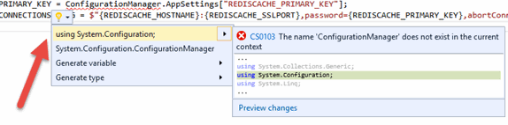

1. Open the file located at `DevCamp.WebApp` -> `Utils` -> `IncidentApiHelper.cs`.

1. Paste the following inside the body of the `IncidentApiHelper` class definition and resolve the references for `IncidentAPI` and `Microsoft.Rest`.

    ```csharp
    public static IncidentAPIClient GetIncidentAPIClient()
    {
            ServiceClientCredentials creds = new BasicAuthenticationCredentials();
            var client = new IncidentAPIClient(new Uri(Settings.INCIDENT_API_URL),creds);
            return client;
    }
    ```

1. Open the file located at `DevCamp.WebApp` -> `Controllers` -> `DashboardController.cs`.

1. Select the current `//TODO: BEGIN Replace with API Data code` comment block in the Index method and delete it. Also delete the existing return View() code.

1. Paste the following inside the `Index()` function:
    ```csharp
    //##### API DATA HERE #####
    List<Incident> incidents;
    using (var client = IncidentApiHelper.GetIncidentAPIClient())
    {
        //TODO: BEGIN ADD Caching
        var results = await client.IncidentOperations.GetAllIncidentsAsync();
        Newtonsoft.Json.Linq.JArray ja = (Newtonsoft.Json.Linq.JArray)results;
        incidents = ja.ToObject<List<Incident>>();
        //TODO: END ADD Caching
    }
    return View(incidents);
    //##### API DATA HERE #####
    ```

    >This code will use the API call `GetAllIncidentsAsync` to retrieve an array of Json objects, and then will convert that to a list of `Incident` objects that we can use in our subsequent code.

1. Resolve the references for `Newtonsoft.Json, IncidentAPI, IncidentAPI.Models and System.Collections.Generic`. Make sure you have a distinct `using` line for the `IncidentAPI` namespace.  Here are all the `using` entries you should have:

    ```csharp
    using DevCamp.WebApp.Utils;
    using IncidentAPI;
    using IncidentAPI.Models;
    using System.Collections.Generic;
    using System.Threading.Tasks;
    using System.Web.Mvc;
    ```

1. You will still see the call to `GetAllIncidentsAsync` underlined in red - that is because it is an async operation, and we need the Index method to be async as well.  Change the method to be async and have the method return a Task by changing the return type to `async Task<ActionResult>`. The code should look like the following:

    ```csharp
        using DevCamp.WebApp.Utils;
        using IncidentAPI;
        using IncidentAPI.Models;
        using Newtonsoft.Json;
        using System.Collections.Generic;
        using System.Threading.Tasks;
        using System.Web.Mvc;

        namespace DevCamp.WebApp.Controllers
        {
            public class DashboardController : Controller
            {
                public async Task<ActionResult> Index()
                {
                    //##### API DATA HERE #####
                    List<Incident> incidents;
                    using (var client = IncidentApiHelper.GetIncidentAPIClient())
                    {
                        //TODO: BEGIN ADD Caching
                        var results = await client.IncidentOperations.GetAllIncidentsAsync();
                        Newtonsoft.Json.Linq.JArray ja = (Newtonsoft.Json.Linq.JArray)results;
                        incidents = ja.ToObject<List<Incident>>();
                        //TODO: END ADD Caching
                    }
                    return View(incidents);
                }
            }
        }
    ```

    This should resolve all the errors in `DashboardController.cs`.

1.  To view Incidents, open the file located at `DevCamp.WebApp` -> `Controllers` -> `IncidentController.cs` and add code to it.

1. In between the `//### ADD DETAILS VIEW CODE HERE ###` comment block in the `Details` method, select the body of this method and delete it.

1. Paste the following:

    ```csharp
        IncidentViewModel incidentView = null;

        using (IncidentAPIClient client = IncidentApiHelper.GetIncidentAPIClient())
        {
            var result = client.IncidentOperations.GetById(Id);
            Newtonsoft.Json.Linq.JObject jobj = (Newtonsoft.Json.Linq.JObject)result;
            Incident incident = jobj.ToObject<Incident>();
            incidentView = IncidentMapper.MapIncidentModelToView(incident);
        }

        return View(incidentView);
    ```

1. Resolve the references for `DevCamp.WebApp.ViewModels` and `IncidentAPI.Models`. 

1. The Incident Mapper will handle the mapping from the data that is returned from the API. It is located at `DevCamp.WebApp` -> `Mappers` -> `IncidentMapper.cs`.

1. Open it and locate the `///TODO: Add Incident Mapper Code` comment block

1. Paste the following:
    
    ```csharp
    public class IncidentMapper
    {
        public static Incident MapIncidentViewModel(IncidentViewModel incident)
        {
            Incident newIncident = new Incident();
            newIncident.FirstName = incident.FirstName;
            newIncident.LastName = incident.LastName;
            newIncident.Street = incident.Street;
            newIncident.City = incident.City;
            newIncident.State = incident.State;
            newIncident.ZipCode = incident.ZipCode;
            newIncident.PhoneNumber = incident.PhoneNumber;
            newIncident.Description = incident.Description;
            newIncident.OutageType = incident.OutageType;
            newIncident.IsEmergency = incident.IsEmergency;
            newIncident.Tags = incident.Tags;
            return newIncident;
        }

        public static IncidentViewModel MapIncidentModelToView(Incident incident)
        {
            IncidentViewModel newIncidentView = new IncidentViewModel();
            newIncidentView.Id = incident.Id;
            newIncidentView.FirstName = incident.FirstName;
            newIncidentView.LastName = incident.LastName;
            newIncidentView.Street = incident.Street;
            newIncidentView.City = incident.City;
            newIncidentView.State = incident.State;
            newIncidentView.ZipCode = incident.ZipCode;
            newIncidentView.PhoneNumber = incident.PhoneNumber;
            newIncidentView.Description = incident.Description;
            newIncidentView.OutageType = incident.OutageType;
            newIncidentView.IsEmergency = incident.IsEmergency.Value;
            newIncidentView.Tags = incident.Tags;
            newIncidentView.Created = incident.Created.Value.ToUniversalTime();
            newIncidentView.LastModified = incident.LastModified.Value.ToUniversalTime();
            return newIncidentView;
        }
    }
    ```

1. Resolve the references for the following namespaces `IncidentAPI`, `IncidentAPI.Models`, `DevCamp.WebApp.Utils`, `DevCamp.WebApp.ViewModels` and `DevCamp.WebApp.Mappers` (or you can simply paste this in to the top of each file):
    
    ```C#
    using IncidentAPI;
    using IncidentAPI.Models;
    using DevCamp.WebApp.Utils;
    using DevCamp.WebApp.ViewModels;
    using DevCamp.WebApp.Mappers;
    ```

1. Now let's add code to create an incident.

1. Add a new `Create` method to the `IncidentController` class that will handle the Create HTTP post method. Add the following code:

    > DO NOT delete the existing `Create` method which handles the default view (e.g. HTTP Get).

    ```csharp
    [HttpPost]
    public ActionResult Create([Bind(Include = "City,Created,Description,FirstName,ImageUri,IsEmergency,LastModified,LastName,OutageType,PhoneNumber,Resolved,State,Street,ZipCode")] IncidentViewModel incident, HttpPostedFileBase imageFile)
    {
        try
        {
            if (ModelState.IsValid)
            {
                Incident incidentToSave = IncidentMapper.MapIncidentViewModel(incident);

                using (IncidentAPIClient client = IncidentApiHelper.GetIncidentAPIClient())
                {
                    var result = client.IncidentOperations.CreateIncident(incidentToSave);
                    Newtonsoft.Json.Linq.JObject jobj = (Newtonsoft.Json.Linq.JObject)result;
                    incidentToSave = jobj.ToObject<Incident>();
                }
                
                //TODO: ADD CODE TO UPLOAD THE BLOB

                //TODO: ADD CODE TO CLEAR THE CACHE

                return RedirectToAction("Index", "Dashboard");
            }
        }
        catch
        {
            return View();
        }

        return View(incident);
    } 
    ```

1. Resolve the references for `System.Web`.

1. Build the application and hit `F5` to start debugging. On the home page, click on the `Dashboard` link. You should see a list of the sample incidents you generated in the database.  This shows that the backend API is being called to retrieve the list of all Incidents from the database.

    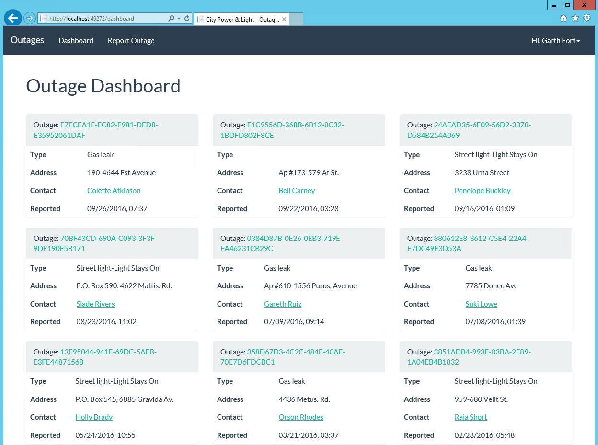

---
## Exercise 2: Add a caching layer<a name="ex2"></a>
Querying our API is a big step forward, but querying a cache would increase performance and limit the load on our API.  Azure offers a managed (PaaS) service called [Azure Redis Cache](https://azure.microsoft.com/en-us/services/cache/).

We deployed an instance of Azure Redis Cache in the ARM Template, but need to add the following application logic:
* First, check the cache to see if a set of incidents is available.
* If not, query the API.
* Cache response from API.
* Clear the cache when a new incident is created.

1. In Visual Studio, right-click on the `DevCamp.WebApp` project and select `Manage NuGet Packages...`:

    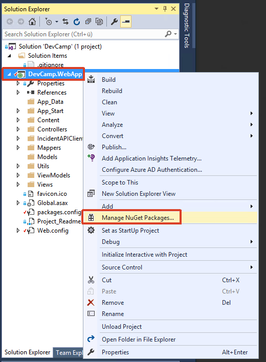

1. Before we do anything with the NuGet package manager, we would like to point out that we have developed the DevCamp application with specific versions of all the included NuGet packages.  For this reason, please **DO NOT** update the modules in this tool. 

1. Click `Browse` and enter `Microsoft.Extensions.Caching.Redis` in the search box.  Add the `Microsoft.Extensions.Caching.Redis` package by highlighting the name, selecting version `1.1.2` (**DO NOT** use a higher version) and selecting `install`:

    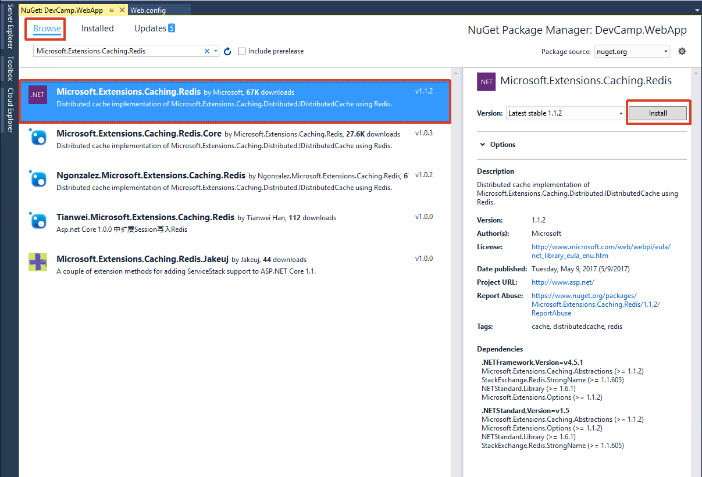

1. Confirm the changes and accept the license to complete the install.

1. Now, let's add our Redis information to local environment variables. In the [Azure Portal](https://portal.azure.com) navigate to the resource group `DevCamp` and select the Redis Cache instance named `incidentcache...`:

    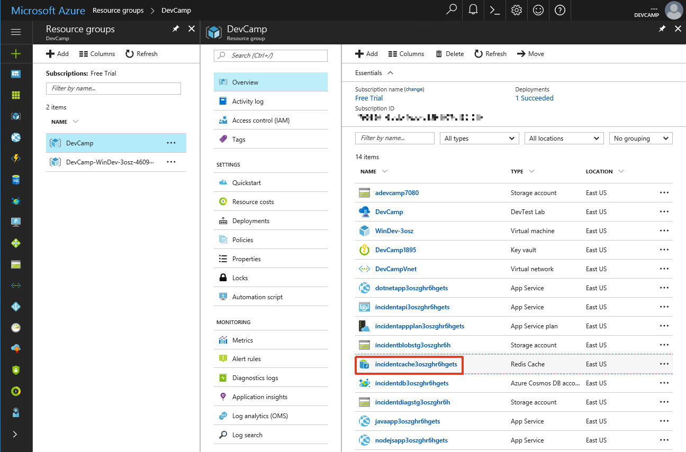

1. On the Redis blade, copy the **Host Name**.

    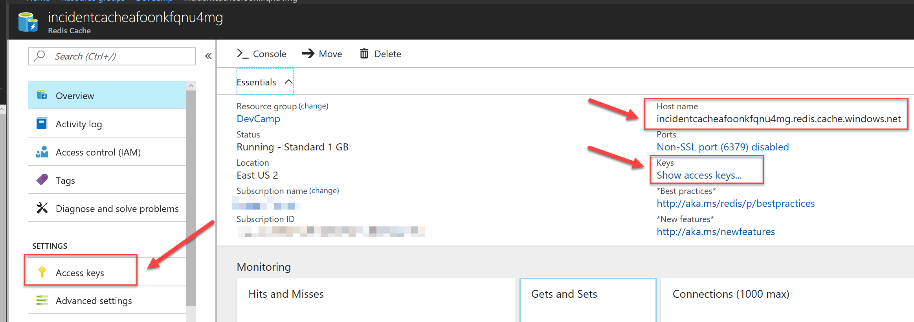

1. Select `Keys` from the overview panel or `Access Keys` from the blade and copy the **Primary Key**.

    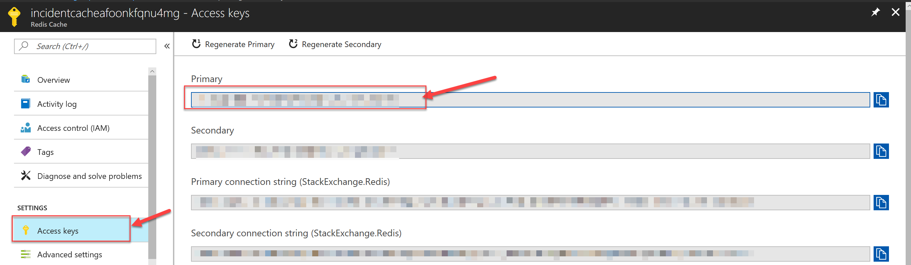

1. Return to the `Overview` blade and expand **Ports** by selecting `Non-SSL port (6379) disabled` and note the Non-SSL port 6379 and SSL Port of 6380 on the port details blade.

    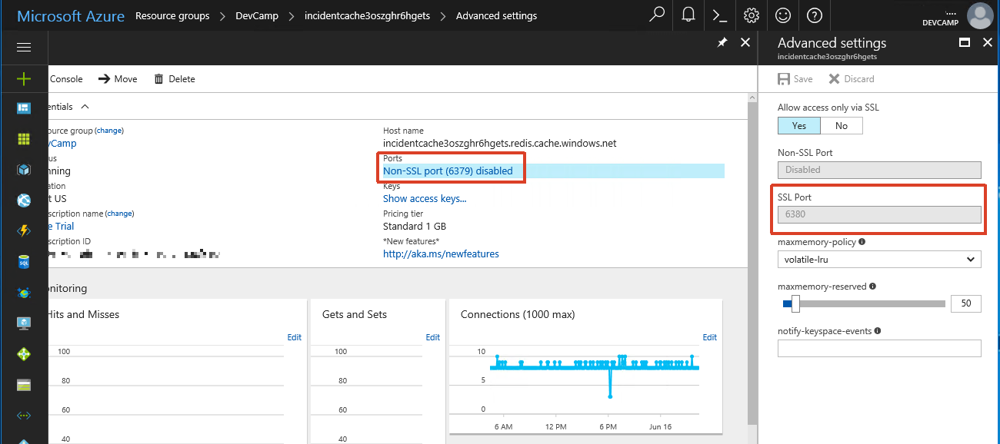

1. Navigate to the `dotnetapp...` web application in your `DevCamp` resource group:

    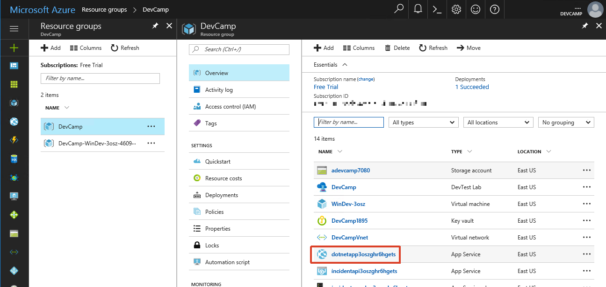

1. Navigate to the application settings:

    

1. Note that the App Settings Keys have values pre-populated with the values required to consume the Azure services matching the values you found in the details of the Redis Cache instance:

    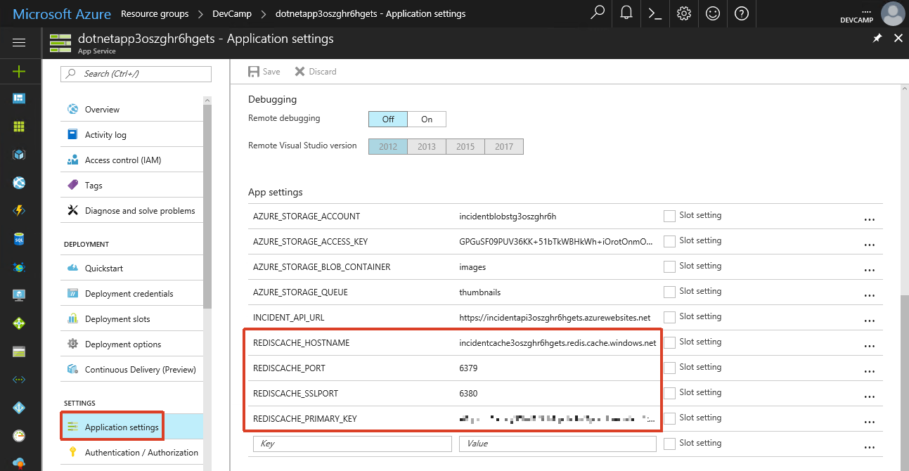

1. In Visual Studio, open the `Web.config` located at `DevCamp.WebApp` -> `Web.config` and copy/paste the values from the app settings that match the keys.

    ```xml
    <add key="REDISCACHE_HOSTNAME" value="" />
    <add key="REDISCACHE_PORT" value="" />
    <add key="REDISCACHE_SSLPORT" value="" />
    <add key="REDISCACHE_PRIMARY_KEY" value="" />
    ```

1. Open the Redis Cache Helper located at `DevCamp.WebApp` -> `Utils` -> `RedisCacheHelper.cs`.

1. Replace all of the existing file contents by pasting the following code:

    ```csharp
    using Newtonsoft.Json;
    using StackExchange.Redis;
    using System;
    using System.Configuration;

    namespace DevCamp.WebApp.Utils
    {
        public class RedisCacheHelper
        {
            private static Lazy<ConnectionMultiplexer> lazyConnection = new Lazy<ConnectionMultiplexer>(() =>
            {
                return ConnectionMultiplexer.Connect(Settings.REDISCACHE_CONNECTIONSTRING);
            });

            static ConnectionMultiplexer CacheConnection
            {
                get
                {
                    return lazyConnection.Value;
                }
            }

            public static string GetDataFromCache(string CacheKey)
            {
                string cachedData = string.Empty;
                IDatabase cache = CacheConnection.GetDatabase();

                cachedData = cache.StringGet(CacheKey);
                return cachedData;
            }

            public static bool UseCachedDataSet(string CacheKey, out string CachedData)
            {
                bool retVal = false;
                CachedData = string.Empty;
                IDatabase cache = CacheConnection.GetDatabase();
                if (cache.Multiplexer.IsConnected)
                {
                    if (cache.KeyExists(CacheKey))
                    {
                        CachedData = GetDataFromCache(CacheKey);
                        retVal = true;
                    }
                }
                return retVal;
            }

            public static void AddtoCache(string CacheKey, object ObjectToCache, int CacheExpiration = 60)
            {
                IDatabase cache = CacheConnection.GetDatabase();
                cache.StringSet(CacheKey, JsonConvert.SerializeObject(ObjectToCache), TimeSpan.FromSeconds(CacheExpiration));
            }

            public static void ClearCache(string CacheKey)
            {
                IDatabase cache = CacheConnection.GetDatabase();
                cache.KeyDelete(CacheKey);
            }
        }
    }
    ```

1. We will now add code to the Dashboard Controller. Open the file located at `DevCamp.WebApp` -> `Controllers` -> `DashboardController.cs`.

1. We are going to change the code to first check whether the incident data is in the cache, and if it is, use the cached version.  Of course if the incident data is not in the cache, we need to call the API as we did before, and then put the retrieved incident data in the cache.  So we're going to wrap the code that calls the API with an `if` statement.

    Inside the `using` statement that contains the API call to the client, ***replace*** the `//TODO: BEGIN ADD Caching` comment block:
    ```csharp
        //TODO: BEGIN ADD Caching
        var results = await client.IncidentOperations.GetAllIncidentsAsync();
        Newtonsoft.Json.Linq.JArray ja = (Newtonsoft.Json.Linq.JArray)results;
        incidents = ja.ToObject<List<Incident>>();
        //TODO: END ADD Caching
    ```
    With the following:

    ```csharp
    //TODO: BEGIN ADD Caching
    int CACHE_EXPIRATION_SECONDS = 300;

    //Check Cache
    string cachedData = string.Empty;
    if (RedisCacheHelper.UseCachedDataSet(Settings.REDISCCACHE_KEY_INCIDENTDATA, out cachedData))
    {
        incidents = JsonConvert.DeserializeObject<List<Incident>>(cachedData);
    }
    else
    {
        //If stale refresh
        var results = await client.IncidentOperations.GetAllIncidentsAsync();
        Newtonsoft.Json.Linq.JArray ja = (Newtonsoft.Json.Linq.JArray)results;
        incidents = ja.ToObject<List<Incident>>();
        RedisCacheHelper.AddtoCache(Settings.REDISCCACHE_KEY_INCIDENTDATA, incidents, CACHE_EXPIRATION_SECONDS);
    }
    //TODO: END ADD Caching
    ```

1. Set a breakpoint on the declaration of the ***CACHE_EXPIRATION_SECONDS*** variable, in preparation for when we run the application later.
 
    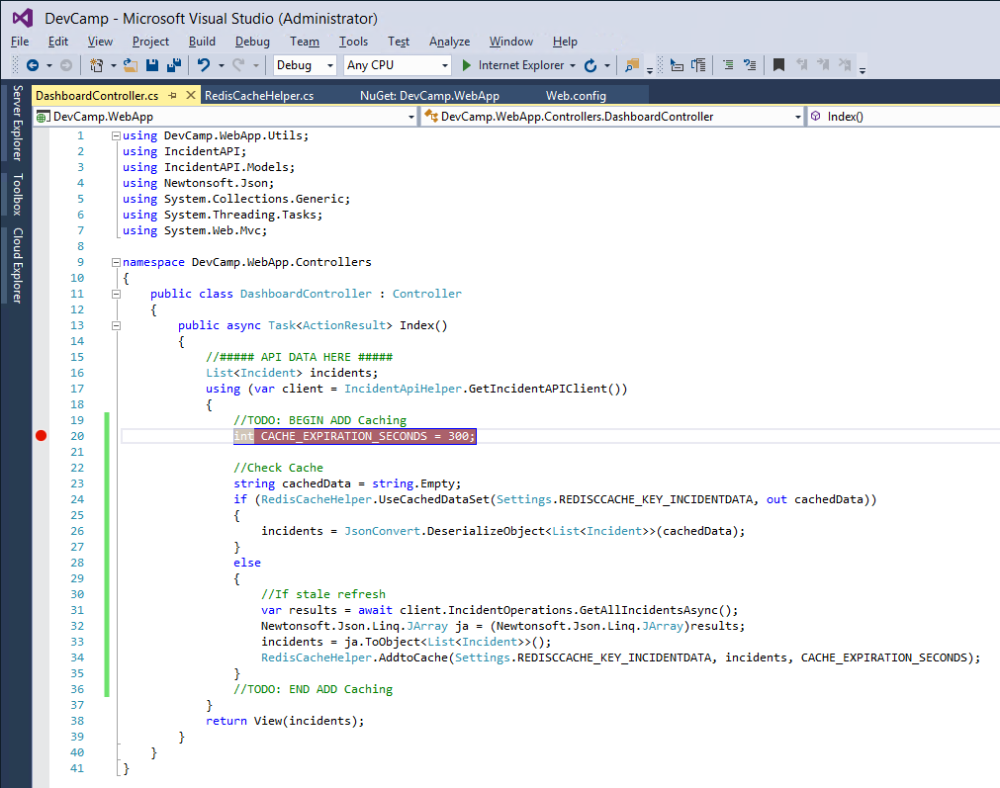

1. If a new incident is reported, that will make the cached data stale.  We can ensure that the newest data is retrieved in this case by clearing the cache when a new incident is reported. Open the Incident Controller. It is located at `DevCamp.WebApp` -> `Controllers` -> `IncidentController.cs`.

1. Locate the `Create` method that handles the adding of the new incident (the method decorated with `[HTTPPost]`) and replace the the `//TODO: ADD CODE TO CLEAR THE CACHE` with the following:

    ```csharp
    //##### CLEAR CACHE ####
    RedisCacheHelper.ClearCache(Settings.REDISCCACHE_KEY_INCIDENTDATA);
    //##### CLEAR CACHE ####

    return RedirectToAction("Index", "Dashboard");
    ``` 
1. Hit `F5` to start debugging. Select the dashboard page. You should hit the breakpoint. Hit `F10` to step over the call. The cache is empty so the application execution falls to the else condition, thus calling the API as before.

1. Hit `F5` to continue stepping. The data should be added to the cache.

1. Hit refresh in the browser and hit the breakpoint again. This time when you hit `F10`, you should be getting the data from cache.

1. Create a new incident from the Report Outage page. Enter some details and click `Create`.

1. Your new incident should be first in the dashboard, showing that the cache was cleared and the newest list of incidents was loaded from the API.

1. Close the browser and stop debugging.  You will also want to delete the breakpoint you set in `DashboardController.cs` file.

---
## Exercise 3: Write images to Azure Blob Storage<a name="ex3"></a>

When a new incident is reported, the user can attach a photo.  In this exercise we will process that image and upload it into an Azure Blob Storage Container.

1. To get the necessary values, open the [Azure Portal](https://portal.azrue.com) and open the resource group `DevCamp`.  Select the Storage Account beginning with `incidentblobstg`.

    > The other storage accounts are used for diagnostics data and virtual machine disks

    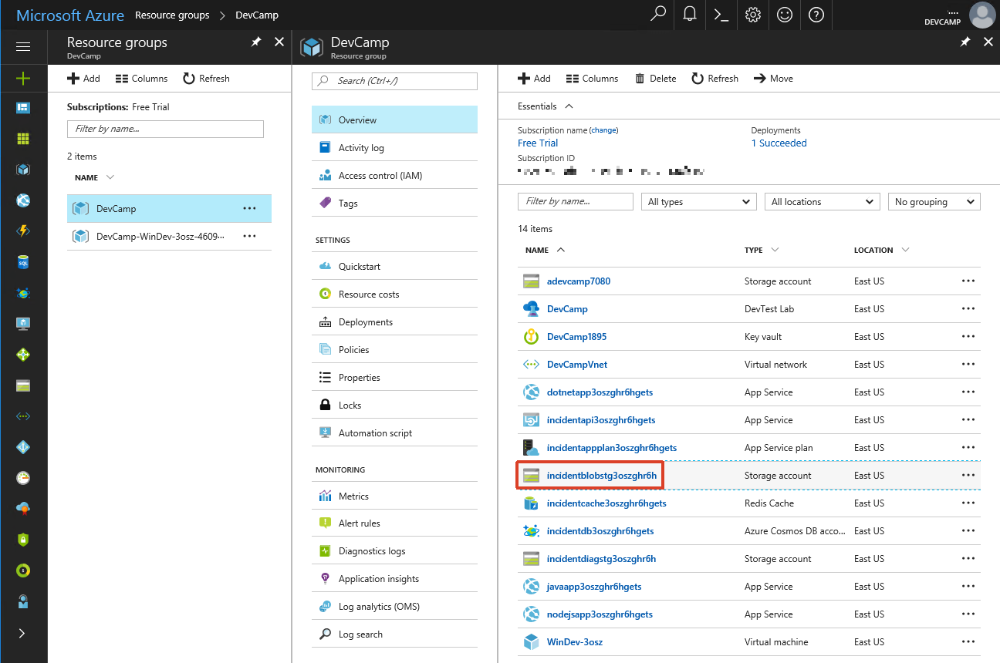

    Select `Access Keys` and note the **Storage account name** and **key1** for the storage account.

    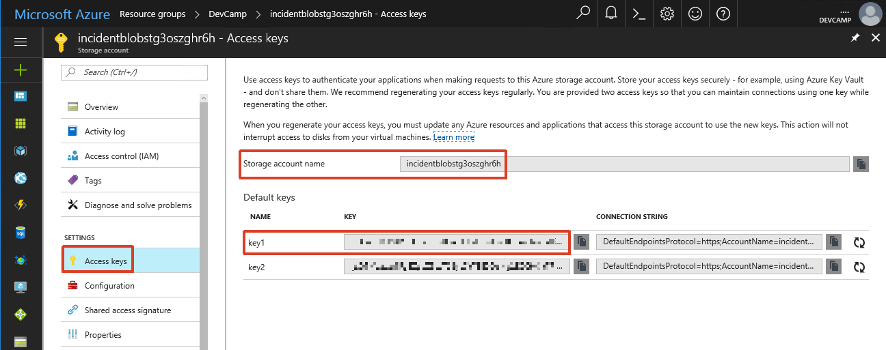

1. In Visual Studio update the `Web.config` which is located at `DevCamp.WebApp` -> `Web.config` with the values from the Azure storage account.  The `AZURE_STORAGE_ACCOUNT` should be the storage account name and the `AZURE_STORAGE_ACCESS_KEY` the `key1`, retrieved above. 

    ```xml
    <add key="AZURE_STORAGE_ACCOUNT" value="" />
    <add key="AZURE_STORAGE_ACCESS_KEY" value="" />

    ```

1. The `Web.config`'s appSettings node should now contain the following entries with your values replaced:

    ```xml
    <add key="INCIDENT_API_URL" value=""/>
    <add key="AZURE_STORAGE_ACCOUNT" value=""/>
    <add key="AZURE_STORAGE_ACCESS_KEY" value=""/>
    <add key="AZURE_STORAGE_BLOB_CONTAINER" value="images"/>
    <add key="AZURE_STORAGE_QUEUE" value="thumbnails"/>
    <add key="REDISCACHE_HOSTNAME" value=""/>
    <add key="REDISCACHE_PORT" value=""/>
    <add key="REDISCACHE_SSLPORT" value=""/>
    <add key="REDISCACHE_PRIMARY_KEY" value=""/>
    ```
1. Now that we configured the storage config values, we can add the logic to upload the images. 

1. In Visual Studio, add the `WindowsAzure.Storage` NuGet package version 8.1.4 to the solution.

    > To do so, repeat the steps from the beginning of exercise 2 that were used to add the `Microsoft.Extensions.Caching.Redis` NuGet package. 

    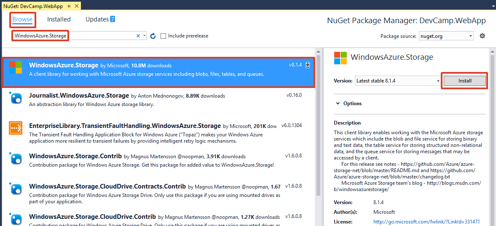

1. Open the Storage Helper located at `DevCamp.WebApp` -> `Utils` -> `StorageHelper.cs` and replace the content with the following code:

    ```csharp
    using Microsoft.WindowsAzure.Storage;
    using Microsoft.WindowsAzure.Storage.Blob;
    using Microsoft.WindowsAzure.Storage.Queue;
    using Newtonsoft.Json;
    using Newtonsoft.Json.Linq;
    using System;
    using System.Configuration;
    using System.IO;
    using System.Threading.Tasks;
    using System.Web;

    namespace DevCamp.WebApp.Utils
    {
        public class StorageHelper
        {
            /// <summary>
            /// Adds an incident message to the queue
            /// </summary>
            /// <param name="IncidentId">The incident ID from the service</param>
            /// <param name="ImageFileName">The file name of the image</param>
            /// <returns></returns>
            public static async Task AddMessageToQueue(string IncidentId, string ImageFileName)
            {
                CloudStorageAccount storageAccount = CloudStorageAccount.Parse(Settings.AZURE_STORAGE_CONNECTIONSTRING);
                CloudQueueClient queueClient = storageAccount.CreateCloudQueueClient();
                CloudQueue msgQ = queueClient.GetQueueReference(Settings.AZURE_STORAGE_QUEUE);
                msgQ.CreateIfNotExists();

                JObject qMsgJson = new JObject();
                qMsgJson.Add("IncidentId", IncidentId);
                qMsgJson.Add("BlobContainerName", Settings.AZURE_STORAGE_BLOB_CONTAINER);
                qMsgJson.Add("BlobName", getIncidentBlobFilename(IncidentId, ImageFileName));

                var qMsgPayload = JsonConvert.SerializeObject(qMsgJson);
                CloudQueueMessage qMsg = new CloudQueueMessage(qMsgPayload);

                await msgQ.AddMessageAsync(qMsg);
            }

            /// <summary>
            /// Uploads a blob to the configured storage account
            /// </summary>
            /// <param name="IncidentId">The IncidentId the image is associated with</param>
            /// <param name="imageFile">The File</param>
            /// <returns>The Url to the blob</returns>
            public static async Task<string> UploadFileToBlobStorage(string IncidentId, HttpPostedFileBase imageFile)
            {
                string imgUri = string.Empty;

                try
                {
                    CloudStorageAccount storageAccount = CloudStorageAccount.Parse(Settings.AZURE_STORAGE_CONNECTIONSTRING);

                    CloudBlobClient blobClient = storageAccount.CreateCloudBlobClient();
                    CloudBlobContainer container = blobClient.GetContainerReference(Settings.AZURE_STORAGE_BLOB_CONTAINER);
                    container.CreateIfNotExists();
                    container.SetPermissions(new BlobContainerPermissions { PublicAccess = BlobContainerPublicAccessType.Blob });

                    CloudBlockBlob imgBlob = container.GetBlockBlobReference(getIncidentBlobFilename(IncidentId, imageFile.FileName));
                    imgBlob.Properties.ContentType = imageFile.ContentType;
                    await imgBlob.UploadFromStreamAsync(imageFile.InputStream);

                    var uriBuilder = new UriBuilder(imgBlob.Uri);
                    uriBuilder.Scheme = "https";
                    imgUri = uriBuilder.ToString();
                }
                catch (Exception ex)
                {
                    throw new HttpUnhandledException($"Unable to upload image for incident {IncidentId} to blob storage. Error:: ${ex.ToString()}");
                }
                return imgUri;
            }

            private static string getIncidentBlobFilename(string IncidentId, string FileName)
            {
                string fileExt = Path.GetExtension(FileName);
                //Remove the starting . if exists
                if (fileExt.StartsWith("."))
                {
                    fileExt.TrimStart(new char[] { '.' });
                }
                return $"{IncidentId}{fileExt}";
            }
        }
    }
    ```
    
    Study the code before you continue. We will now insert calls to the Storage Helper methods in the Incident Controller.

1. In the Incident Controller located at `DevCamp.WebApp` -> `Controllers` -> `IncidentController.cs`, locate the `//TODO: ADD CODE TO UPLOAD THE BLOB` add the following inside of the `Create` method decorated with `[HttpPost]`. This will handle the upload of the image file.

    ```csharp
    //Now upload the file if there is one
    if (imageFile != null && imageFile.ContentLength > 0)
    {
        //### Add Blob Upload code here #####
        //Give the image a unique name based on the incident id
        var imageUrl = await StorageHelper.UploadFileToBlobStorage(incidentToSave.Id, imageFile);
        //### Add Blob Upload code here #####


        //### Add Queue code here #####
        //Add a message to the queue to process this image
        await StorageHelper.AddMessageToQueue(incidentToSave.Id, imageFile.FileName);
        //### Add Queue code here #####
    }

    //##### CLEAR CACHE ####

    ```

1. Because we are using awaitable methods, we need to change the `Create` method to async and have the method return a `Task`. Change the return type to `async Task<ActionResult>`. Resolve the reference for `System.Threading.Tasks`. The code should look like the following:

    ```csharp
    public async Task<ActionResult> Create([Bind(Include = "City,Created,Description,FirstName,ImageUri,IsEmergency,LastModified,LastName,OutageType,PhoneNumber,Resolved,State,Street,ZipCode")] IncidentViewModel incident, HttpPostedFileBase imageFile)
    {
        ...OMMITED
    }
    ```

1. Save the files and hit `F5` to debug. Click the `Report Outage` link.

1. Add a new incident with a picture and it will get uploaded to Azure storage.
 
    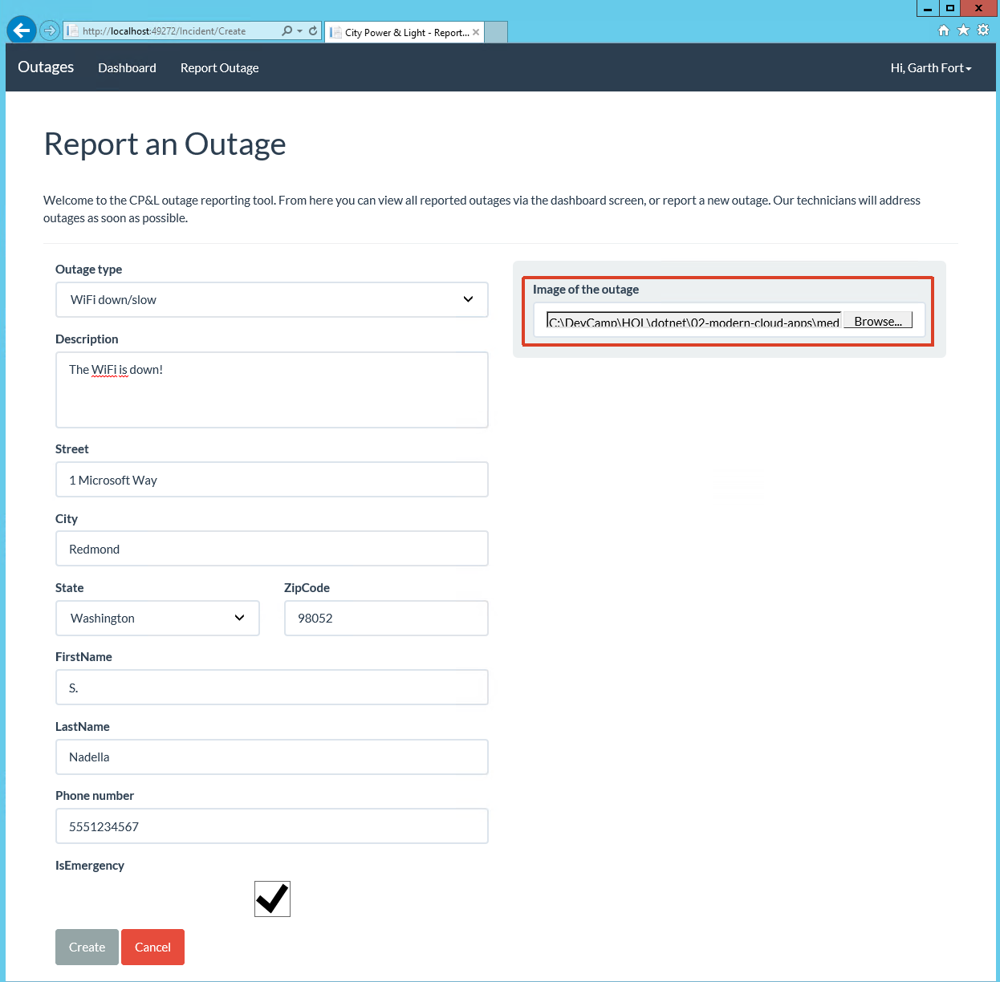

1. Close the browser and stop debugging.

1. Within your virtual machine, open the Azure Storage Explorer. If it has not been installed automatically you can download the setup from [storageexplorer.com](http://storageexplorer.com/).
 
1. Connect it to your Azure Storage using your login data.

1. Verify that your image and a queue entry were uploaded to Azure storage.

    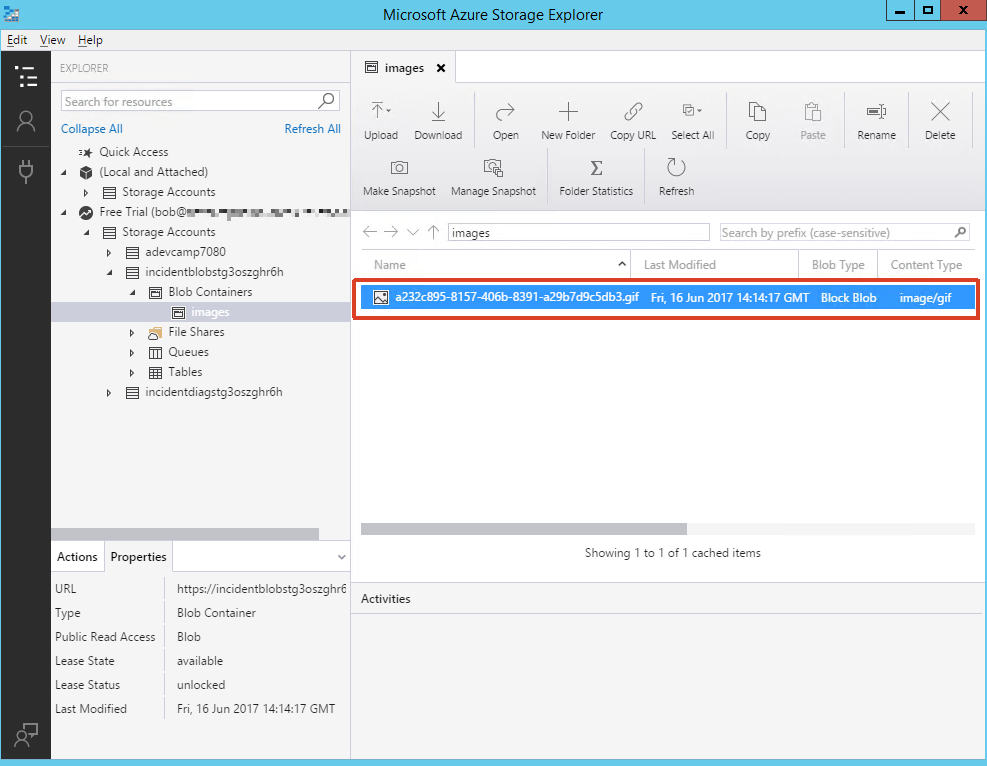

    You can also use the Azure Storage Explorer to view the `thumbnails` queue, and verify that there is an entry for the image we uploaded. It is also safe to delete the images and queue entries using Azure Storage Explorer, and enter new Incidents for testing.

Our application can now create new incidents and upload related images to Azure Blob Storage. It will also put an entry into an Azure queue, to invoke an image resizing process, for example. In a later demo, we'll show how an [Azure Function](https://azure.microsoft.com/en-us/services/functions/) can be invoked via a queue entry to 
do tasks such as this.

---
## Summary
Our application started as a prototype on our local machine, but now uses a variety of Azure services. We started by consuming data from an API hosted in Azure, optimized that data call by introducing Azure Redis Cache, and enabled the uploading of image files to the affordable and redundant Azure Storage. 

In this hands-on lab, you learned how to:
* Use Visual Studio to connect to an Azure hosted ASP.NET WebAPI that queries a CosmosDB Collection and leveraging several Azure services at the same time.
* Provision an Azure Web App to host the Web site.
* Modify a view to add caching. This enables you to use the benefits of the Azure Redis Cache, reducing queries and increasing performance.
* Modify code to add queuing and blob storage.

After completing this module, you can continue on to Module 3: Identity with Azure AD and Office 365 APIs.

### View Module 3 instructions for [.NET](../03-azuread-office365).

---
Copyright 2018 Microsoft Corporation. All rights reserved. Except where otherwise noted, these materials are licensed under the terms of the MIT License. You may use them according to the license as is most appropriate for your project. The terms of this license can be found at https://opensource.org/licenses/MIT.