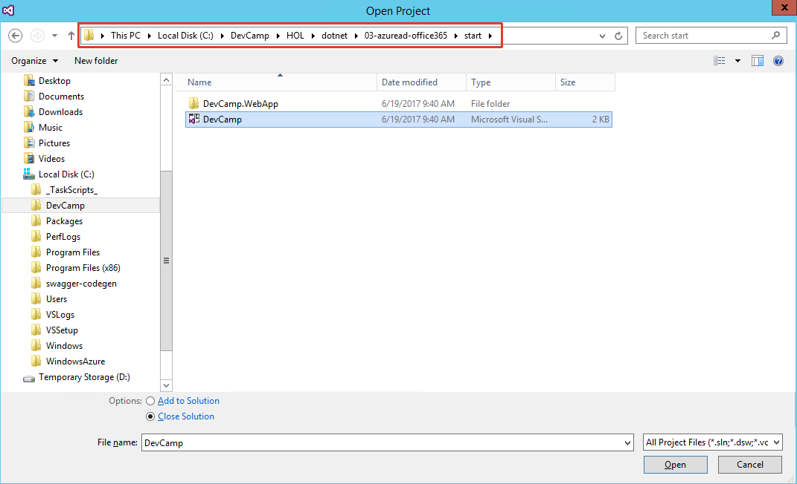

# Hands on Lab - Identity with Azure AD and Office 365 APIs (.NET)

## Overview

City Power & Light is a sample application that allows citizens to report "incidents" that have occurred in their community. It includes a landing screen, a dashboard, and a form for reporting new incidents with an optional photo. The application is implemented with several components:

* Front end web application contains the user interface and business logic. This component has been implemented three times in .NET, NodeJS, and Java.
* WebAPI is shared across the front ends and exposes the backend CosmosDB.
* CosmosDB is used as the data persistence layer.

In this lab, you will continue enhancing the City Power & Light application by adding authentication for users powered by [Azure Active Directory](https://azure.microsoft.com/en-us/services/active-directory/). Once authenticated, you may then query the [Microsoft Office Graph](https://graph.microsoft.io) to retrieve information pertinent to the application.

> This guide use Visual Studio on Windows as the IDE. You can use [Visual Studio community Edition](https://www.visualstudio.com/post-download-vs/?sku=community&clcid=0x409&downloadrename=true).

## Objectives
In this hands-on lab, you will learn how to:

* Take an anonymous application and add user authentication via AzureAD.
* Query data from the Microsoft Graph.
* Manipulate data in the Microsoft Graph.

## Prerequisites

* The source for the starter app is located in the [start](start) folder. 
* The finished project is located in the [end](end) folder. 
* Deployed the starter ARM Template [HOL 1](../01-developer-environment).
* Completion of the [HOL 2](../02-modern-cloud-apps).

> &#x1F53A; **Note**: If you did not complete the previous labs, the project in the [start](start) folder is cumulative. But you need to add the HOL 2 settings to the `Web.config` file and make all necessary changes to Azure. &#x1F53A;

> If you are starting from [HOL 2](../02-modern-cloud-apps) and not from the [start](start) folder, add the following keys to `Web.config`:

```xml
    <add key="AAD_APP_ID" value="APPID" />
    <add key="AAD_APP_SECRET" value="SECRET" />
    <add key="AAD_APP_REDIRECTURI" value="SITE URL" />
    <add key="AAD_INSTANCE" value="https://login.microsoftonline.com/{0}/{1}" />
    <add key="AAD_AUTHORITY" value="https://login.microsoftonline.com/common/" />
    <add key="AAD_LOGOUT_AUTHORITY" value="https://login.microsoftonline.com/common/oauth2/logout?post_logout_redirect_uri=" />
    <add key="AAD_GRAPH_SCOPES" value="openid email profile offline_access Mail.ReadWrite Mail.Send User.Read User.ReadBasic.All" />
    <add key="GRAPH_API_URL" value="https://graph.microsoft.com" />
```

> &#x1F53A; If you did complete HOL 2 just continue with the same solution you have been using. &#x1F53A;

## Exercises

This hands-on-lab has the following exercises:

* [Exercise 1: Setup authentication](#ex1)
* [Exercise 2: Create a user profile page](#ex2)
* [Exercise 3: Send a confirmation email to the user on incident creation](#ex3)

### Note
> ***In the hands-on-labs you will be using Visual Studio Solutions. Please do not update the NuGet packages to the latest available, as we have not tested the labs with every potential combination of packages.*** 

---
## Exercise 1: Register the application<a name="ex1"></a>

AzureAD can handle authentication for web applications. First we will create a new application in our AzureAD directory, and then we will extend our application code to work with an authentication flow. 

1.  Open the Visual Studio project file from the `start` folder:

    
    
1. Build the project and press `F5` to restore the NuGet packages and start IISExpress. This will create the web application with the dynamic port.

1. Stop debugging. Right-click on the project and select `Properties`:

    

    Note the `Project URL` and port on the `Web` tab, you will need this later:

    

1. Navigate in a browser to [https://apps.dev.microsoft.com](https://apps.dev.microsoft.com), login with your Azure credentials (Work or school Account), and click the button to `Add an app`.

    

1. Provide an application name. Uncheck the `Guided Setup Let us help you get started` checkbox and click `Create`:

    

1. On the Registration page, take note of the `Application ID`. This will be used as an environment variable named `AAD_APP_ID` and is used to configure the authentication library.  

    We also need to generate a client secret. Select the `Generate New Password` button.

    

1. A key is generated for you. ***Save this key***, as you will not be able to retrieve it in the future. This key will become the `AAD_APP_SECRET` environment variable. **Note:** If the generated key contains the characters **\\** or **&** please generate a new key!

    

1. Click on the `Add Platform` button:

    

1. Select `Web`:

    

1. After AzureAD handles the authentication, it needs a location to redirect the user. For testing locally, we'll use the local IISExpress web site `http://localhost:[YOUR LOCAL DYNAMIC PORT]/` as the `Redirect URL` and set the URL as an app setting variable named `AAD_APP_REDIRECTURI`. This URL may need to be updated to the IISExpress dynamic port that is generated while debugging. You don't have to provide a `Logout URL`.  

    

1. We will need to grant our application permission to access resources on our behalf. In the Microsoft Graph Permissions section for `Delegated Permissions`, select `Add`:

      

1. Add the following permissions (you will have to scroll down to find them):
    * Mail.ReadWrite
    * Mail.Send
    * User.Read
    * User.ReadBasic.All

    
    
	
	Confirm your selection and close the modal dialog by clicking `OK`.

1. Click the `Save` button on the bottom of the screen.

      
    
    Sometimes the `Save` button will not work in Internet Explorer and the saving animation will not disapear. In this case please retry using the Chrome browser.

1. In Visual Studio, open `Web.config` and update the settings with the values from the app registration screen:
    For the `AAD_APP_REDIRECTURI` value, enter the local IIS web site URL including the port and an ending `/`. Example: `http://localhost:8443/`, 
    ```xml
   <!--HOL 3-->
    <add key="AAD_APP_ID" value="APPID" />
    <add key="AAD_APP_SECRET" value="SECRET" />
    <add key="AAD_APP_REDIRECTURI" value="LOCAL HTTPS IIS WEBSITE" />
    ```

1. In Visual Studio, add the following packages from NuGet:

    > `Microsoft.IdentityModel.Clients.ActiveDirectory`  **Choose version 3.13.8**
    >
    > `Microsoft.IdentityModel.Protocol.Extensions`  **Choose version 1.0.4.403061554**
    >
    > `Microsoft.IdentityModel.Tokens` **Choose version 5.1.3**
    >
    > `Microsoft.Owin.Security.OpenIdConnect` **Choose version 3.0.1**
    >
    > `Microsoft.Owin.Security.Cookies` **Choose version 3.0.1**
    >
    > `Microsoft.Owin.Host.SystemWeb` **Choose version 3.0.1**

	

1. First let's update the `Settings` class with the additional constants. 

1. Open the `Utils` -> `Settings.cs` file and paste these values below the existing entries from HOL2.

    ```csharp
        // --- OMITTED ---

        //####    HOL 2    ######

        //####    HOL 3    ######
        public static string AAD_APP_ID = ConfigurationManager.AppSettings["AAD_APP_ID"];
        public static string AAD_INSTANCE = ConfigurationManager.AppSettings["AAD_INSTANCE"];
        public static string AAD_APP_REDIRECTURI = ConfigurationManager.AppSettings["AAD_APP_REDIRECTURI"];
        public static string AAD_TENANTID_CLAIMTYPE = "http://schemas.microsoft.com/identity/claims/tenantid";
        public static string AAD_OBJECTID_CLAIMTYPE = "http://schemas.microsoft.com/identity/claims/objectidentifier";
        public static string AAD_AUTHORITY = ConfigurationManager.AppSettings["AAD_AUTHORITY"];
        public static string AAD_LOGOUT_AUTHORITY = ConfigurationManager.AppSettings["AAD_LOGOUT_AUTHORITY"];
        public static string GRAPH_API_URL = ConfigurationManager.AppSettings["GRAPH_API_URL"];
        public static string AAD_APP_SECRET = ConfigurationManager.AppSettings["AAD_APP_SECRET"];
        public static string AAD_GRAPH_SCOPES = ConfigurationManager.AppSettings["AAD_GRAPH_SCOPES"];
        public static string GRAPH_CURRENT_USER_URL = GRAPH_API_URL + "/v1.0/me";
        public static string GRAPH_SENDMESSAGE_URL = GRAPH_CURRENT_USER_URL + "/sendMail";
        public static string SESSIONKEY_ACCESSTOKEN = "accesstoken";
        public static string SESSIONKEY_USERINFO = "userinfo";
        //####    HOL 3    ######
    ```

1. Navigate to the `Utils` folder and create **two** new helper class files. Create a file called `AuthHelper.cs` and another called `SessionTokenCache.cs`.

1. Open `Utils` -> `AuthHelper.cs` and paste the following code. This code will obtain a token from Azure AD for users:

    ```csharp
    using System.Threading.Tasks;
    using System.Web;
    using Microsoft.IdentityModel.Clients.ActiveDirectory;
    using Microsoft.Owin.Security;
    using Microsoft.Owin.Security.OpenIdConnect;
    using System.IdentityModel.Claims;

    namespace DevCamp.WebApp.Utils
    {
        public class AuthHelper
        {
            // This is the logon authority
            // i.e. https://login.microsoftonline.com/common
            public string Authority { get; set; }
            // This is the application ID obtained from registering at
            // https://apps.dev.microsoft.com
            public string AppId { get; set; }
            // This is the application secret obtained from registering at
            // https://apps.dev.microsoft.com
            public string AppSecret { get; set; }
            // This is the token cache
            public SessionTokenCache TokenCache { get; set; }

            public AuthHelper(string authority, string appId, string appSecret, SessionTokenCache tokenCache)
            {
                Authority = authority;
                AppId = appId;
                AppSecret = appSecret;
                TokenCache = tokenCache;
            }

            public async Task<string> GetUserAccessToken(string redirectUri)
            {
                AuthenticationContext authContext = new AuthenticationContext(Authority, false, TokenCache);

                ClientCredential credential = new ClientCredential(AppId, AppSecret);

                try
                {
                    AuthenticationResult authResult = await authContext.AcquireTokenSilentAsync("https://graph.microsoft.com", credential,
                    new UserIdentifier(TokenCache.UserObjectId, UserIdentifierType.UniqueId));
                    return authResult.AccessToken;
                }
                catch (AdalSilentTokenAcquisitionException)
                {
                    HttpContext.Current.Request.GetOwinContext().Authentication.Challenge(
                    new AuthenticationProperties() { RedirectUri = redirectUri },
                    OpenIdConnectAuthenticationDefaults.AuthenticationType);

                    return null;
                }
            }
        }
    }
    ```

1. Open `Utils` -> `SessionTokenCache.cs` and paste the following code. This code will handle the custom caching of tokens:

    ```csharp
    //Copyright (c) Microsoft. All rights reserved. Licensed under the MIT license.
    //See LICENSE in the project root for license information.

    using System.Web;
    using Newtonsoft.Json;
    using Microsoft.IdentityModel.Clients.ActiveDirectory;

    namespace DevCamp.WebApp.Utils
    {
        public class SessionTokenCache : TokenCache
        {
            private HttpContextBase context;
            private static readonly object FileLock = new object();
            private readonly string CacheId = string.Empty;
            public string UserObjectId = string.Empty;

            public SessionTokenCache(string userId, HttpContextBase context)
            {
                this.context = context;
                this.UserObjectId = userId;
                this.CacheId = UserObjectId + "_TokenCache";

                AfterAccess = AfterAccessNotification;
                BeforeAccess = BeforeAccessNotification;
                Load();
            }

            public void Load()
            {
                lock (FileLock)
                {
                    Deserialize((byte[])context.Session[CacheId]);
                }
            }

            public void Persist()
            {
                lock (FileLock)
                {
                    // reflect changes in the persistent store
                    var bytes = Serialize();
                    var x = System.Text.Encoding.UTF8.GetString(bytes);
                    context.Session[CacheId] = Serialize();
                    // once the write operation took place, restore the HasStateChanged bit to false
                    HasStateChanged = false;
                }
            }

            // Empties the persistent store.
            public override void Clear()
            {
                base.Clear();
                context.Session.Remove(CacheId);
            }

            public override void DeleteItem(TokenCacheItem item)
            {
                base.DeleteItem(item);
                Persist();
            }

            // Triggered right before ADAL needs to access the cache.
            // Reload the cache from the persistent store in case it changed since the last access.
            private void BeforeAccessNotification(TokenCacheNotificationArgs args)
            {
                Load();
            }

            // Triggered right after ADAL accessed the cache.
            private void AfterAccessNotification(TokenCacheNotificationArgs args)
            {
                // if the access operation resulted in a cache update
                if (HasStateChanged)
                {
                    Persist();
                }
            }
        }
    }
    ```

1. Open the `App_Start` -> `Startup.cs` file in the editor and paste the following code. This will handle the initial authentication flow and cache the tokens:

    ```csharp
    using DevCamp.WebApp.App_Start;
    using DevCamp.WebApp.Utils;
    using Microsoft.IdentityModel.Protocols;
    using Microsoft.Owin;
    using Microsoft.Owin.Security;
    using Microsoft.Owin.Security.Cookies;
    using Microsoft.Owin.Security.Notifications;
    using Microsoft.Owin.Security.OpenIdConnect;
    using Owin;
    using System;
    using System.Globalization;
    using System.IdentityModel.Claims;
    using System.IdentityModel.Tokens;
    using System.Threading.Tasks;
    using System.Web;
    using ADAL = Microsoft.IdentityModel.Clients.ActiveDirectory;

    [assembly: OwinStartup(typeof(Startup))]
    namespace DevCamp.WebApp.App_Start
    {
        public partial class Startup
        {
            public void Configuration(IAppBuilder app)
            {
                app.SetDefaultSignInAsAuthenticationType(CookieAuthenticationDefaults.AuthenticationType);

                app.UseCookieAuthentication(new CookieAuthenticationOptions());

                app.UseOpenIdConnectAuthentication(
                new OpenIdConnectAuthenticationOptions
                {
                    // The `Authority` represents the auth endpoint - https://login.microsoftonline.com/common/
                    // The 'ResponseType' indicates that we want an authorization code and an ID token 
                    // In a real application you could use issuer validation for additional checks, like making 
                    // sure the user's organization has signed up for your app, for instance.
                    ClientId = Settings.AAD_APP_ID,
                    Authority = string.Format(CultureInfo.InvariantCulture, Settings.AAD_INSTANCE, "common", ""),
                    ResponseType = "code id_token",
                    PostLogoutRedirectUri = "/",
                    RedirectUri = Settings.AAD_APP_REDIRECTURI,
                    Scope = Settings.AAD_GRAPH_SCOPES,
                    TokenValidationParameters = new TokenValidationParameters
                    {
                        ValidateIssuer = false,
                    },
                    Notifications = new OpenIdConnectAuthenticationNotifications
                    {
                        //Set up handlers for the events
                        AuthorizationCodeReceived = OnAuthorizationCodeReceived,
                        AuthenticationFailed = OnAuthenticationFailed
                    }
                }
                );
            }


            /// <summary>
            /// Fired when the user authenticates
            /// </summary>
            /// <param name="notification"></param>
            /// <returns></returns>
            private async Task OnAuthorizationCodeReceived(AuthorizationCodeReceivedNotification notification)
            {
                // Get the user's object id (used to name the token cache)
                string userObjId = notification.AuthenticationTicket.Identity.FindFirst(Settings.AAD_OBJECTID_CLAIMTYPE).Value;

                // Create a token cache
                HttpContextBase httpContext = notification.OwinContext.Get<HttpContextBase>(typeof(HttpContextBase).FullName);
                SessionTokenCache tokenCache = new SessionTokenCache(userObjId, httpContext);

                // Exchange the auth code for a token
                ADAL.ClientCredential clientCred = new ADAL.ClientCredential(Settings.AAD_APP_ID, Settings.AAD_APP_SECRET);

                // Create the auth context
                ADAL.AuthenticationContext authContext = new ADAL.AuthenticationContext(
                string.Format(CultureInfo.InvariantCulture, Settings.AAD_INSTANCE, "common", ""), false, tokenCache);

                ADAL.AuthenticationResult authResult = await authContext.AcquireTokenByAuthorizationCodeAsync(
                notification.Code, notification.Request.Uri, clientCred, Settings.GRAPH_API_URL);
            }

            private Task OnAuthenticationFailed(AuthenticationFailedNotification<OpenIdConnectMessage, OpenIdConnectAuthenticationOptions> notification)
            {
                notification.HandleResponse();
                notification.Response.Redirect("/Error?message=" + notification.Exception.Message);
                return Task.FromResult(0);
            }
        }
    }
    ```

1. Create a new partial page that will handle our login navigation. In the `Views` -> `Shared` folder, create a new partial page named `_LoginPartial` of type `MVC 5 Partial Page (Razor)`:

    

    

1. Paste the following code to the `Views` -> `Shared` -> `_LoginPartial.cs` file to add links that will handle signing in/out and profile pages:

    ```html
    @if (Request.IsAuthenticated)
    {
        <text>
        <li class="dropdown">
            @*The 'preferred_username' claim can be used for showing the user's primary way of identifying themselves.*@

            <a href="#" class="dropdown-toggle" data-toggle="dropdown" role="button" aria-haspopup="true" aria-expanded="false">
                Hi, @(System.Security.Claims.ClaimsPrincipal.Current.FindFirst("name").Value)!<span class="caret"></span>
            </a>
            <ul class="dropdown-menu">
                <li>@Html.ActionLink("Profile", "Index", "Profile")</li>
                <li role="separator" class="divider"></li>
                <li>
                    @Html.ActionLink("Sign out", "SignOut", "Profile")
                </li>
            </ul>
        </li>
        </text>
    }
    else
    {
        <ul class="nav navbar-nav navbar-right">
            <li>@Html.ActionLink("Sign in", "SignIn", "Profile", routeValues: null, htmlAttributes: new { id = "loginLink" })</li>
        </ul>
    }

    ```

1. Open the `Views` -> `Shared` -> `_Layout.cshtml` page and paste the following to replace the existing navigation links with the new `_LoginPartial.cshtml`:

    ```html
         <div class="navbar-collapse collapse">
			<ul class="nav navbar-nav">
				<li>@Html.ActionLink("Dashboard", "Index", "Dashboard")</li>
				<li>@Html.ActionLink("Report Outage", "Create", "Incident")</li>
			</ul>

			<!-- Top Navigation Right -->
			<ul class="nav navbar-nav navbar-right">
				@Html.Partial("_LoginPartial")
			</ul>
		</div>
    ```
    #### Before:

    
        
    #### After:

    

1. Go to the `Controllers` folder.

1. Right-click and select `Add` -> `New Scaffolded Item...`:

    

1. Select `MVC 5 Controller - Empty` and click `Add`:

    

1. As the name enter `ProfileController` and click `Add` to create a new controller that handles signins.

    

1. Paste the following code:

    ```csharp
        using DevCamp.WebApp.Utils;
        using DevCamp.WebApp.ViewModels;
        using Microsoft.Owin.Security;
        using Microsoft.Owin.Security.Cookies;
        using Microsoft.Owin.Security.OpenIdConnect;
        using Newtonsoft.Json;
        using System;
        using System.Collections.Generic;
        using System.Net.Http;
        using System.Net.Http.Headers;
        using System.Threading.Tasks;
        using System.Web;
        using System.Web.Mvc;

        namespace DevCamp.WebApp.Controllers
        {
            //BASED ON THE SAMPLE https://azure.microsoft.com/en-us/documentation/articles/active-directory-v2-devquickstarts-dotnet-web/
            //AND https://github.com/microsoftgraph/aspnet-connect-rest-sample
            //AND https://github.com/microsoftgraph/aspnet-connect-sample <--DO NOT USE Uses MSAL Preview

            public class ProfileController : Controller
            {
                // The URL that auth should redirect to after a successful login.
                Uri loginRedirectUri => new Uri(Url.Action(nameof(Index), "Profile", null, Request.Url.Scheme));
                // The URL to redirect to after a logout.
                Uri logoutRedirectUri => new Uri(Url.Action(nameof(Index), "Profile", null, Request.Url.Scheme));

                public void SignIn()
                {
                    if (!Request.IsAuthenticated)
                    {
                        // Signal OWIN to send an authorization request to Azure
                        HttpContext.GetOwinContext().Authentication.Challenge(
                        new AuthenticationProperties { RedirectUri = "/" },
                        OpenIdConnectAuthenticationDefaults.AuthenticationType);
                    }
                }

                public void SignOut()
                {
                    if (Request.IsAuthenticated)
                    {
                        // Get the user's token cache and clear it
                        string userObjId = System.Security.Claims.ClaimsPrincipal.Current
                        .FindFirst(Settings.AAD_OBJECTID_CLAIMTYPE).Value;

                        SessionTokenCache tokenCache = new SessionTokenCache(userObjId, HttpContext);
                        tokenCache.Clear();
                    }
                    // Send an OpenID Connect sign-out request. 
                    HttpContext.GetOwinContext().Authentication.SignOut(
                    CookieAuthenticationDefaults.AuthenticationType);
                    Response.Redirect("/");
                }
           
                public async Task<ActionResult> Index()
                {
        
                    return View();
                }
            }
        }
    ```

1. Add the `[Authorize]` attribute to the `Controllers` -> `IncidentConroller` methods to block any access to these routes until the user authenticates. 

    ```csharp
    [Authorize]
    public ActionResult Details(string Id)
        ... OMITTED

    [Authorize]
    [HttpPost]
    public async Task<ActionResult> Create([Bind(Include = "City,Created,Description,FirstName,ImageUri,IsEmergency,LastModified,LastName,OutageType,PhoneNumber,Resolved,State,Street,ZipCode")] IncidentViewModel incident, HttpPostedFileBase imageFile)
        ... OMITTED

    ```
1. Compile and hit `F5` to start debuggging. If you receive an error regarding your `Web.config`, open the `Web.config` file and just hit `F5` again until debugging starts.

    

    You should be able to call the `http://` and the `https://` addresses with their respective port numbers.

    > If the main page of the application doesn't load using HTTPS, there are some steps to perform:
    > 1. Go to the `Control Panel` on your machine, programs and features, find `IIS 10.0 Express`. Right-click on it, and choose `Repair`.
    >
	>
    >	
    > 1. In Visual Studio, select the `DevCamp.WebApp` project in the solution explorer. In the `Properties` window at the bottom, ensure that `SSL Enabled` is `True`.  Also make note of the URL and SSL URL: 
    >
    >
	
    > 1. Right-click on the `DevCamp.WebApp` project in the `Solution Explorer` and choose `Properties`. This should open the properties page in the middle window of Visual Studio. In the left hand list of pages choose `Web`, and ensure that the Project Url in the center is the SSL URL from above.  
    > 1. Go back to the [apps.dev.microsoft.com](https://apps.dev.microsoft.com) page, and add the Project URL under the `platforms` section of the form. Remove any other URLs that were already there, and save your changes. 
    > 1. Update the `AAD_APP_REDIRECTURI` value in your `web.config`.
    > 1. Make sure your browsers are closed, then re-run your application.
    > 1. Closing Visual Studio during the exercise can create new port numbers. Keep the entry in [apps.dev.microsoft.com](https://apps.dev.microsoft.com) and the `web.config` up to date.
    
1. When you login for the first time, you will be prompted to allow permission for the app to access your data. Click `Accept`.

    

1. Click on the `Report Outage` button. The application now behaves differently for anonymous vs. authenticated users, allowing you the developer flexibility in exposing pieces of your application to anonymous audiences while ensuring sensitive content stays protected.

---
## Exercise 2: Create a user profile page with Graph Data<a name="ex2"></a>

Next, we are going to create a page to display information about the logged in user. While AzureAD returns a name and email address, we can query the Microsoft Graph for extended details about a given user. We will query the Graph for user information.

1. In the `Views` -> `Profile` folder, create a new view named `Index.cshtml`. This view will display a set of attributes in a simple table where each row corresponds to an attribute. 

    

1. Paste the following code in the view:

    ```csharp
    @model DevCamp.WebApp.ViewModels.UserProfileViewModel

    @{
        ViewBag.Title = "Profile";
    }


    <!-- Body -->
    <div class="container">

        <h1>User Profile</h1>

        <table class="table table-striped table-bordered">
            <tbody>
                <tr>
                    <th>Profile</th>
                    <td>https://graph.microsoft.com/v1.0/$metadata#users/$entity</td>
                </tr>
                <tr>
                    <th>id</th>
                    <td>@Html.DisplayFor(model => model.Id)</td>
                </tr>
                <tr>
                    <th>businessPhones</th>
                    @*<td>@Html.DisplayFor(model => model.BusinessPhones)</td>*@
                </tr>
                <tr>
                    <th>displayName</th>
                    <td>@Html.DisplayFor(model => model.DisplayName)</td>
                </tr>
                <tr>
                    <th>givenName</th>
                    <td>@Html.DisplayFor(model => model.GivenName)</td>
                </tr>
                <tr>
                    <th>jobTitle</th>
                    <td>@Html.DisplayFor(model => model.JobTitle)</td>
                </tr>
                <tr>
                    <th>mail</th>
                    <td>@Html.DisplayFor(model => model.Mail)</td>
                </tr>
                <tr>
                    <th>mobilePhone</th>
                    <td>@Html.DisplayFor(model => model.MobilePhone)</td>
                </tr>
                <tr>
                    <th>officeLocation</th>
                    <td>@Html.DisplayFor(model => model.OfficeLocation)</td>
                </tr>
                <tr>
                    <th>preferredLanguage</th>
                    <td>@Html.DisplayFor(model => model.PreferredLanguage)</td>
                </tr>
                <tr>
                    <th>surname</th>
                    <td>@Html.DisplayFor(model => model.Surname)</td>
                </tr>
                <tr>
                    <th>userPrincipalName</th>
                    <td>@Html.DisplayFor(model => model.UserPrincipalName)</td>
                </tr>
            </tbody>
        </table>

    </div>

    ```

1. We will use a ViewModel to represent the data we display in the UI. In the `ViewModels` folder, create a new class called `UserProfileViewModel.cs`.

    

1. Paste the following code in the file:

    ```csharp
    using System;
    using System.Collections.Generic;
    using System.Linq;
    using System.Web;

    namespace DevCamp.WebApp.ViewModels
    {
        public class UserProfileViewModel
        {
            public string Id { get; set; }
            public List<string> BusinessPhones { get; set; }
            public string DisplayName { get; set; }
            public string GivenName { get; set; }
            public string JobTitle { get; set; }
            public string Mail { get; set; }
            public string MobilePhone { get; set; }
            public string OfficeLocation { get; set; }
            public string PreferredLanguage { get; set; }
            public string Surname { get; set; }
            public string UserPrincipalName { get; set; }
        }

        public enum SendMessageStatusEnum
        {
            NotSent,
            Sent,
            Fail
        }

        // Data / schema contracts between this app and the Office 365 unified API server.
        public class SendMessageResponse
        {
            public SendMessageStatusEnum Status { get; set; }
            public string StatusMessage { get; set; }
        }

        public class SendMessageRequest
        {
            public Message Message { get; set; }

            public bool SaveToSentItems { get; set; }
        }

        public class Message
        {
            public string Subject { get; set; }
            public MessageBody Body { get; set; }
            public List<Recipient> ToRecipients { get; set; }
        }
        public class Recipient
        {
            public UserProfileViewModel EmailAddress { get; set; }
        }

        public class MessageBody
        {
            public string ContentType { get; set; }
            public string Content { get; set; }
        }
    }
    ```

1. Replace the code in the ProfileController class's `Index` method found in `Controllers` -> `ProfileController.cs` file to bind data from the Graph to the ViewModel. We are also adding the authorize attribute to ensure that the user is signed in before viewing this page.

    ```csharp
    [Authorize]
    //
    // GET: /UserProfile/
    public async Task<ActionResult> Index()
    {
        UserProfileViewModel userProfile = new UserProfileViewModel();
        try
        {
            string userObjId = System.Security.Claims.ClaimsPrincipal.Current.FindFirst(Settings.AAD_OBJECTID_CLAIMTYPE).Value;
            SessionTokenCache tokenCache = new SessionTokenCache(userObjId, HttpContext);

            string tenantId = System.Security.Claims.ClaimsPrincipal.Current.FindFirst(Settings.AAD_TENANTID_CLAIMTYPE).Value;
            string authority = string.Format(Settings.AAD_INSTANCE, tenantId, "");
            AuthHelper authHelper = new AuthHelper(authority, Settings.AAD_APP_ID, Settings.AAD_APP_SECRET, tokenCache);
            string accessToken = await authHelper.GetUserAccessToken(Url.Action("Index", "Home", null, Request.Url.Scheme));

            using (var client = new HttpClient())
            {
                client.DefaultRequestHeaders.Accept.Clear();
                client.DefaultRequestHeaders.Authorization = new AuthenticationHeaderValue("Bearer", accessToken);
                client.DefaultRequestHeaders.Accept.Add(new MediaTypeWithQualityHeaderValue("application/json"));

                HttpResponseMessage response = await client.GetAsync(Settings.GRAPH_CURRENT_USER_URL);
                if (response.IsSuccessStatusCode)
                {
                    string resultString = await response.Content.ReadAsStringAsync();

                    userProfile = JsonConvert.DeserializeObject<UserProfileViewModel>(resultString);
                }
            }
        }
        catch (Exception ex)
        {
            ViewBag.Error = "An error has occurred. Details: " + ex.Message;
            return View();
        }

        return View(userProfile);
    }

    ```

1. Let's also fill in some information on the Create new incident form from the logged in user. Open the `Controllers` -> `IncidentController.cs` file.

1. Replace the existing `Create` method with the following code:

    ```csharp
    [Authorize]
    public async Task<ActionResult> Create()
    {
        //####### FILL IN THE DETAILS FOR THE NEW INCIDENT BASED ON THE USER
        IncidentViewModel incident = new IncidentViewModel();

        string userObjId = ClaimsPrincipal.Current.FindFirst(Settings.AAD_OBJECTID_CLAIMTYPE).Value;
        SessionTokenCache tokenCache = new SessionTokenCache(userObjId, HttpContext);

        string tenantId = ClaimsPrincipal.Current.FindFirst(Settings.AAD_TENANTID_CLAIMTYPE).Value;
        string authority = string.Format(Settings.AAD_INSTANCE, tenantId, "");
        AuthHelper authHelper = new AuthHelper(authority, Settings.AAD_APP_ID, Settings.AAD_APP_SECRET, tokenCache);
        string accessToken = await authHelper.GetUserAccessToken(Url.Action("Create", "Incident", null, Request.Url.Scheme));

        UserProfileViewModel userProfile = new UserProfileViewModel();
        try
        {

            using (var client = new HttpClient())
            {
                client.DefaultRequestHeaders.Accept.Clear();
                client.DefaultRequestHeaders.Authorization = new AuthenticationHeaderValue("Bearer", accessToken);
                client.DefaultRequestHeaders.Accept.Add(new MediaTypeWithQualityHeaderValue("application/json"));

                // New code:
                HttpResponseMessage response = await client.GetAsync(Settings.GRAPH_CURRENT_USER_URL);
                if (response.IsSuccessStatusCode)
                {
                    string resultString = await response.Content.ReadAsStringAsync();

                    userProfile = JsonConvert.DeserializeObject<UserProfileViewModel>(resultString);
                }
            }
        }
        catch (Exception eee)
        {
            ViewBag.Error = "An error has occurred. Details: " + eee.Message;
        }

        incident.FirstName = userProfile.GivenName;
        incident.LastName = userProfile.Surname;
        //####### 
        return View(incident);
    }

    ```

    The Create new incident form will now populate the first and last name fields with the data from the logged in user.

1. Resolve any missing references to `System`, `System.Security.Claims`, `System.Net.Http` and `System.Net.Http.Headers` and hit `F5` to see the resulting profile page. We now have a simple visualization of the current user's profile information as loaded from the Microsoft Graph.

    
	
    

---
## Exercise 3: Interact with the Microsoft Graph<a name="ex3"></a>

In the previous exercise you read data from the Microsoft Graph, but there are other endpoints can be used for more sophisticated tasks. In this exercise we will use the Graph to send an email message whenever a new incident is reported.

1. Add a method to `Utils` -> `Settings.cs` that will generate the HTML body content for the email. We will be setting 2 placeholders `{0} and {1}` for the first name and last name of the person reporting the incident. After you have pasted the new code resolve the missing reference to `System.Text`:

    ```csharp
    static string getEmailMessageBody()
    {
        StringBuilder emailContent = new StringBuilder();
        emailContent.Append(@"<html><head><meta http-equiv='Content-Type' content='text/html; charset=us-ascii\'>");
        emailContent.Append(@"<title></title>");
        emailContent.Append(@"</head>");
        emailContent.Append(@"<body style='font-family:Calibri' > ");
        emailContent.Append(@"<div style='width:50%;background-color:#CCC;padding:10px;margin:0 auto;text-align:center;'> ");
        emailContent.Append(@"<h1>City Power &amp; Light</h1> ");
        emailContent.Append(@"<h2>New Incident was reported by {0} {1}</h2> ");
        emailContent.Append(@"<p>A new incident has been reported to the City Power &amp; Light outage system.</p> ");
        emailContent.Append(@"<br /> ");
        emailContent.Append(@"</div> ");
        emailContent.Append(@"</body> ");
        emailContent.Append(@"</html>");
        return emailContent.ToString();
    }
    ```

1. Add some new constants to `Utils` -> `Settings.cs` file. These handle standard text for the emails.

    ```csharp
    public static string EMAIL_MESSAGE_BODY = getEmailMessageBody();
    public static string EMAIL_MESSAGE_SUBJECT = "New Incident Reported";
    public static string EMAIL_MESSAGE_TYPE = "HTML";
    ```
1. Create a new C# class file named `MailMessage.cs` in the `Models` folder to represent the MailMessage. This represents a subset of the [message](https://graph.microsoft.io/en-us/docs/api-reference/v1.0/resources/message) resource. 

1. Add the following to the `Models` -> `MailMessage.cs` file: 

    ```csharp
    using System;
    using System.Collections.Generic;

    namespace DevCamp.WebApp.Models
    {
        public class Body
        {
            public string contentType { get; set; }
            public string content { get; set; }
        }

        public class EmailAddress
        {
            public string name { get; set; }
            public string address { get; set; }
        }

        public class Sender
        {
            public Sender()
            {
                emailAddress = new EmailAddress();
            }
            public EmailAddress emailAddress { get; set; }
        }

        public class From
        {
            public From()
            {
                emailAddress = new EmailAddress();
            }
            public EmailAddress emailAddress { get; set; }
        }

        public class ToRecipient
        {
            public ToRecipient()
            {
                emailAddress = new EmailAddress();
            }
            public EmailAddress emailAddress { get; set; }
        }

        public class Message
        {
            public Message()
            {
                sender = new Sender();
                body = new Body();
                from = new From();
                toRecipients = new List<ToRecipient>();
            }
            public string subject { get; set; }
            public Body body { get; set; }
            public Sender sender { get; set; }
            public From from { get; set; }
            public List<ToRecipient> toRecipients { get; set; }
        }
        public class EmailMessage
        {
            public EmailMessage()
            {
                Message = new Message();
            }
            public Message Message { get; set; }
            public bool SaveToSentItems { get; set; }
        }
    }
    ```

1. Add some helper methods to the `IncidentController` that will handle the email interaction. Paste the following methods in the class found in `Controllers` -> `IncidentConroller.cs`:

    ```csharp
    private async Task SendIncidentEmail(Incident incidentData, string AuthRedirectUrl)
    {
        string userObjId = ClaimsPrincipal.Current.FindFirst(Settings.AAD_OBJECTID_CLAIMTYPE).Value;

        //The email is the UPN of the user from the claim
        string emailAddress = getUserEmailAddressFromClaims(ClaimsPrincipal.Current);

        SessionTokenCache tokenCache = new SessionTokenCache(userObjId, HttpContext);

        string tenantId = ClaimsPrincipal.Current.FindFirst(Settings.AAD_TENANTID_CLAIMTYPE).Value;
        string authority = string.Format(Settings.AAD_INSTANCE, tenantId, "");
        AuthHelper authHelper = new AuthHelper(authority, Settings.AAD_APP_ID, Settings.AAD_APP_SECRET, tokenCache);
        string accessToken = await authHelper.GetUserAccessToken(Url.Action("Create", "Incident", null, Request.Url.Scheme));

        EmailMessage msg = getEmailBodyContent(incidentData, emailAddress);

        using (var client = new HttpClient())
        {
            client.DefaultRequestHeaders.Accept.Clear();
            client.DefaultRequestHeaders.Authorization = new AuthenticationHeaderValue("Bearer", accessToken);
            client.DefaultRequestHeaders.Accept.Add(new MediaTypeWithQualityHeaderValue("application/json"));

            // New code:
            StringContent msgContent = new StringContent(JsonConvert.SerializeObject(msg), System.Text.Encoding.UTF8, "application/json");
            msgContent.Headers.ContentType = new MediaTypeWithQualityHeaderValue("application/json");
            HttpResponseMessage response = await client.PostAsync(Settings.GRAPH_SENDMESSAGE_URL, msgContent);
            if (response.IsSuccessStatusCode)
            {
                string resultString = await response.Content.ReadAsStringAsync();
            }
        }
    }

    private string getUserEmailAddressFromClaims(ClaimsPrincipal CurrentIdentity)
    {
        string email = string.Empty;
        //see of the name claim looks like an email address
        //Another option is to access the graph again to get the email addresss
        if (CurrentIdentity.Identity.Name.Contains("@"))
        {
            email = CurrentIdentity.Identity.Name;
        }
        else
        {
            foreach (Claim c in CurrentIdentity.Claims)
            {
                if (c.Value.Contains("@"))
                {
                    //Might be an email address, use it
                    email = c.Value;
                    break;
                }
            }
        }
        return email;
    }

    private static EmailMessage getEmailBodyContent(Incident incidentData, string EmailFromAddress)
    {
        EmailMessage msg = new EmailMessage();
        msg.Message.body.contentType = Settings.EMAIL_MESSAGE_TYPE;
        msg.Message.body.content = string.Format(Settings.EMAIL_MESSAGE_BODY, incidentData.FirstName, incidentData.LastName);
        msg.Message.subject = Settings.EMAIL_MESSAGE_SUBJECT;
        Models.EmailAddress emailTo = new Models.EmailAddress() { name = EmailFromAddress, address = EmailFromAddress };
        ToRecipient sendTo = new ToRecipient();
        sendTo.emailAddress = emailTo;
        msg.Message.toRecipients.Add(sendTo);
        msg.SaveToSentItems = true;
        return msg;
    }
    ```
1. In the `Create` method, add code to send the email. After we clear the cache, let's send the email. Paste the following code *AFTER* the ***Clear Cache*** code:

    ```csharp
    //clear cache code above

    //##### SEND EMAIL #####
    await SendIncidentEmail(incidentToSave, Url.Action("Index", "Dashboard", null, Request.Url.Scheme));
    //##### SEND EMAIL  #####

    // Redirect code below
    ```
	
	The method should now look like this:
	
	
	
1. Resolve the missing reference to `DevCamp.WebApp.Models`.

1. Click `Save` -> `Build` and `F5` to start debugging. Now when you add a new incident via the `Report outage` link, you should recieve an email. Go to [outlook.office365.com/owa/](https://outlook.office365.com/owa/) to see it. Use the credentials you used to create your Azure subscription.
    
    

> Note that the reciever is HARD CODED in the `getEmailBodyContent` method. In production, you may have a mailbox account that is common.

Sending this email did not require the setting up of a dedicated email server, but instead leveraged capabilities within the Microsoft Graph. We could have also created a calendar event, or a task related to the incident for a given user, all via the API.

---
## Summary
Our application can now distinguish between anonymous and authenticated users to ensure flexibility between public and private data. We are also able to leverage the Microsoft Graph to not only return the user's extended user profile, but to send email confirmations whenever a new incident is created.

In this hands-on lab, you learned how to:
* Take an anonymous application and add user authentication via AzureAD.
* Query data from the Microsoft Graph.
* Manipulate data in the Microsoft Graph.

After completing this module, you can continue on to Module 4: DevOps with Visual Studio Team Services.

### View Module 4 instructions for [.NET](../04-devops-ci).

---
Copyright 2018 Microsoft Corporation. All rights reserved. Except where otherwise noted, these materials are licensed under the terms of the MIT License. You may use them according to the license as is most appropriate for your project. The terms of this license can be found at https://opensource.org/licenses/MIT.