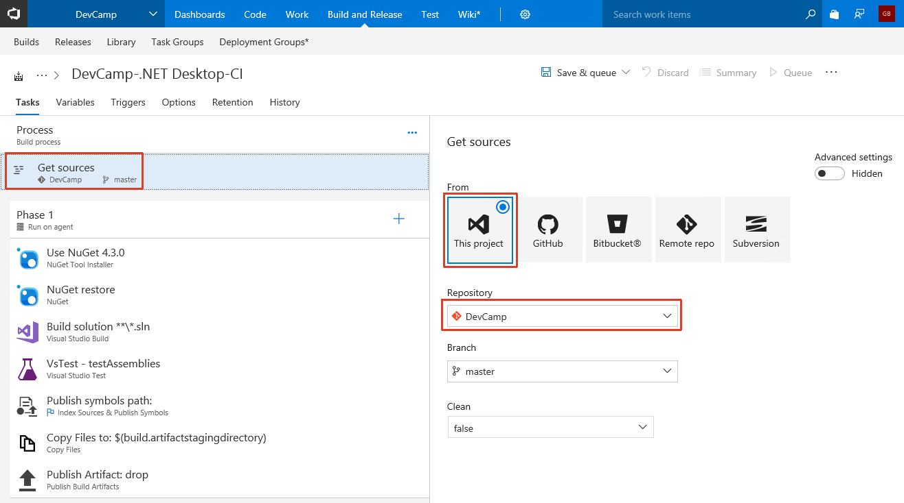
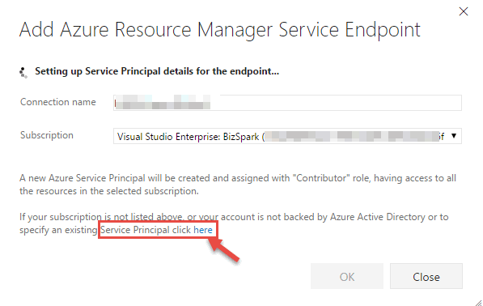

# DevOps with Visual Studio Team Services (.NET)

## Overview
In this lab, you will create a Visual Studio Team Services online account, check in your code, create a Continuous Integration pipeline, and test your cloud-based application.

## Objectives
In this hands-on lab, you will learn how to:
* Create a Visual Studio Team Services online account.
* Create a VSTS Git repository.
* Add your code to the VSTS Git repository.
* Create a Continuous Integration pipeline.
* Deploy a built application to an Azure Web App from VSTS.

## Prerequisites

* The source for the starter app is located in the [start](start) folder. 
* There will be no code changes required so the the [end](end) folder will remain empty. 
* Deployed the starter ARM Template [HOL 1](../01-developer-environment).
* Completion of the [HOL 3](../03-azuread-office365).

> &#x1F53A; **Note**: If you did not complete the previous labs, the project in the [start](start) folder is cumulative. But you need to add the previous HOL's settings to the `Web.config` file and make all necessary changes to Azure. &#x1F53A;

> &#x1F53A; If you did complete HOL 3 just continue with the same solution you have been using. &#x1F53A;

## Exercises
This hands-on-lab has the following exercises:
* [Exercise 1: Create VSTS online account](#ex1)
* [Exercise 2: Create VSTS Git repository](#ex2)
* [Exercise 3: Add application to VSTS Git](#ex3)
* [Exercise 4: Create a Continuous Integration pipeline](#ex4)
* [Exercise 5: Deploy code to an Azure Web App](#ex5)

---
## Exercise 1: Create VSTS online account<a name="ex1"></a>

> &#x1F53A; You can skip this exercise if you already created an account in HOL 1. &#x1F53A;

1. In your browser, navigate to [https://www.visualstudio.com/](https://www.visualstudio.com/)

    

1. Click `Get started for free` link below `Visual Studio Team Services`.

1. Log in with your Azure AD account.

1. You will be asked to choose an hosting address and if you want to use Git or Team Foundation Version Control. Select `Git` and click `Continue`.

1. A new project called `MyFirstProject` will be automatically created.

---
## Exercise 2: Create VSTS Git repository<a name="ex2"></a>

VSTS gives us the option to use Git or [TFVC](https://www.visualstudio.com/en-us/docs/tfvc/overview) as our project's repository. For this exercise we will use Git, and then clone the repository to our dev machine. 

> Note that if you acquired these lab materials via a `git clone` of the workshop repo then you should select a folder somewhere else on your dev machine. This will minimize conflicts between the two separate repositories.

1. We will ignore the automatically created `MyFirstProject`. Starting at your TFVC account's landing page, click `New Project`.

    

1. Enter a project name such as **DevCamp**, ensure `Version control` is set to `Git` and then click `Create`.

    

1. Wait for the project to be created. This process may take up to 60 seconds. When finished you will be redirected to the project page

1. Click `Dashboards` and explore your pre-built dashboard. Familiarize yourself with the variety of widgets available, and the customization options. 

    

You have now created a project in VSTS with a Git repository. Next we'll clone the repository locally to your developer machine and upload code from our machine to VSTS.

---
## Exercise 3: Add application to VSTS Git<a name="ex3"></a>

1. Click `Code` on the top toolbar to navigate to the Code screen.

    

1. Click the `Clone in Visual Studio` button.

    

    > **Note** if you are using Chrome, you may receive a pop-up message. The Clone in Visual Studio option uses a custom protocol handler to open in the client. Select `Launch Application`.
    >
    > 
    >
    > The Internet Explorer will display a security warning. Click `Allow` to continue:
    >
    > 


1. When Visual Studio launches, you will be prompted in the `Team Explorer` window to create a local folder to clone into. Select the `...` next to the local address:

    

1. Create a new local folder ***outside*** of the GIT folder you have been using for the other HOLs. In the example below, the folder was created as `DevCampVSO`:

    

1. Click `OK` and `Clone`.

1. Open Windows Explorer and copy the files from the `start` folder in this HOL and copy the contents into the folder you created above.

      

1. Open the **copied solution** file in Visual Studio.

1. Ensure the `Web.config` settings are set to the values for your application (you can copy them from your working copy back from HOL 3).

    ```xml
    <!--HOL 2-->
    <add key="INCIDENT_API_URL" value="API URL" />
    <add key="AZURE_STORAGE_ACCOUNT" value="STORAGEACCOUNT" />
    <add key="AZURE_STORAGE_ACCESS_KEY" value="STORAGEKEY" />
    <add key="AZURE_STORAGE_BLOB_CONTAINER" value="images" />
    <add key="AZURE_STORAGE_QUEUE" value="thumbnails" />
    <add key="REDISCACHE_HOSTNAME" value="" />
    <add key="REDISCACHE_PORT" value="6379" />
    <add key="REDISCACHE_SSLPORT" value="6380" />
    <add key="REDISCACHE_PRIMARY_KEY" value="" />
    <!--HOL 3-->
    <add key="AAD_APP_ID" value="" />
    <add key="AAD_APP_SECRET" value="" />
    <add key="AAD_APP_REDIRECTURI" value="" />
    <add key="AAD_INSTANCE" value="https://login.microsoftonline.com/{0}/{1}" />
    <add key="AAD_AUTHORITY" value="https://login.microsoftonline.com/common/" />
    <add key="AAD_LOGOUT_AUTHORITY" value="https://login.microsoftonline.com/common/oauth2/logout?post_logout_redirect_uri=" />
    <add key="AAD_GRAPH_SCOPES" value="openid email profile offline_access Mail.ReadWrite Mail.Send User.Read User.ReadBasic.All" />
    <add key="GRAPH_API_URL" value="https://graph.microsoft.com" />
    ```

1. Compile the solution and make sure it works.

1. On the Team Explorer tab, select the changes view by clicking on `Changes`. You may be prompted to confirm your user name.

    

1. In the changes view, you will see a list of changes that are ready to commit to the local repository. In our case it will be the copied solution.

    

    > If you made changes to the files, and you do not see them in the list, ensure that you have cloned the repository from the repo.
    
    ```CMD
    cd\DevCampVSO
    Git init
    Git commit *
    Git push origin master -m ‘initial commit’
    ```

1. Right click on the top level folder and select `Stage`:

    

1. Enter a comment for the check-in and click `Commit Staged`. Not that the comment is mandatory and the button becomes active only after you have entered a comment.

    

1. Because Git is a distributed source control system, the changes we commit are not visible to anyone else. Making our changes visible will require that we ***synchronize*** the repositories. This process is both a Git Pull (to receive changes from the remote repo to your local repo) and a Git Push to send changes from the local repository. We will perform a sync to pull the changes and push our changes. Click `Sync` in the commit message.

     

1. On the next screen, we will push our changes to the server. Since this is the first check-in, there are no incoming commits. Click the `Push` link below `Outgoing Commits`.

     

1. In your browser, navigate to the Visual Studio Team Services site and view the committed files.

     

1. If you want to return to the changes view of the Team Explorer to stage more commits, click the headline to open a drop-down of all the views.

     

---
## Exercise 4: Create a Continuous Integration pipeline<a name="ex4"></a>

With application code now uploaded to VSTS, we can begin to create builds via a Build Definition. Navigate to the `Build` tab from the top navigation. We will use the hosted agent within VSTS to process our builds in this exercise.

1. From the `Build & Release` tab, create a new `Build Definition` by clicking the `New Definition` button:

    

1. There are pre-built definitions for a variety of programming languages and application stacks. For this exercise select `.NET Desktop` and click `Apply`:

    

1. The build tasks are created for us as part of the template. 

1. In the `Process` settings select `Hosted` as the `Agent queue`:

    
    
1. On the `Get sources` step set the `From` value to your VSTS Project and the `Repository` to the repo that was earlier created.

    

1. Navigate to the `Build Solution` step. Add the following in the `MSBuild Arguments` text box to create a web deployment package as part of the build:

    ```xml
    /p:DeployOnBuild=true /p:WebPublishMethod=Package /p:PackageAsSingleFile=true /p:SkipInvalidConfigurations=true /p:PackageLocation="bin\deploymentpackage"
    ```
    

1. In the build step `Copy Files to: $(build.artifactstagingdirectory)`, the default setting uses build definition folders. We are not using custom build configurations so we need to update the contents value.

    ```xml
    **\bin\**
    ```
    
    

1. Click `Save & queue`. Our saved Build Definition is ready to be processed by the Hosted Build Agent.

    

1. Accept the defaults and click `Save & Queue`. Your build will then be queued until the Hosted Build Agent can pick it up for processing. This typically takes less than 60 seconds to begin.

1. Click the build number to proceed.
 
    

1. Once your build completes, click each step on the left navigation bar and inspect the output.

    
	
	> ***Note:*** If your build fails go back to Visual Studio and make sure the solution can be build. Make any neccessary fixes and commit the changes by staging the changes, synchronizing and pushing.

1. Let's inspect the output artifacts that were published. Click the `Build XXX` header in the left pane to view the build's landing page. 

1. Select `Artifacts` from the horizontal toolbar.

    

1. A `drop` folder has been created containing the compiled output. Click `Explore` to see them.
    
    

1. Expand the `drop` folder and view the build artifacts. Click `Close` when complete.

    

1. Click `Download` next to the `drop` folder to save the build locally.

    

1. Unzip `drop.zip` to see the application files created by the build agent. This artifact will be deployed to an Azure Web App in a later exercise.

We now have a Build Definition that will compile the application and create a package for deployment anytime code is checked into the repository, or a manual build is queued.

---
## Exercise 5: Deploy code to an Azure Web App<a name="ex5"></a>

In the ARM Template that was originally deployed, a web app was created as a development environment to hold a deployed .NET application. We will use this web app as a deployment target from VSTS. First, we need to prepare this web app for our application code.

1. Visit the Azure Web App by browsing to the [Azure Portal](http://portal.azure.com), opening the `DevCamp` Resource Group, and select the Azure Web App resource that begins with `dotnetapp` before the random string. 

    

1. Once the blade expands, select `Browse` from the top toolbar:

    

1. A new browser tab will open with a splash screen visible. It will look similar to this image (it gets updated regularly with new information) and tell you that the app service has been created:

    

1. Now that we have a build being created and a website to deploy into, let's connect them. In VSTS, navigate to the `Build & Release` tab.

1. Click on `Releases`.

1. Click the `+ New Definition` button to create a new release definition:

    

1. Select `Azure App Service Deployment` and click `Apply`.

    

1. Click `Add artifact`. Ensure the `Source (Build definition)` is set to the Build Definition name used in the earlier exercise. Then click `Add` to finish creating the Release Definition.

    

1.  We need to connect your VS agent with your Azure subscription so it can deploy resources. Select `Tasks` from the menu. If the drop-down next to `Azure subscription` offers you your subscription, select it, authorize it and continue to select your `dotnetapp...` Azure Web app resource from the `App Service name` drop-down.

    

    1. If the drop-down next to `Azure subscription` does not offer you your subscription or the drop-down next to `App Service name` does not offer you your Azure Web app resource (give it a moment after selecting the subscription), click on `Manage`:

        

    1. This will open a screen where you can connect to the ARM service endpoint. Select `New Service Endpoint` -> `Azure Resource Manager`.

        

    1. Provide a connection name and select your subscription then click `OK`.

        

        > If your subscription is not in the dropdown list, click the link at the bottom of the window, and the window 
        > format will change to allow you to enter connection information on your subscription:    

    1. Another option is to create a service principal. The steps to create a service principal is below.

        > If you have not created a service principal for the subscription, you will have to follow the 
        > [instructions](https://go.microsoft.com/fwlink/?LinkID=623000&clcid=0x409) to do so.  This process will 
        > provide the information to enter in this dialog:
        >

        1. Open [this PowerShell script](https://raw.githubusercontent.com/Microsoft/vsts-rm-documentation/master/Azure/SPNCreation.ps1) in your browser. Select all the content from the window and copy to the clipboard.

        1. Open a PowerShell ISE window. In the text window, paste the PowerShell script from the clipboard.

            

        1. Click the green arrow to run the PowerShell script.

            

            > If the PowerShell gives an error at runtime regarding a missing AzureRM module, please install it by executing the following command in a PowerShell window with admin privileges: `Install-Module AzureRM`. Then run `Set-ExecutionPolicy RemoteSigned -Scope process` to adjust the execution level

        1. The PowerShell script will ask for your **subscription name** and a **password**. This password is for the service principal only, not the password for your subscription. So you can use whatever password you would like, just remember it.    

            

        1. You will then be asked for your Azure login credentials. Enter your Azure username and password. The script will print out several values that you will need to enter into the `Add Azure Resource Manager Service Endpoint` window. Copy and paste these values from the PowerShell window:

            * Subscription ID
            * Subscription Name
            * Service Principal Client ID
            * Service Principal Key
            * Tenant ID

            1. Also, enter a user-friendly name to use when referring to this service endpoint connection.

                

        1. Click `Verify connection`, and ensure that the window indicates that the connection was verified. Then Click `OK` and `Close`.

            

        1. If this is the first time you are connecting to this subscription, you will need to authorize VSTS to have access to deploy to Azure. After you select your subscription, click `Authorize`.

         

    1. Navigate back to the VSTS build tab in the browser and click the click the `Refresh` icon to refresh the connections. The `Azure` connection that we setup should now appear. Select it.

    1. Next, for `App Service Name` choose the name of the .NET Azure Web App. It may take a moment to populate.

        

1. From the menu bar select `Save` to save the Release Definition, and select `Release` -> `Create Release`.

    

1. Enter the release information and select the build to deploy. Ensure that the latest successful build is selected from the drop-down box. Click `Create`.

    

1. Click on the release number in navigation header. This will allow you view the current release information.
    
    

1. After a successful build you should see the application deployed to your web app.

    

1. Update the application configuration to match the current settings you have deployed. Copy the values from the `Web.config` to the Application configuration in Azure if they do not match. Open the Azure portal and find the .NET web application.

1. Open the Application Settings.

     

1. Copy the values from the `Web.config` into the application settings (including `AAD_APP_REDIRECTURI` - not shown). If you do not have values for these settings, please review the previous labs for the correct values.

1. Click `Save`.

     
    
1. Navigate to the [Application Registration Portal](https://apps.dev.microsoft.com).

1. Open the configuration for your application and add the Azure web application URL to the list of Redirect URLs. Click `Save`.

     

    > Note: Be sure to include the trailing slash **/** in the URL and ensure this address is using **https**.

1. Open a browser and navigate to the site. You should see the running site on Azure.
    
    

    > If your browser displays the error `Could not load file or assembly 'System.IdentityModel.Tokens.Jwt' [...]` you have to downgrade the NuGet package `System.IdentityModel.Tokens.Jwt` to 4.0.3 in Visual Studio.
---
## Summary

In this hands-on lab, you learned how to:
* Create a Visual Studio Team Services online account that you used for version control of your code, automatic compiling and deploying of your web app.
* Create a VSTS Git repository that you utilized to synchronize your source code on your machine and in the cloud.
* Add your code to the VSTS Git repository.
* Create a Continuous Integration pipeline that you used to automatically compile your application and create packages for deployment anytime code is checked into the repository.
* Deploy a built application to an Azure Web App from VSTS and thus automating the final steps of your deployment process.

After completing this module, you can continue on to Module 5: ARM.

### View Module 5 instructions for [.NET](../05-arm-cd).

---
Copyright 2018 Microsoft Corporation. All rights reserved. Except where otherwise noted, these materials are licensed under the terms of the MIT License. You may use them according to the license as is most appropriate for your project. The terms of this license can be found at https://opensource.org/licenses/MIT.