# Monitoring with Application Insights (.NET)

## Overview
In this lab, you will create and integrate an instance of Application Insights with your application to provide a 360° view of your app performance. 

> This guide use Visual Studio on Windows as the IDE. You can use [Visual Studio Community Edition](https://www.visualstudio.com/post-download-vs/?sku=community&clcid=0x409&downloadrename=true).

## Objectives
In this hands-on lab, you will learn how to:
* Learn to create an Application Insights instance.
* Use SDKs to add telemetry to your application.
* View performance metrics in the Azure Portal.

## Prerequisites

* The source for the starter app is located in the [start](start) folder.
* The finished project is located in the [end](end) folder. 
* Deployed the starter ARM Template [HOL 1](../01-developer-environment).
* Completion of the [HOL 3](../03-azuread-ofice365).

> &#x1F53A; **Note**: If you did not complete the previous labs, the project in the [start](start) folder is cumulative. But you need to add the previous HOL's settings to the `Web.config` file and make all necessary changes to Azure. &#x1F53A;

> &#x1F53A; If you did complete HOL 4 just continue with the same solution you have been using. &#x1F53A;

### Note
> In the hands-on-labs you will be using Visual Studio Solutions. Please do not update the NuGet packages to the latest available, as we have not tested the labs with every potential combination of packages. 

## Exercises
This hands-on-lab has the following exercises:
* [Exercise 1: Create an Application Insights resource](#ex1)
* [Exercise 2: Add server and client side SDKs](#ex2)
* [Exercise 3: Monitor custom events](#ex3)
* [Exercise 4: Create a global web test](#ex4)
* [Exercise 5: Interact with your telemetry data](#ex5)

---
## Exercise 1: Create an Application Insights resource<a name="ex1"></a>

An instance of Application Insights can be created in a variety of ways, including ARM Templates or CLI commands. For this exercise we will use the Azure Portal to create and configure our instance.

1. In a browser, navigate to the [Azure Portal](https://portal.azure.com).

1. Open the Resource Group that was originally deployed. Click `Add` on the top toolbar to add a new Azure resource to this group.

    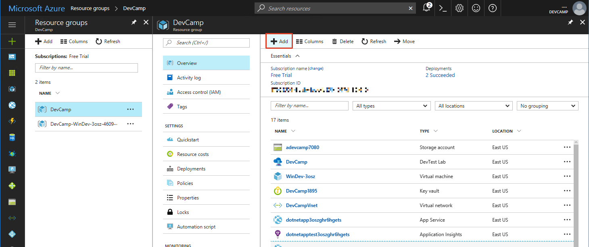

1. Search for `Application Insights` and select the entry from the results list:

    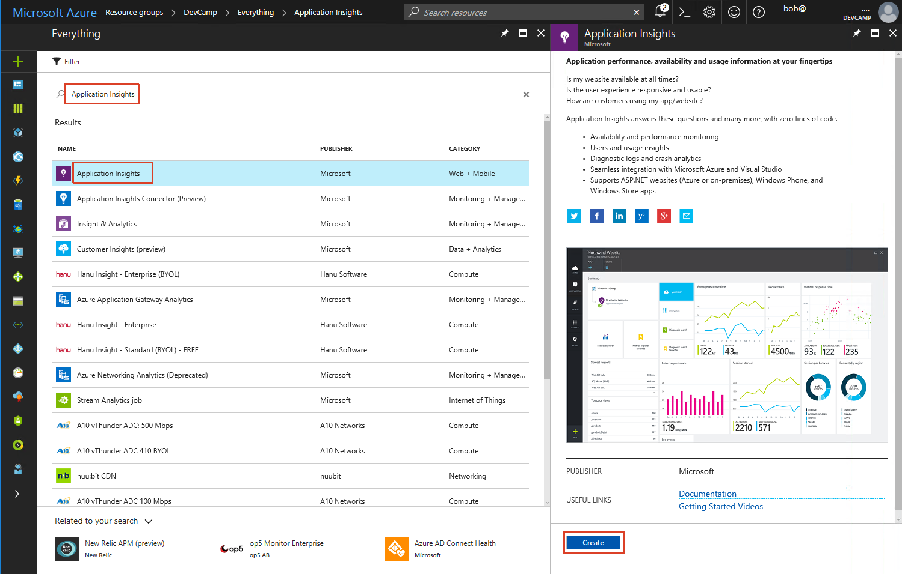

1. In the overview blade that opens, click `Create` to open the creation settings blade. Enter a name, configure `Application Type` to `ASP.NET Web Application` and then click the `Create` button.

    Creation typically takes less than a minute.

    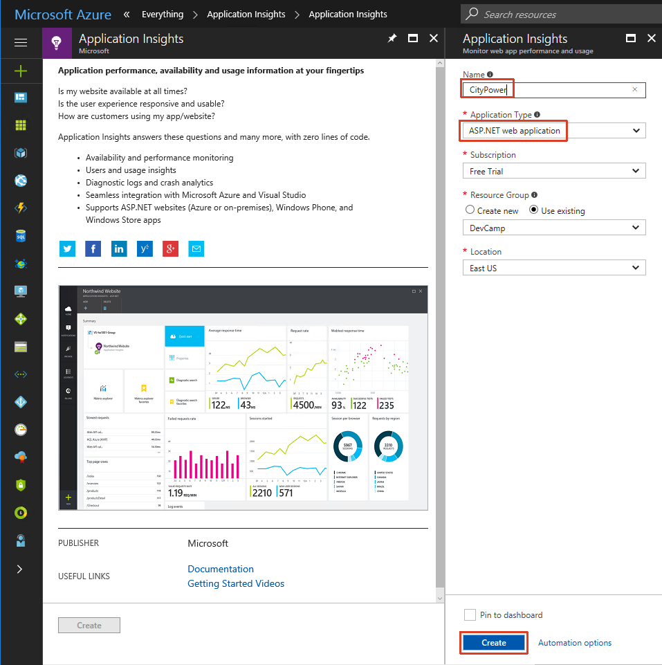

1. Once provisioning completes, return to your Resource Group and open the resource. You may need to hit the refresh button within the resource group blade.

    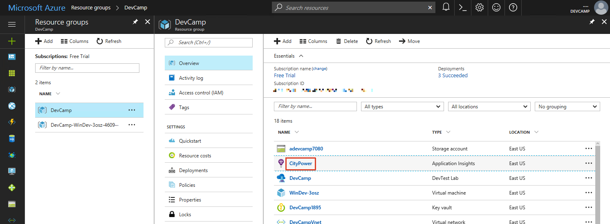

1.  In the `Essentials` section, take note of the `Instrumentation Key`. We will need that in future exercises.

    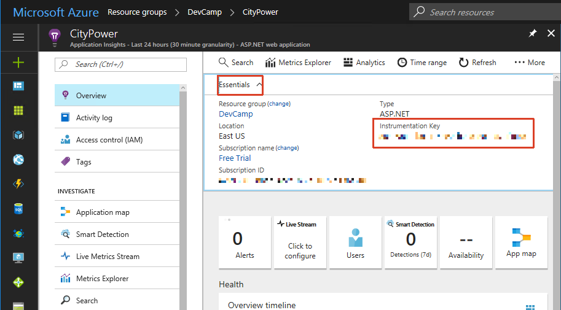

We now have an instance of Application Insights created and ready for data. The Instrumentation Key is important, as it is the link that ties an application to the AI service. 

---
## Exercise 2: Add server and client side SDKs <a name="ex2"></a>

App Insights works with 2 components:
1. A server side SDK that integrates into the ASP.NET processes.
2. A snippet of JavaScript sent down to the client's browser to monitor behavior.

We will add both components to our application and enable the sending of telemetry into the AppInsights service.

1. In Visual Studio open the starter solution of the AppInsights HOL. 
 
    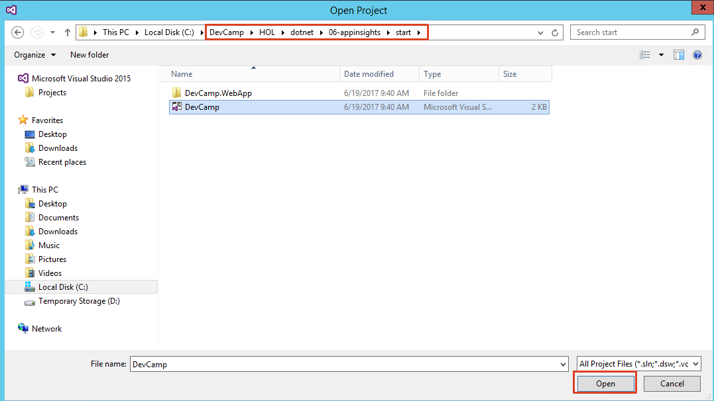

1. Register the Application and add the AppInsights SDK to the solution by right-clicking on the project and clicking `Add Application Insights Telemetry...` or alternatively  by right-clicking on the project and clicking `Add` and then `Application Insights Telemetry...`:

    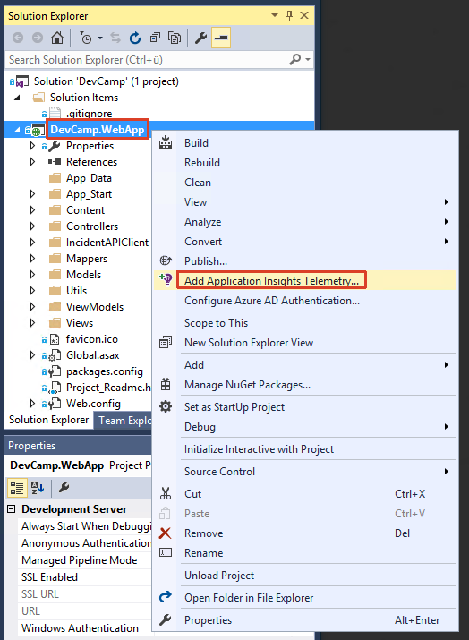

1. The Application Insights page appears. Login to you Azure subscription.

1. Select your AppInsights resource you created above. You can choose from the drop down or click on Configure Settings.


    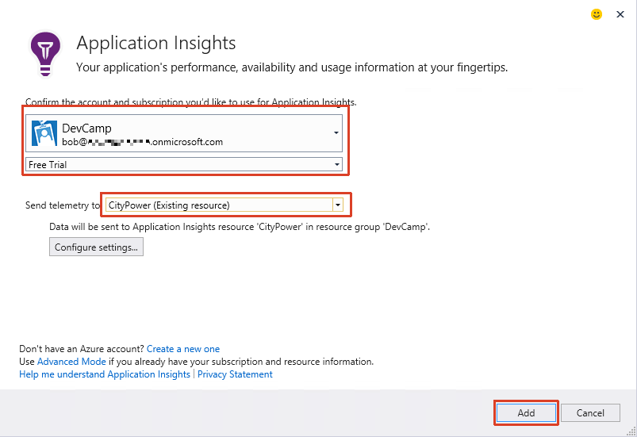

    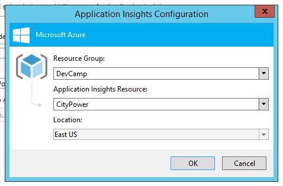

1. Click the `Add` button. This will download the NuGet packages and add an `ApplicationInsights.config` to your solution. Your browser will display the Application Insights help page.

1. Click on `Enable exception collection` and `Collect traces from System.Diagnostics`. This will enable additional trace listeners.
    
    > The snippet below was taken from the Application Insights Configuration window. You can access it by right-clicking the project in your solution and choosing `Application Insights` -> `Configure Application Insights...`.
    >
    > If you aren't seeing this option, make sure you are using an updated version of the `Developer Analytics Tools` extension. You can check this by going to `Tools` -> `Extensions and Updates` and click `Updates` -> `Visual Studio Gallery`. If available, choose `Developer Analytics Tools`.
    >
    > By the time of this writing, this is version 7.19 and automatic updates were not shown. If this happens try to uninstall the `Developer Analytics Tools`, restart Visual Studio and install the `Developer Analytics Tools` again. If this does not work, you might have to install the update manually by downloading it from [Visual Studio Gallery](https://visualstudiogallery.msdn.microsoft.com/82367b81-3f97-4de1-bbf1-eaf52ddc635aJakub).

    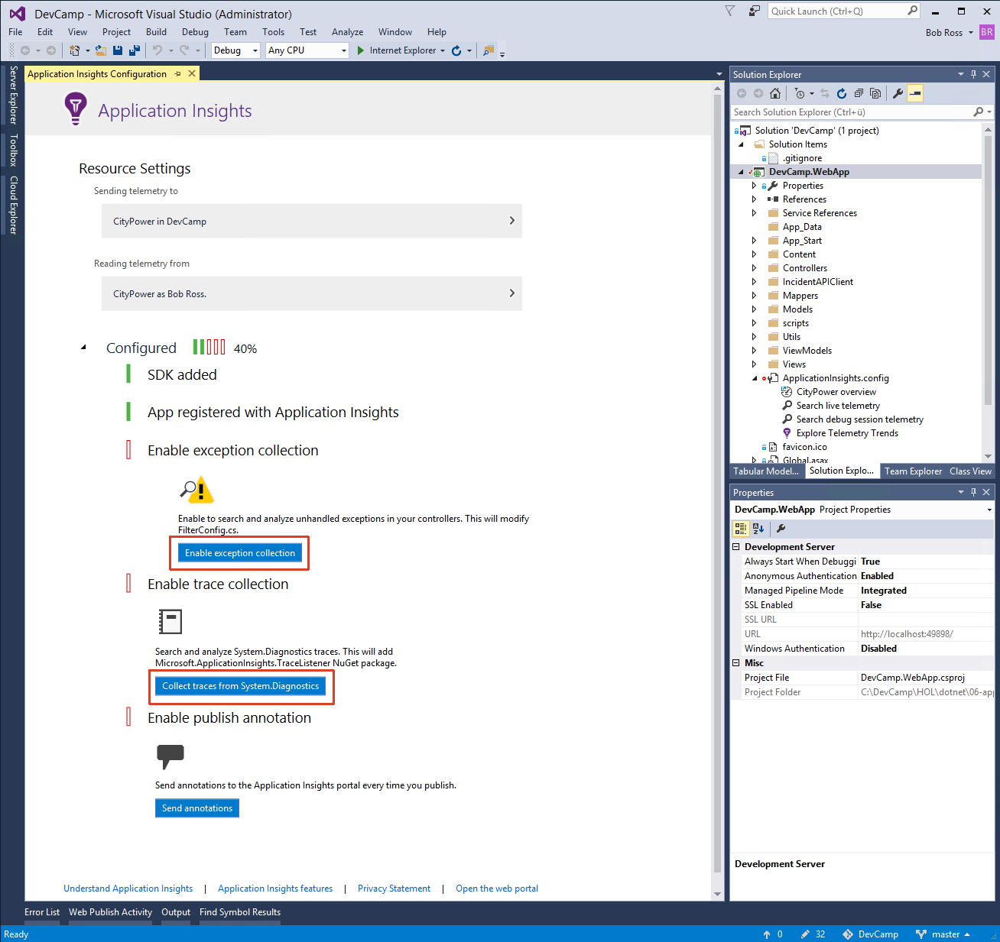
    
1. By default, the `ApplicationInsights.config` is excluded from source control due to the fact that it contains the Instrumentation key. We will remove this from the config file and inject it at runtime. Remove the following key from the `ApplicationInsights.config` file:

    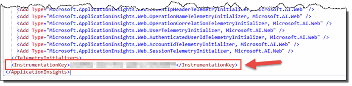

1. Open the `Web.config` file and add the following entry, below the other keys. Replace the value with the AppInsights key you just removed from the `ApplicationInsights.config`:

    ```xml
    <!--HOL 6-->
    <add key="APPINSIGHTS_KEY" value="TELEMETRYKEY" />
    ```
1. Open the `Utils` -> `Setting.cs` file and add the following key below the existing entries:
    
    ```csharp
    //####    HOL 6   ######
    public static string APPINSIGHTS_KEY = ConfigurationManager.AppSettings["APPINSIGHTS_KEY"];
    //####    HOL 6   ######
    ```

1. Open the `Global.asax.cs` file and add the following to the `Application_Start()` method, below the existing code:

    ```csharp
    //Add the telemetry key from config
    TelemetryConfiguration.Active.InstrumentationKey = Settings.APPINSIGHTS_KEY;
    ```
1.  Resolve the references to using `DevCamp.WebApp.Utils` and `Microsoft.ApplicationInsights.Extensibility` in this file.

1. If you receive an error related to the `FilterConfig` class, check to see if a duplicate `FilterConfig.cs` was created. If so remove it.

    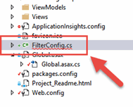

1. Build and run your application and then navigate around several pages to generate sample telemetry.

    > If you encounter the error that `an assembly cannot be loaded` try to downgrade the NuGet package `System.IdentityModel.Tokens.Jwt` to 4.0.3 in Visual Studio.

1. You can view telemetry in the Azure Portal or directly in Visual Studio from the menu item. 
    
    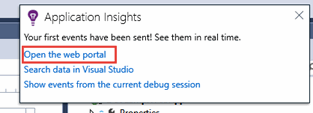

    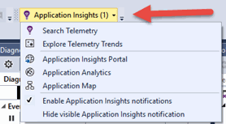

1. Back in the Azure Portal, refresh the browser tab (or click `Refresh` from the top toolbar) until you see data appear.

    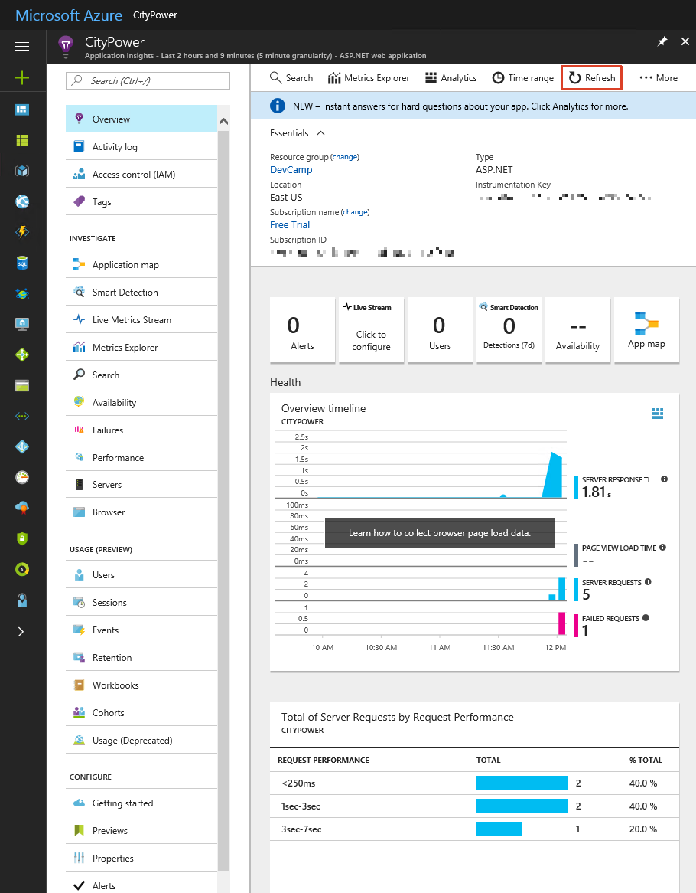

    > It may take 3-5 minutes for data to appear even when manually refreshing.

1. Our server is now sending data, but what about the client side? Let's add the JavaScript library.

    In the portal, click the tile that says `Learn how to collect browser page load data`:
    
    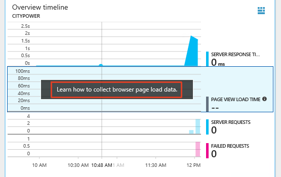

1. The next blade will give you a JavaScript snippet pre-loaded with the Instrumentation Key. This snippet, when placed on an HTML page, will download the full Application Insights JavaScript library and configure itself. The HTML snippet in the portal integrates the App Insights key into the markup. We will replace the key with a value from our settings class to allow for dynamic configuration of the App Insights resource. By doing this, we can configure the specific setting using a configuration value.

    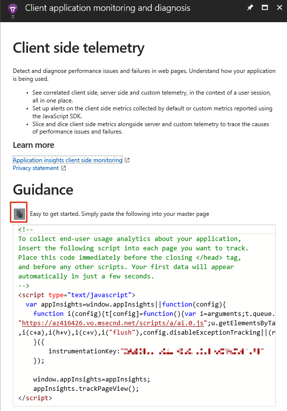

1. Let's integrate the snippet into our views. In Visual Studio open the `Views` -> `Shared` -> `Layout.cshtml` file. This file controls the outer layout for all of the pages.

1. Paste the following snippet below the existing script tags. 

    >**Notice that we replaced the static instrumentation key with the constant from our settings.cs class**:
    >instrumentationKey: "@DevCamp.WebApp.Utils.Settings.APPINSIGHTS_KEY"
    >

    ```html
    <!-- 
    To collect end-user usage analytics about your application, 
    insert the following script into each page you want to track.
    Place this code immediately before the closing </head> tag,
    and before any other scripts. Your first data will appear 
    automatically in just a few seconds.
    -->
    <script type="text/javascript">
    var appInsights=window.appInsights||function(config){
        function i(config){t[config]=function(){var i=arguments;t.queue.push(function(){t[config].apply(t,i)})}}var t={config:config},u=document,e=window,o="script",s="AuthenticatedUserContext",h="start",c="stop",l="Track",a=l+"Event",v=l+"Page",y=u.createElement(o),r,f;y.src=config.url||"https://az416426.vo.msecnd.net/scripts/a/ai.0.js";u.getElementsByTagName(o)[0].parentNode.appendChild(y);try{t.cookie=u.cookie}catch(p){}for(t.queue=[],t.version="1.0",r=["Event","Exception","Metric","PageView","Trace","Dependency"];r.length;)i("track"+r.pop());return i("set"+s),i("clear"+s),i(h+a),i(c+a),i(h+v),i(c+v),i("flush"),config.disableExceptionTracking||(r="onerror",i("_"+r),f=e[r],e[r]=function(config,i,u,e,o){var s=f&&f(config,i,u,e,o);return s!==!0&&t["_"+r](config,i,u,e,o),s}),t
        }({
            instrumentationKey: "@DevCamp.WebApp.Utils.Settings.APPINSIGHTS_KEY"
        });
        
        window.appInsights=appInsights;
        appInsights.trackPageView();
    </script>
    ```
1. Redeploy the application and load several pages to generate more sample telemetry. The Azure Portal should now light up data for **Page View Load Time**:

    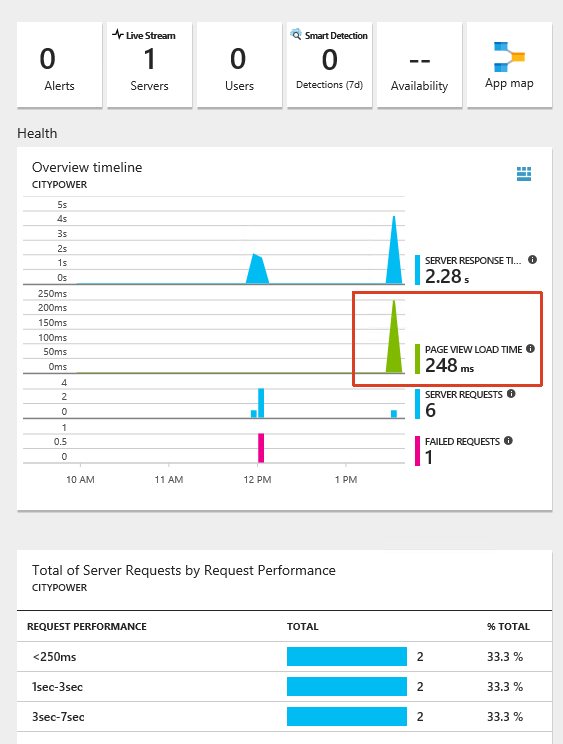

Our application is now providing the Application Insights service telemetry data from both the server and client.

---
## Exercise 3: Monitor custom events<a name="ex3"></a>

Up until this point the telemetry provided has been an automatic, out-of-the-box experience. For custom events we need to use the SDK. Let's create an event where any time a user views their Profile page, we record their name and AzureAD tenant ID.

1. Open the `Controllers` -> `Profilecontroller.cs` file.

1. Add the following to the top of the class:

    ```csharp
    //Add telemetry
    private TelemetryClient telemetryClient = new TelemetryClient();
    ```

1. In the `SignIn()` method, add the following as the first call:
    
    ```csharp
    telemetryClient.TrackEvent("Sign in");
    ```
1. In the `SignOut` method(), add the following as the first call:

    ```csharp
    telemetryClient.TrackEvent("Sign out");
    ```
1. In the Index() Method, add the following **AFTER** the call to the GraphAPI and the parsing of the userProfile to capture the token:

    ```csharp
    //#### TRACK A CUSTOM EVENT ####
    var profileProperties = new Dictionary<string, string> { { "userid", userObjId }, { "tenantid", tenantId }, { "DisplayName", userProfile.DisplayName }, { "Mail", userProfile.Mail } };
    telemetryClient.TrackEvent("View Profile", profileProperties);
    //#### TRACK A CUSTOM EVENT ####
    ```
    
    Your method should look like this:
    
    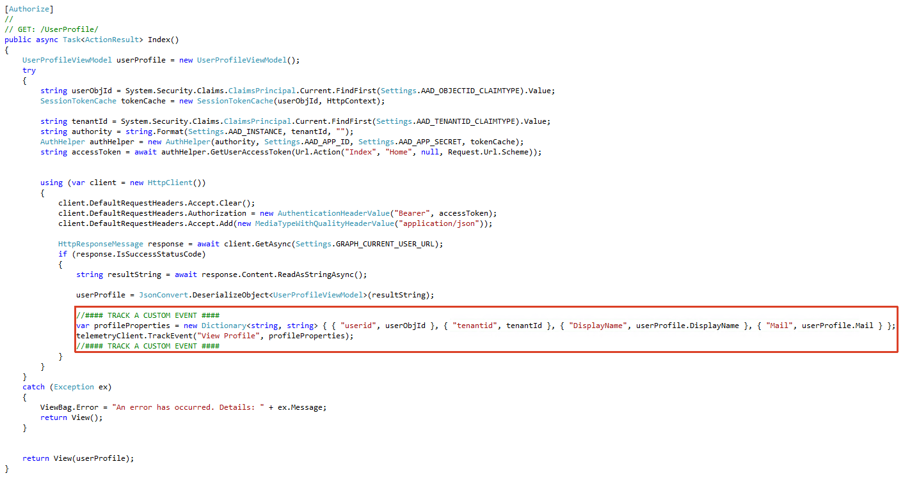
    
1. Resolve the references to `Microsoft.ApplicationInsights` in this class and save the open files.

1. Hit F5 to begin debugging. Sign in, view your profile and Sign out a few times. Then view the custom events in the portal by opening the `Application Insights` blade and pressing the `Search` button. Clicking on one of the custom events gives us more details including the custom data we defined. For exceptions, we get the call stack and more information associated with the event.

    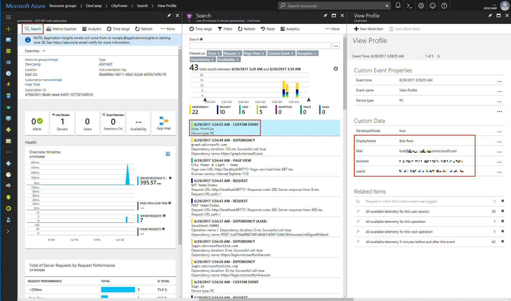

    > ***Note:*** If you do not see your custom events, look at the URL you are redirected to after your sign in. If you are redirected to the Azure hosted instance of your app, update your settings on [https://apps.dev.microsoft.com](https://apps.dev.microsoft.com) to reflect your current debugging environment. Remove the Azure addresses and enter the current port number that Visual Studio uses for debugging.

These custom events (and the related concept of custom metrics) are a powerful way to integrate telemetry into our application and centralize monitoring across multiple application instances.

---
## Exercise 4: Create a global web test<a name="ex4"></a>

Application Insights has the ability to do performance and availability testing of your application from multiple locations around the world, all configured from the Azure portal.  

1. To show the Application Insights availability monitoring capability, we first need to make sure the application is deployed to the Azure App service. This is done in the [DevOps with Visual Studio Team Services](../04-devops-ci) hands-on-lab. To verify the application is running in the cloud, first go to the Azure portal, open your resource group, and click on the dotnet app service:

    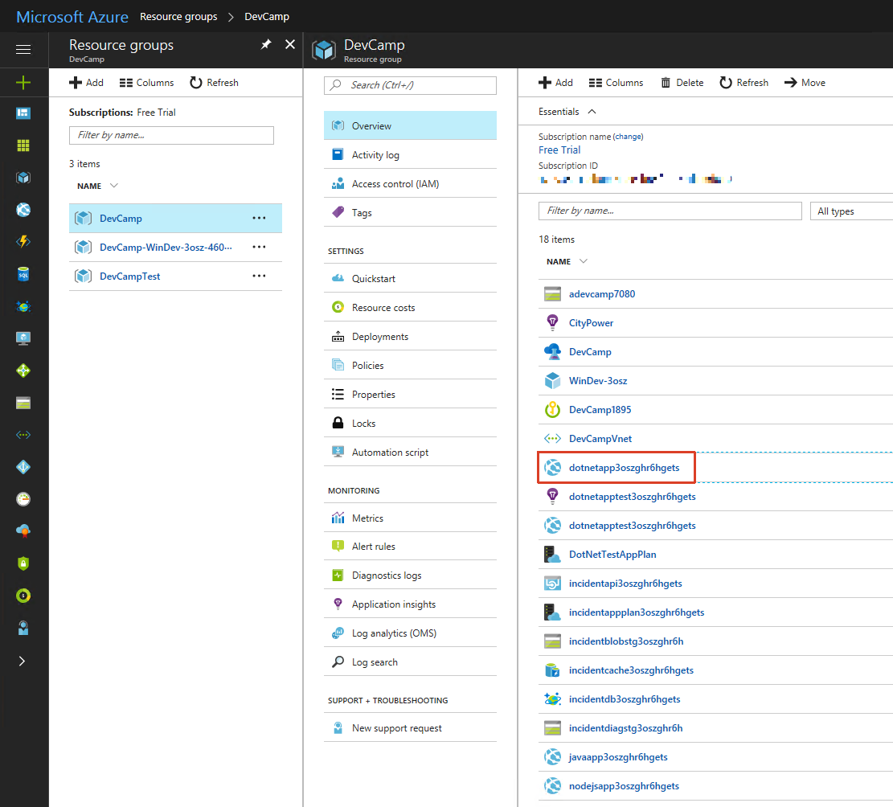

    Then, click the `Browse` link in the App service blade:

    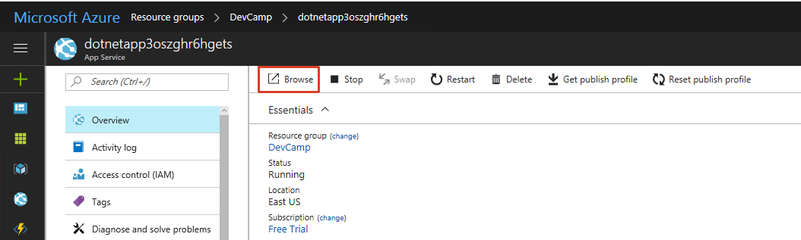

    This should open another window with the City Power and Light application in it. Make note of the URL at the top of the browser.

2. In the Azure portal, click on the City Power Application Insights deployment in your resource group to open its blade. Availability is under `INVESTIGATE` in the scrolling pane - click on it to open the `Availability` tab:

    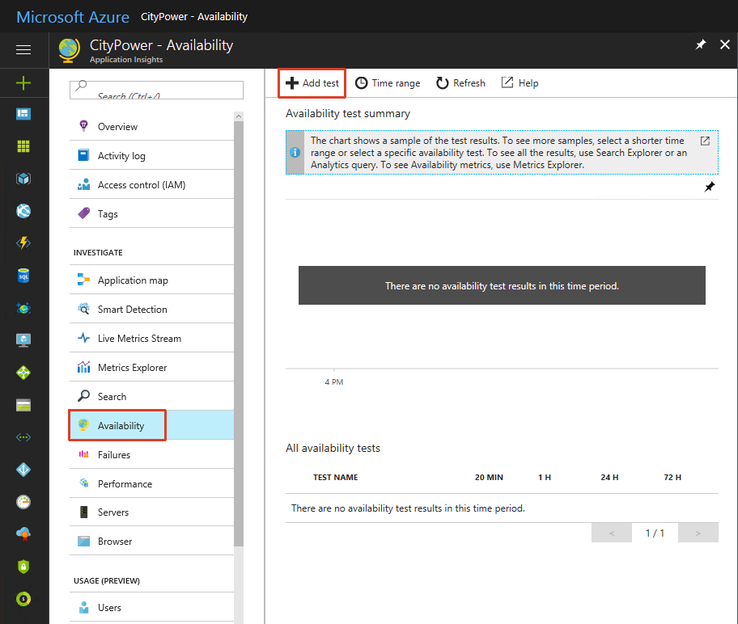

    Click on `Add test`. In the `Create test` blade, give the test a name, put the URL for your application in the URL box, and choose several
    locations to test your application from. You can choose to receive an alert email when the availability test fails by clicking on the `Alerts` box and entering the alert configuration. Click `OK` and `Create`.  

    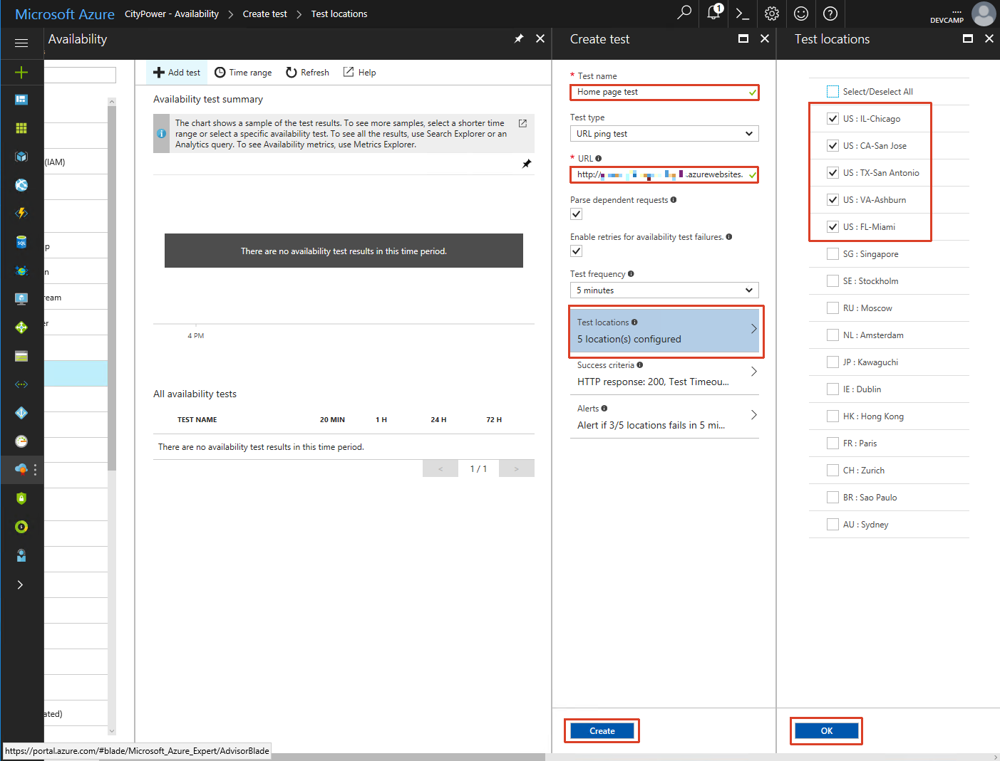

    It may take 5-10 minutes for your web test to start running. When it is executing and collecting data, you should see availability information on the `Availability` tab of the Application Insights blade. You can click on the web test to get more information:

    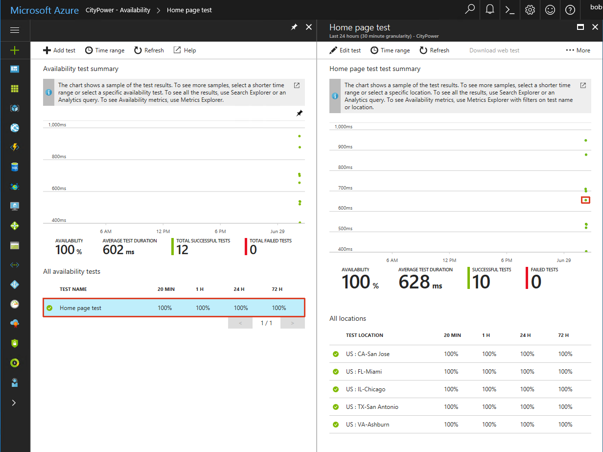

    And clicking on one of the dots on the graph will give you information about that specific test. Clicking on the request will show you the response that was received from your application:

    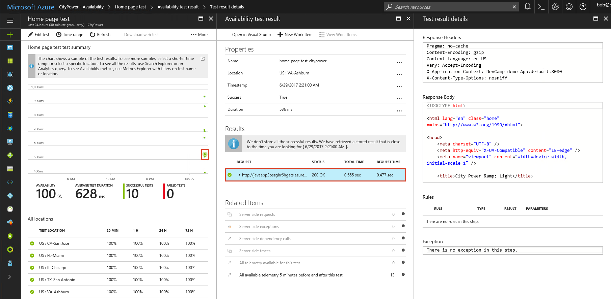

    > With all of this testing, you may exceed the limits of the free service tier for Azure app services. If that occurs, you can click on the App Service, and you'll see a notification that your App Service has been stopped due to it's consumption. All you need to do is change the App service plan to basic, which will start the application again.

---
## Exercise 5: Interact with your telemetry data<a name="ex5"></a>

In the `Metrics Explorer`, you can create charts and grids based on the telemetry data received, and you can relate data points over time. These charts and graphs are very configurable, so you can see the metrics that matter to you.

1. Here is an example of page views vs process CPU and processor time:

    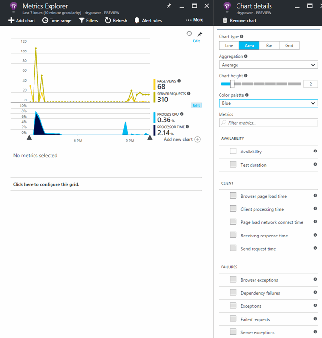

    In `Search` you can see the raw telemetry events, you can filter on the specific events you want to see, and you can drill into more detail on those events. You can also search for properties on the telemetry event. Here is the basic view:

    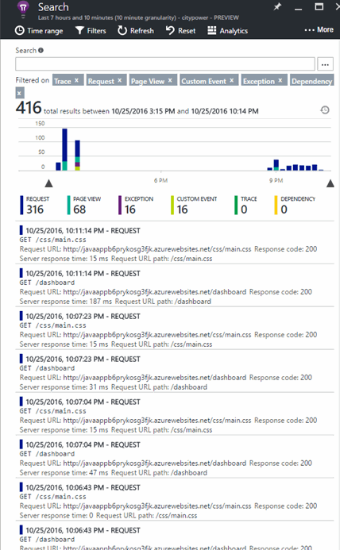
    
    Clicking on one of the events gives you a detail blade for that event:

    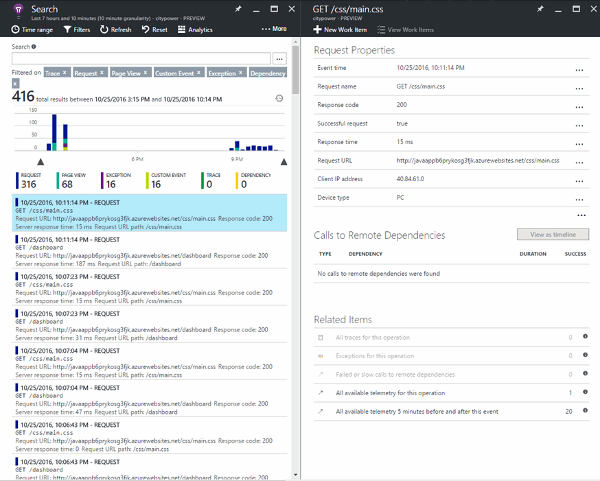

    If there are remote dependencies, such as calls to a database or other resources, those will appear under `Calls to Remote Dependencies`. If there were exceptions, traces or failed calls to dependencies, you could get detail on that under `Related Items`.

1. When we go to `Application map`, we can see a diagram of the monitored items that make up the application:

   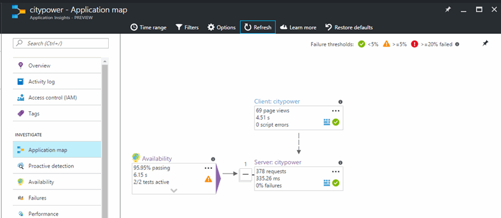

---
## Summary
Azure gives you a complete toolset to monitor the status and performance of your applications. It also allows you to run automated performance tests to easily find weaknesses before you go live with your app.

In this hands-on lab, you learned how to:
* Create an Application Insights instance.
* Use SDKs to add telemetry to your application.
* View performance metrics in the Azure Portal.

After completing this module, you can continue on to Module 7: Bots.

### View Module 7 instructions for [.NET](../07-bot).

---
Copyright 2018 Microsoft Corporation. All rights reserved. Except where otherwise noted, these materials are licensed under the terms of the MIT License. You may use them according to the license as is most appropriate for your project. The terms of this license can be found at https://opensource.org/licenses/MIT.