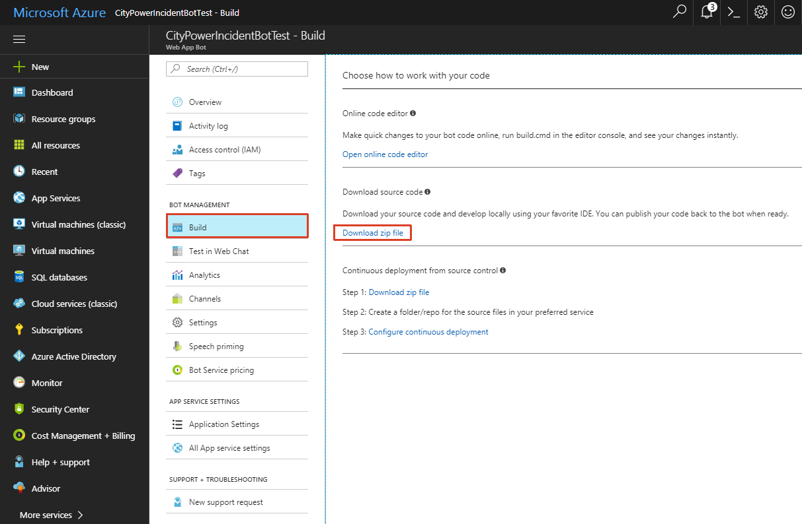

# Bots (.NET)

## Overview
City Power & Light is a sample application that allows citizens to report "incidents" that have occurred in their community. It includes a landing screen, a dashboard, and a form for reporting new incidents with an optional photo. The application is implemented with several components:

* Front end web application contains the user interface and business logic. This component has been implemented three times in .NET, NodeJS, and Java.
* WebAPI is shared across the front ends and exposes the backend CosmosDB.
* CosmosDB is used as the data persistence layer.

In this lab, you will continue enhancing the overall City Power & Light experience by creating an incident reporting bot from scratch and via the Azure Bot Service and host it in Azure. The bot will be able to gather data from a user with an optional photo and submit it to the WebAPI.

## Objectives
In this hands-on lab, you will learn how to:
* Set up the developing environment to support the creation of bot applications.
* Create your own bot from scratch.
* Create your own bot using Azure Bot Service.
* Call Azure Cognitive Services to leverage computer vision API
* Hosting your bot in Azure.

## Prerequisites
* The source for the starter app is located in the [start](start) folder. 
* The finished project is located in the [end](end) folder. 
* Deployed the starter ARM Template [HOL 1](../01-developer-environment).
* Completion of the [HOL 5](../05-arm-cd).

> **Note**: If you did not complete the previous labs, the project in the [start](start) folder is cumulative. But you need to add the previous HOL's settings to the `Web.config` file.

## Exercises
This hands-on-lab has the following exercises:
* [Exercise 1: Set up your environment](#ex1)
* [Exercise 2: Create an interactive dialog](#ex2)
* [Exercise 3: Integrate the API](#ex3)
* [Exercise 4: Send attachments to the bot](#ex4)
* [Exercise 5: Analyze submitted pictures automatically](#ex5)
* [Exercise 6: Host your bot in Azure](#ex6)
* [Exercise 7: Azure Bot Service](#ex7) 
* [Exercise 8: Azure Functions Bot](#ex8) 

---
## Exercise 1: Set up your environment<a name="ex1"></a>

To develop a bot on your machine you need the `Bot Application` template for Visual Studio and the `Bot Framework Emulator`. To test your bot once it has been deployed to Azure you will need `ngrok`.

1. The easiest way to install the `Bot Application` template is via the Visual Studio 2015 `New Project` dialog. Select `Online` and enter `Bot` in the search box. Select `Bot_Application`. Create a new project by clicking `OK` and the template will be installed.

    

    If you are using Visual Studio 2017 download the [Bot Application template](http://aka.ms/bf-bc-vstemplate) and install the template by saving the .zip file to your Visual Studio 2017 project templates directory. The Visual Studio 2017 project templates directory is typically located here: `%USERPROFILE%\Documents\Visual Studio 2017\Templates\ProjectTemplates\Visual C#\ `.

1. We will use the locally installed `Bot Framework Emulator` to test our bot. Once the bot is registered it can also be tested in the Bot Framework Portal. There you can configure the channels your bot will support. It can be integrated into a website, reached via Skype and many other channels.

1. To install the `Bot Framework Emulator`, download the current version from the [release page](https://emulator.botframework.com/) and execute the setup.

    

1. `ngrok` is a tunneling software that allows you to debug a remotely hosted bot. Download the current version of [ngrok](https://ngrok.com/) and extract the `.exe` file to your Desktop.

    

    You have now installed all the necessary components to start developing a bot on your machine. The bot will have to store its state data in an Azure database which we will create next.

1. Navigate to the DevCamp resource group and click `Add`. Enter `Azure Cosmos DB` in the filter box, then on the details enter a unique name and select `SQL` as the API and click `Create` blade.

    

1. You will be redirected to the `Quick start` blade. Click `Keys`. Note the values for `URI` and `KEY 1`.

    

---
## Exercise 2: Create an interactive dialog<a name="ex2"></a>

We are using the [FormFlow](https://docs.microsoft.com/en-us/bot-framework/dotnet/bot-builder-dotnet-formflow) template to create our bot. The template let's you define a number of properties, including ones based on enums, that the bot will automatically gather from the user. We can even modify the text the bot uses to prompt the user and simply add regular expressions that are verified by the bot.

1. Open Visual Studio and load the `CityPowerBot.sln` from the `start` folder.

1. Open `web.config` of the `CityPowerBot Project` and replace the values for `DocumentDbUrl` and `DocumentDbKey` with the values of your newly created database that you copied in the previous exercise. Make sure to include the port in the `DocumentDbUrl` value.

1. Open the `CityPowerBot` -> `Dialogs` -> `BasicForm.cs` and add the following code which will create a property for each value of our incident report. It will also let the bot introduce itself and greet the user with its own name. The order of the interaction is determined by the `FormBuilder` in the `BuildForm` method.

    ```csharp
    using Microsoft.Bot.Builder.Dialogs;
    using Microsoft.Bot.Builder.FormFlow;
    using Microsoft.Bot.Builder.FormFlow.Advanced;
    using System;
    using System.Collections.Concurrent;
    using System.Collections.Generic;
    using System.Globalization;
    using System.IO;
    using System.Linq;
    using System.Reflection;
    using System.Threading;
    #pragma warning disable 649

    namespace CityPowerBot
    {
        public enum IncidentTypes { GasLeak = 1, StreetLightStaysOn };
        
        // For more information about this template visit http://aka.ms/azurebots-csharp-form
        [Serializable]
        public class BasicForm
        {
            [Prompt("What is your {&}?")]
            public string FirstName { get; set; }

            [Prompt("And your {&}?")]
            public string LastName { get; set; }

            [Prompt("What type of outage would you like to report? {||}")]
            public IncidentTypes IncidentType { get; set; }

            [Prompt("Is this issue an {&}? {||}")]
            public bool Emergency { get; set; }

            [Prompt("Please give a {&} of the problem.")]
            public string Description { get; set; }
            
            [Pattern(@"(<Undefined control sequence>\d)?\s*\d{3}(-|\s*)\d{4}")]
            [Prompt("What is the {&} where we can currently reach you?")]
            public string PhoneNumber { get; set; }

            [Prompt("In which {&} do you live?")]
            public string City { get; set; }

            [Prompt("And in which {&}?")]
            public string State { get; set; }

            [Prompt("Lastly, what {&} do you live on?")]
            public string Street { get; set; }

            [Pattern(@"^\d{5}(?:[-\s]\d{4})?$")]
            [Prompt("What is your {&}?")]
            public string ZipCode { get; set; }
            
            public static IForm<BasicForm> BuildForm()
            {
                // Builds an IForm<T> based on BasicForm
                return new FormBuilder<BasicForm>()
                    .Message("I am the City Power Bot! You can file a new incident report with me :-)")
                    .Field(nameof(FirstName))
                    .Field(nameof(LastName))
                    .Message("Hello {FirstName} {LastName}! Let's file your report!")
                    .Field(nameof(Emergency))
                    .Field(nameof(IncidentType))
                    .Field(nameof(Description))
                    .Field(nameof(City))
                    .Field(nameof(State))
                    .Field(nameof(ZipCode))
                    .Field(nameof(Street))
                    .Field(nameof(PhoneNumber))
                    .Build();
            }

            public static IFormDialog<BasicForm> BuildFormDialog(FormOptions options = FormOptions.PromptInStart)
            {
                // Generated a new FormDialog<T> based on IForm<BasicForm>
                return FormDialog.FromForm(BuildForm, options);
            }
        }
    }
    ```

    Note how we can use the `IncidentTypes` enum and the boolean property `Emergency`. The `FormBuilder` will automatically turn these types into choices presented to the user. Two regular expressions check the format of the `PhoneNumber` and `ZipCode` properties.
    
1. Let's test the new bot. Hit `F5` to start the debugging process. The Internet Explorer will open and display bot information. Note the address.

1. Start the `Bot Framework Emulator`.

1. As the endpoint URL enter your bot's address followed by `/api/messages`. It should look similar to `http://localhost:3979/api/messages`. Since we are debugging locally you can ignore the textboxes for `Microsoft App ID`, `Microsoft App Password`, and `Locale` and just click the `CONNECT` button.

    

1. The `Log` section in the lower right corner will inform you, that you are now connected to your bot.

1. Enter any text in the message window to start the dialog with your bot. It will then start to prompt you for incident details.

    

1. During your interaction you can use command words like `back`, `quit`, `reset`, `status` and `help`.

    

You have now created a rudimentary bot that gathers all the data we need for an incident report from the user using the [FormFlow](https://docs.microsoft.com/en-us/bot-framework/dotnet/bot-builder-dotnet-formflow) template which does most of the work for you. Next you will extend the bot to also accept an image for the report. 

---
## Exercise 3: Send attachments to the bot<a name="ex3"></a>

Did you notice the image button next to the message window? You can not only send text messages to your bot but also image files. Let's tell the bot how to handle them.
    
1. In the `CityPowerBot` -> `Controllers` -> `MessagesController.cs` replace the creation of the `MainDialog` with a switch that filters messages containing images while letting the existing `MainDialog` handle all the other messages.

    ```csharp
    if (activity.Type == ActivityTypes.Message)
    {
        // Stores send images out of order.
        var connector = new ConnectorClient(new Uri(activity.ServiceUrl));
        var imageAttachment = activity.Attachments?.FirstOrDefault(a => a.ContentType.Contains("image"));
        if (imageAttachment != null)
        {
            LastImage = await GetImageStream(connector, imageAttachment);
            LastImageName = imageAttachment.Name;
            LastImageType = imageAttachment.ContentType;
            LastImageTags = String.Empty;
            LastImageDescription = String.Empty;
            Activity reply = activity.CreateReply("Got your image!");
            await connector.Conversations.ReplyToActivityAsync(reply);
        }
        else
        {
            // Creates a dialog stack for the new conversation, adds MainDialog to the stack, and forwards all messages to the dialog stack.
            await Conversation.SendAsync(activity, () => new MainDialog());
        }
    }
    ```

1. Add these two methods that will extract a stream from the image send by the user.

    ```csharp
    private static async Task<Stream> GetImageStream(ConnectorClient connector, Attachment imageAttachment)
    {
        using (var httpClient = new HttpClient())
        {
            // The Skype attachment URLs are secured by JwtToken,
            // you should set the JwtToken of your bot as the authorization header for the GET request your bot initiates to fetch the image.
            // https://github.com/Microsoft/BotBuilder/issues/662
            var uri = new Uri(imageAttachment.ContentUrl);
            if (uri.Host.EndsWith("skype.com") && uri.Scheme == "https")
            {
                httpClient.DefaultRequestHeaders.Authorization = new AuthenticationHeaderValue("Bearer", await GetTokenAsync(connector));
                httpClient.DefaultRequestHeaders.Accept.Add(new MediaTypeWithQualityHeaderValue("application/octet-stream"));
            }

            return await httpClient.GetStreamAsync(uri);
        }
    }

    /// <summary>
    /// Gets the JwT token of the bot. 
    /// </summary>
    /// <param name="connector"></param>
    /// <returns>JwT token of the bot</returns>
    private static async Task<string> GetTokenAsync(ConnectorClient connector)
    {
        var credentials = connector.Credentials as MicrosoftAppCredentials;
        if (credentials != null)
        {
            return await credentials.GetTokenAsync();
        }

        return null;
    }
    ```

    The code will store the last submitted image in the variables to be used when the report is submitted.

1. Now we have to tell the users that they can send images along with their incident reports. Open the `CityPowerBot` -> `Dialogs` -> `BasicForm.cs` and in the `BuildForm` method add this additional message right after the first message your bot sends:

    ```csharp
    .Message("Did you know? At any point during our conversation you can send me an image that I will attach to your report.")
    ```

1. Hit `F5` to start the debugging process and talk to your bot via the `Bot Framework Emulator`. Note that the bot is informing you about its new capability. During the interaction click the image button and send an image from your machine. The bot will confirm that it "got your image".

    
    
    The DevCamp folder contains many images that you can use to test the feature.
    
    

    Sending the image will not affect the rest of your conversation with the bot.

Your bot now accepts and stores an image send by the user. Now that you have everything that can be submitted in an incident report you are going to send it to the incident API.

---
## Exercise 4: Integrate the API<a name="ex4"></a>

To file the reported incident we use the incident API. The necessary methods are present in the `DataWriter` project. The project contains excerpts from the previous hands on labs. The code was shortened to just create an incident and upload the attached image. To complete it you have to add your Azure account information. 

1. Open `web.config` of the `CityPowerBot Project` and replace the value for `INCIDENT_API_URL` with the URL of your incident API which you retrieved in [HOL 2 exercise 1]((../02-modern-cloud-apps)#ex1) and looks similar to `http://incidentapi[...].azurewebsites.net`.

1. Replace the value for `AZURE_STORAGE_ACCOUNT` with your **storage account name** and the value for `AZURE_STORAGE_ACCESS_KEY` with your **storage account key** you retrieved in [HOL 2 exercise 3]((../02-modern-cloud-apps)#ex3).

1. Your `web.config` should now be updated with your unique values.

    ```xml
    <add key="INCIDENT_API_URL" value="API URL" />
    <add key="AZURE_STORAGE_ACCOUNT" value="STORAGEACCOUNT"/>
    <add key="AZURE_STORAGE_ACCESS_KEY" value="STORAGEKEY" />
    ```

1. Now that the `DataWriter` project is prepared we will call its `Create` method after we got all the data from the user. Open `CityPowerBot` -> `Dialogs` -> `BasicForm.cs` and add the following `OnCompletionAsyncDelegate` declaration at the beginning of the `BuildForm` method before the `return`:

    ```csharp
    OnCompletionAsyncDelegate<BasicForm> processReport = async (context, state) =>
    {
        await context.PostAsync("We are currently processing your report. We will message you the status.");
        if (await DataWriter.IncidentController.CreateAsync(state.FirstName, state.LastName, state.Street, state.City, state.State, state.ZipCode, state.PhoneNumber, state.Description + (String.IsNullOrWhiteSpace(MessagesController.LastImageDescription) ? String.Empty : (Environment.NewLine + MessagesController.LastImageDescription)), state.IncidentType.ToString(), state.Emergency, MessagesController.LastImage, MessagesController.LastImageName, MessagesController.LastImageType, MessagesController.LastImageTags))
        {
            await context.PostAsync("The incident report has been logged.");
        }
        else
        {
            await context.PostAsync("An error occured logging the incident.");
        }
    };
    ```

1. We are going to let the users confirm that they want to submit the entered data using the template's confirm feature. If the user replies with `No` the input can be changed before it is submitted. Again the [FormFlow](https://docs.microsoft.com/en-us/bot-framework/dotnet/bot-builder-dotnet-formflow) template does all of the work for you. Once we get the confirmation we can process the incident report by sending it to our incident API. Add the `Confirm` and `OnCompletion` calls to the end of the form builder chain before the `Build()` call:

    ```csharp
    .Field(nameof(PhoneNumber))
    
    .Confirm(async (state) =>
    {
        return new PromptAttribute($"OK, we have got all your data. Would you like to send your incident report now?");
    })
    .OnCompletion(processReport)
    
    .Build();
    ```

1. Hit `F5` to start the debugging process and talk to your bot via the `Bot Framework Emulator`.

1. Answer all the bot's questions and confirm that you want to send the incident report.

    

1. In another browser tab, open the Dashboard of the City Power site you deployed in the previous hands on labs to check that your new incident has been logged. You can also run a local copy of your code from another instance of Visual Studio to run the City Power site.

    

1. Use the Azure Storage Explorer like you did in [HOL 2 exercise 3]((../02-modern-cloud-apps)#ex3) to check that the image you attached was uploaded to the blob storage. You can double-click the image to open it in a new window.    

    

Your bot gathers and uploads data in the next exercise it will also analyze the data using the Azure Cognitive Services.

---
## Exercise 5: Analyze submitted pictures automatically<a name="ex5"></a>

Azure Cognitive Services offer multiple exciting APIs that can be utilized to add advanced features to your apps. In this exercise we will use the Computer Vision API to analyze the pictures submitted to the bot and automatically add a description and the most likely tags to our data before it gets submitted to the incident service.

1. To call Cognitive Service APIs you first need to create a key. Navigate to the DevCamp resource group and click `Add`. Enter `Cognitive Service` in the filter box, then select the `Cognitive Service` and click `Create` on the details blade.

    

1. Enter a name for your bot, select your subscription and the existing resource group. As the API type select `Computer Vision API`, as the Pricing tier select `F0` (which will currently give you 20 API calls per minute and a total of 5000 API calls per month for free). Confirm and click `Create` again.

    

1. You will be redirected to the `Quick start` blade. Click `Keys`.

    

1. Note the value for `KEY 1`.

    

1. Switch to the `Overview` and note the value for `Endpoint`.

    

1. Return to your Visual Studio solution and add your generated key and the endpoint to the `Web.config`. Be sure to keep the `/analyze?` at the end of the endpoint address.

    ```csharp
    <add key="AZURE_COGNITIVE_SERVICES_KEY" value="COMPUTER_VISION_KEY" />
    <add key="AZURE_COGNITIVE_SERVICES_URI" value="https://westus.api.cognitive.microsoft.com/vision/v1.0/analyze?" />
    ```

1. In the `CityPowerBot` -> `Controllers` -> `MessagesController.cs` replace the `Post` method with this code which will call the `GetImageInfo` method for each submitted image and add the result of the analysis to the `tags` and `description` properties. It will also inform the user what we think we see in their image.

    ```csharp
    public async Task<HttpResponseMessage> Post([FromBody]Activity activity)
    {
      if (activity.Type == ActivityTypes.Message)
      {
        // Stores send images out of order.
        var connector = new ConnectorClient(new Uri(activity.ServiceUrl));
        var imageAttachment = activity.Attachments?.FirstOrDefault(a => a.ContentType.Contains("image"));
        if (imageAttachment != null)
        {
          LastImage = await GetImageStream(connector, imageAttachment);
          LastImageName = imageAttachment.Name;
          LastImageType = imageAttachment.ContentType;
          ComputerVisionResult computerVisionResult = await GetImageInfo(LastImage);
          LastImageTags = String.Join(", ", computerVisionResult.Tags);
          LastImageDescription = computerVisionResult.Description;
          String replyText = "Got your image!";
          if (!String.IsNullOrWhiteSpace(computerVisionResult.Text))
          {
            replyText += $" It probably shows { computerVisionResult.Text}.";
          }
          Activity reply = activity.CreateReply(replyText);
          await connector.Conversations.ReplyToActivityAsync(reply);
        }
        else
        {
          // Creates a dialog stack for the new conversation, adds MainDialog to the stack, and forwards all messages to the dialog stack.
          await Conversation.SendAsync(activity, () => new MainDialog());
        }
      }
      var response = Request.CreateResponse(HttpStatusCode.OK);
      return response;
    }
    ```

1. Finally add the `GetImageInfo` method to the `MessagesController` class. It will call cognitive services, submit the image, request a description and tags (tags will be automatically included in the description but will not contain confidence values which we will use to filter the returned tags) and parse the returned JSON result. If the API's confidence in a description or a tag is higher than 80% we will return those values.

    ```csharp
    private static async Task<ComputerVisionResult> GetImageInfo(Stream imageStream)
    {
      ComputerVisionResult result = new ComputerVisionResult();
      try
      {
        // Call cognitive services.
        var jsonResult = string.Empty;
        using (HttpClient client = new HttpClient())
        {
          // Request headers.
          client.DefaultRequestHeaders.Add("Ocp-Apim-Subscription-Key", ConfigurationManager.AppSettings["AZURE_COGNITIVE_SERVICES_KEY"]);
          var queryString = HttpUtility.ParseQueryString(string.Empty);
          queryString["visualFeatures"] = "Description,Tags";
          queryString["language"] = "en";

          // Assemble the URI for the REST API Call.
          string uri = ConfigurationManager.AppSettings["AZURE_COGNITIVE_SERVICES_URI"] + queryString;

          // Request body. Posts a locally stored JPEG image.
          byte[] byteData = null;
          using (MemoryStream ms = new MemoryStream())
          {
            imageStream.CopyTo(ms);
            if (ms.Length >= IMAGE_SIZE_LIMIT)
              throw new ArgumentException($"Images size should be less than {IMAGE_SIZE_LIMIT / 1024} Kb");

            byteData = ms.ToArray();
          }

          using (ByteArrayContent content = new ByteArrayContent(byteData))
          {
            content.Headers.ContentType = new MediaTypeHeaderValue("application/octet-stream");

            // Execute the REST API call.
            var response = await client.PostAsync(uri, content);

            if (response.StatusCode != HttpStatusCode.OK)
            {
              throw new Exception("Image analysis failed.");
            }

            // Get the JSON response.
            jsonResult = await response.Content.ReadAsStringAsync();
          }
        }

        // Retrieve only tags
        JObject json = JObject.Parse(jsonResult);

        JToken captions = json["description"]["captions"];
        JToken tags = json["tags"];

        String caption = captions.First()["text"].Value<String>();
        Double captionConfidence = captions.First()["confidence"].Value<Double>();
        if (captionConfidence >= 0.8)
        {
          result.Description = caption;
          result.Text = caption;
        }

        foreach (JToken item in tags)
        {
          String tag = item["name"].Value<String>();
          Double confidence = item["confidence"].Value<Double>();

          if (confidence >= 0.8)
          {
            result.Tags.Add(tag);
            if (String.IsNullOrWhiteSpace(result.Text))
            {
              result.Text = tag;
            }
          }
        }
      }
      catch (Exception ex)
      {
        result.Description = ex.Message;
      }
      return result;
    }
    ```

1. Hit `F5` to start the debugging process and talk to your bot via the `Bot Framework Emulator`. Use your preferred search engine to search for a picture of street lamps. Save the picture locally and submit it to your bot.

    

1. Answer all the bot's questions and confirm that you want to send the incident report.

1. In another browser tab, open the Dashboard of the City Power site you deployed in the previous hands on labs to check that your new incident has been logged. Click on the incident id to open the details page and see the automatically generated description added to the one entered by the user and the most likely tags in your data.

    

Your bot is finished. It gathers, analyses and uploads data to create a new incident report. Next you are going to deploy it to Azure to make it globally accessible.

---
## Exercise 6: Host your bot in Azure<a name="ex6"></a>

To make our bot accessible we have to publish it in a public location. An Azure app is idealy suited for this. We will let Visual Studio do the publishing and automatically create a new Azure app in our resource group to host the bot. Once the Visual Studio publishing wizard has done this we will register the bot in the [Bot Framework Portal](https://dev.botframework.com/bots) and add the generated IDs to our `Web.config`.

1. If your bot is still running, stop it. In Solution Explorer, right-click on the `CityPowerBot` project and select `Publish`. This starts the Microsoft Azure publishing wizard.

    

1. Select `Microsoft Azure App Service` which will open the App Service dialog.

    

1. Select the `DevCamp` resource group and click `New...`. 

    

1. Accept the defaults and click `Create`.

    

1. Note the `Destination URL` value (you'll need this value later to test the connection to the bot), and then click `Validate Connection` to verify that the settings have been configured correctly. If validation is successful, click `Next`.

    

1. By default, your bot will be published in a `Release` configuration. (If you want to debug your bot, change `Configuration` to `Debug`.) Click `Publish` to publish your bot to Microsoft Azure.

    

1. Open a browser and navigate to the [Azure Portal](https://portal.azure.com). After you sign in, select the DevCamp resource group and click `Add`. Enter `Bot` in the filter box, then select the `Bot Channels Registration` and click `Create` on the details blade.:

    

1. Enter a name for your bot, select the `F0` pricing tier and enter the `Destination URL` you noted earlier and add `https` and `/api/messages` as the messaging endpoint. It should look similar to this: `https://citypowerbot20170712104043.azurewebsites.net/api/messages`. Click `Create` again.

    

1. An app will be automatically registered in the [Application Registration Portal](https://apps.dev.microsoft.com). Navigate to the site and select your bot's registration. Click `Generate new password` and note the password and your bot's application id:

    

1. Return to the bot channel registration and click `Settings`. Note the `Bot handle`:

    

1. In Azure navigate to your bot's app service and click `Application settings` and create three new settings `MicrosoftAppId`, `MicrosoftAppPassword` and `BotId` and enter the values you just gathered (the `BotId` is the `Bot handle` from the bot channel registration settings):

    

1. In Visual Studio, open the `CityPowerBot` -> `Web.config` and enter the same values for the keys `BotId`, `MicrosoftAppId` and `MicrosoftAppPassword` in the `appSettings` section.

    ```xml
    <appSettings>
        <!--OMITTED-->
        <!-- update these with your BotId, Microsoft App Id and your Microsoft App Password-->
        <add key="BotId" value="YourBotId" />
        <add key="MicrosoftAppId" value="" />
        <add key="MicrosoftAppPassword" value="" />
    </appSettings>
    ```

1. In Solution Explorer, right-click on the `CityPowerBot` project and select `Publish`. This starts the Microsoft Azure publishing wizard. Click `Publish` to publish the changes.

    

1. Verify the deployment of your bot by using the `Bot Framework Emulator`. You have to configure `ngrok` to connect to your Azure hosted bot. Click the three dots and select `App Settings`to open the settings dialog.

    

1. In the dialog select the `ngrok.exe` file you extracted to your Desktop in the first exercise, check the `Use version 1.0 authentication tokens` option and click `SAVE` to close the dialog.

    

1. Enter the bot's HTTPS endpoint into the address bar of the Emulator. It should look similar to this: `https://citypowerbot20170712104043.azurewebsites.net/api/messages`. Also provide the `Microsoft App ID` and the `Microsoft App Password` you noted earlier. Then click `CONNECT`. Test your bot as before.

    
    
    > If you get a Server 500 error message try removing the `Microsoft App ID` and the `Microsoft App Password` and reconnect to the bot.

1. You can also verify your bot by using the `Test in Web Chat` blade within the Azure bot channel registration. **If you cannot connect to the bot try different web browsers.**

    

1. If you like you can now [configure the bot](https://docs.microsoft.com/en-us/bot-framework/portal-configure-channels) to run on one or more channels by opening the `Channels` blade.

    

You have now manually created a bot and uploaded it to Azure. An alternative way of creating a bot is using the Azure Bot Service.

---
## Exercise 7: Azure Bot Service<a name="ex7"></a>

You have seen some of the basics of bot development. In the exercises you have used the [FormFlow](https://docs.microsoft.com/en-us/bot-framework/dotnet/bot-builder-dotnet-formflow) template to create the interaction between the user and the bot. Many other templates are available. You can also use [Azure Bot Service](https://docs.microsoft.com/en-us/bot-framework/azure/azure-bot-service-overview) to quickly create a bot from within the Azure portal.

1. To create a bot using the Azure Bot Service navigate to the DevCamp resource group and click `Add`. Enter `Bot` in the filter box, then select the `Web App Bot` and click `Create` on the details blade.

    

1. Enter a name for your bot, select the `Form (C#)` bot template, the `F0` pricing tier and click `Create` again.

    

    1. You can find more information on the templates and their application [here](https://docs.microsoft.com/en-us/bot-framework/azure/azure-bot-service-overview).

1. Navigate to the bot in your resource group. You will be redirected to the and click `Test in Web Chat`. The `Test` blade will open and you can test your newly created bot right away. **If you cannot connect to the bot try different web browsers.** The newly created bot already contains a sample application, the `simple sandwich bot`. Type a message to start a conversation.

    

1. You can now develop and test your bot directly within the Azure Portal. Azure offers an online code editor. You can also download the source code and continue editing it in Visual Studio. Click `Build` and select `Download zip file`.

    

1. The creation of the zip file will take some minutes. Click `Download zip file`.

    

1. Extract the zip file and load the solution in Visual Studio. Make changes to your code, e.g. add a topping options in the sandwich model. Right-click the project and click `Publish...`.

    

1. The publish wizard will open. Select `Connection` to enter the required password.

1. You can find the password that Azure created for you in the file `yourbotname.PublishSettings` in the folder `PostDeployScripts` in the value `userPWD`. Copy it to the publish wizard and click `Validate Connection`. When the validation succeeded you can click `Publish` to transmit your changes to Azure.

    

1. Revisit the `Test in Web Chat` page and talk to your bot again. Your code changes should now be visible.

    

You have now seen an alternative way to create and debug a bot using the Azure Bot Service. A basic bot can be created completely without a development environment.

## Exercise 8: Azure Functions Bot<a name="ex8"></a>

Instead of using an Azure App, we will deploy the bot to an Azure Functions App. The bot will use the Translator Text API of Cognitive Services to translate chat messages. We will then integrate the bot with Telegram to be able to use it in group chats, so foreign language speakers will be able to understand your messages, even without knowing your language.

### Exercise 8: 1. Create and test the Functions Bot

1. Click on `Create a resource` in the left navigation bar.

    

1. Enter `bot` in the search box and click on `Functions Bot`.

    

1. Create a new `Functions Bot` by clicking the `Create` button.

    

1. Enter all required information to create the bot and click on the `Create` button. Make sure to select the free Pricing tier `F0 (10K Premium Messages)`.

    

1. In order to test the new bot, click on `Bot Services` on the left navigation bar. If `Bot Services` is missing, click on `All services` on the left navigation bar.

    

1. Search for `bot` and click on `Bot Services`. You can add a shortcut to the left navigation bar by selecting the star icon.

    

1. In `Bot Services`, click on the newly created bot. In this example it is called `TranslatorTextBot`.

    

1. You can test the bot by selecting `Test in Web Chat` from the `Bot Management` section. Enter something and the bot will welcome you and reply to your message.

    

### Exercise 8: 2. Cognitive Services and the Translator Text API<a name="ex8-2"></a>

1. Click on `Create a resource` in the left navigation bar.

    

1. Enter `translator` in the search box and select `Translator Text API` from the search results.

    

1. Click the `Create` button to create a new Translator Text API service.

    

1. Enter all required information and select `F0 (2M Up to 2M characters translated per month)` as `Pricing tier`. Click `Create` to continue.

    

1. Search for `cognitive` and select `Cognitive Services` from the search results. You can add a shortcut to the left navigation bar by selecting the star icon.

    

1. In `Cognitive Services`, select the newly created service `TranslatorText`.

    

1. Select `Keys` from the `Resource Management` section.

    

1. Here you find the keys which you need to add to your code later to connect to the service.

    

### Exercise 8: 3. Telegram Bot API

In the following steps you will create a Telegram bot and connect it to the Functions Bot. Then the Functions Bot can be used in Telegram e.g. in group chats to translate your messages for other users.

1. Install the Telegram app for your device. Got to https://telegram.org/apps and select the preferred download link. To create an account, you need a valid phone number.

1. Create a new telegram bot using [@BotFather](https://t.me/botfather). Start a conversation with the bot by following the link https://t.me/botfather or search for `BotFather` in your contacts.

    

1. After selecting the start button at the bottom of the chat, you will see a list of available commands for [@BotFather](https://t.me/botfather).

    

1. To create a new bot enter or select `/newbot` from the list of commands.

1. Next [@BotFather](https://t.me/botfather) asks you to choose the name for your bot. Thereafter you need to enter the username, which has to end with the term ‘bot’ and will be used later to communicate with the bot (e.g. [@TextTranslationBot](https://t.me/texttranslationbot)).

1. If everything worked well, the bot was successfully created and you will receive a message with a token which is used to access the Telegram Bot API. The token is needed in the following steps.

1. In the following steps you are going to add a new channel to the Functions Bot and connect it to the Telegram Bot from the previous steps. Click on `Bot Services` on the left navigation bar or select `All services`, search for `bot` and click on `Bot Services` in the search results. Select `Channels` from the `Bot Services` menu. Click on the Telegram icon under `More channels` at the bottom of the page.

    

1. Enter the token you received after creating the Telegram bot in the `Access Token` field. The token has the format `123456789:AaBbCcDdEeFfGgHhIiJjKkLlMmNnOoPpQqR`.

    

1. Click `Save` to validate and save the token.

    

1. Open Telegram and search for the bot you created in the previous steps. In this example we are searching for [Microsoft Translator API](https://t.me/texttranslationbot) or [@TextTranslationBot](https://t.me/texttranslationbot).

    

### Exercise 8: 4. Configure the Functions Bot

In this exercise you will configure the Functions Bot. The goal is to connect it to the Translator Text API and to translate incoming messages to the specified language(s), so foreign language speaking users can read and understand all chat messages.

1. Click on `Bot Services` on the left navigation bar. If `Bot Services` is missing, click on `All services` on the left navigation bar.

    

1. Search for `bot` and click on `Bot Services`. You can add a shortcut to the left navigation bar by selecting the star icon.

    

1. In `Bot Services`, click on the newly created bot. In this example it is called `TranslatorTextBot`.

    

1. Select `Build` from the `Bot Management` section. Click on `Open this bot in Azure Functions` in the blade right from the menu.

    

1. Select `messages` from the Function Apps menu and click on `View files` right from the code.

    

1. Select `EchoDialog.csx` from the file list.

    

1. Replace the contents of the file `EchoDialog.csx` with the following code and click on `Save and run`. Make sure to replace `YOUR_SUBSCRIPTION_KEY` in line 195 with your Translator Text API subscription key. Read from mark 5. of [Exercise 8: 2. Cognitive Services and the Translator Text API](#ex8-2) for how to retrieve your subscription key.

	```csharp
	using System;
	using System.IO;
	using System.Net;
	using System.Net.Http;
	using System.Runtime.Serialization;
	using System.Threading.Tasks;
	using System.Text;
	using System.Web;
	using Microsoft.Bot.Builder.Dialogs;
	using Microsoft.Bot.Connector;
	using Newtonsoft.Json;

	public enum Language
	{
		Chinese,   // zh
		Croatian,  // hr
		English,   // en
		French,    // fr
		German,    // de
		Russian,   // ru
		Vietnamese // vi
	}

	public class DetectedLanguage
	{
		public string Language { get; set; }
		public double Score { get; set; }
	}

	public class Translation
	{
		public string Text { get; set; }
		public string To { get; set; }
	}

	public class TranslateResult
	{
		public DetectedLanguage DetectedLanguage { get; set; }
		public IList<Translation> Translations { get; set; }
	}

	// For more information about this template visit http://aka.ms/azurebots-csharp-basic
	[Serializable]
	public class EchoDialog : IDialog<object>
	{
		public static IList<Language> _languages = new List<Language>();

		public Task StartAsync(IDialogContext context)
		{
			try
			{
				context.Wait(MessageReceivedAsync);
			}
			catch (OperationCanceledException error)
			{
				return Task.FromCanceled(error.CancellationToken);
			}
			catch (Exception error)
			{
				return Task.FromException(error);
			}

			return Task.CompletedTask;
		}

		public virtual async Task MessageReceivedAsync(IDialogContext context, IAwaitable<IMessageActivity> argument)
		{
			var message = await argument;
			if (message.Text == "/add") 
			{
				PromptDialog.Choice(
					context: context,
					resume: ResumeAddLanguage,
					options: (IEnumerable<Language>)Enum.GetValues(typeof(Language)),
					prompt: "I will translate all your messages for you. Select a language to add it to the list of languages.",
					retry: "I didn't understand. Please try again.");
			}
			else if (message.Text == "/reset")
			{
				_languages.Clear();

				await context.PostAsync("All languages have been deleted. Enter /add to add a new language.");
			}
			else if (message.Text == "/show")
			{
				string languages = string.Empty;

				foreach (Language language in _languages)
				{
					if (languages != string.Empty)
					{
						languages += ", ";
					}
					languages += language.ToString();
				}

				await context.PostAsync("You have selected the following languages: " + languages);
			}
			else
			{
				var text = string.Empty;
				if (!string.IsNullOrEmpty(message.From.Name))
				{
					text += $"{message.From.Name}:\r\n";
				}

				IList<string> toLocales = new List<string>();

				foreach (Language language in _languages)
				{
					if (language == Language.Chinese)
					{
						toLocales.Add("zh");
					}
					else if (language == Language.Croatian)
					{
						toLocales.Add("hr");
					}
					else if (language == Language.English)
					{
						toLocales.Add("en");
					}
					else if (language == Language.German)
					{
						toLocales.Add("de");
					}
					else if (language == Language.French)
					{
						toLocales.Add("fr");
					}
					else if (language == Language.Russian)
					{
						toLocales.Add("ru");
					}
					else if (language == Language.Vietnamese)
					{
						toLocales.Add("vi");
					}
				}

				text += await Translate(message.Text, toLocales);

				await context.PostAsync(text);

				context.Wait(MessageReceivedAsync);
			}
		}

		public async Task ResumeAddLanguage(IDialogContext context, IAwaitable<Language> result)
		{
			Language newLanguage = await result;

			if (!_languages.Contains(newLanguage))
			{
				_languages.Add(newLanguage);
			}

			string message = string.Empty;

			foreach (Language language in _languages)
			{
				if (message != string.Empty)
				{
					message += ", ";
				}
				message += language.ToString();
			}

			await context.PostAsync("Thanks. Your messages will be translated to: " + message);
		}

		public async Task<string> Translate(string text, IList<string> toLocales)
		{
			if (toLocales.Count == 0)
			{
				return string.Empty;
			}

			string url = "https://api.cognitive.microsofttranslator.com/translate?api-version=3.0";
			foreach (string toLocale in toLocales)
			{
				url += "&to=" + toLocale;
			}

			System.Object[] body = new System.Object[] { new { Text = text } };
			string requestBody = JsonConvert.SerializeObject(body);

			using (HttpClient httpClient = new HttpClient())
			{
				using (HttpRequestMessage httpRequestMessage = new HttpRequestMessage())
				{
					httpRequestMessage.Method = HttpMethod.Post;
					httpRequestMessage.RequestUri = new Uri(url);
					httpRequestMessage.Content = new StringContent(requestBody, Encoding.UTF8, "application/json");
					httpRequestMessage.Headers.Add("Ocp-Apim-Subscription-Key", "YOUR_SUBSCRIPTION_KEY");

					HttpResponseMessage httpResponseMessage = await httpClient.SendAsync(httpRequestMessage);
					string responseBody = await httpResponseMessage.Content.ReadAsStringAsync();

					IList<TranslateResult> translateResults = JsonConvert.DeserializeObject<IList<TranslateResult>>(responseBody);

					string result = string.Empty;
					foreach (var translateResult in translateResults)
					{
						foreach (Translation translation in translateResult.Translations)
						{
							result += translation.Text + "\r\n\r\n";
						}
					}
					return result;
				}
			}
		}
	}
	```

1. Go back to the Web Chat to test the new code. Enter something to start the conversation with the bot. The bot will send you a welcome message which includes some commands you can use to configure the translation. Enter `/add` and select the language to which your messages should be translated. Repeat it if you want your messages to be translate to more than one language.

	

1. Open Telegram messenger and start a group chat. Add your bot to your chat by selecting `Add Members` and enter the name of your bot. In this example we add the `Microsoft Translator API` bot.

	

1. Enter `/add` and select the language to which your messages should be translated.

	

1. After selecting the language the bot shows the language which was selected.

	

1. Enter a message in the group chat. The message will be translated to the selected language.

	

---
## Summary

In this hands-on lab, you learned how to:
* Set up the developing environment to support the creation of bot applications.
* Create your own bot from scratch.
* Create your own bot using Azure Bot Service.
* Call Azure Cognitive Services to leverage Computer Vision API and Translator Text API.
* Hosting your bot in Azure and Azure Functions.

After completing this module, you can continue on to Module 9: IoT.

### View Module 9 instructions for [.NET](../11-IoT/)
---
Copyright 2018 Microsoft Corporation. All rights reserved. Except where otherwise noted, these materials are licensed under the terms of the MIT License. You may use them according to the license as is most appropriate for your project. The terms of this license can be found at https://opensource.org/licenses/MIT.