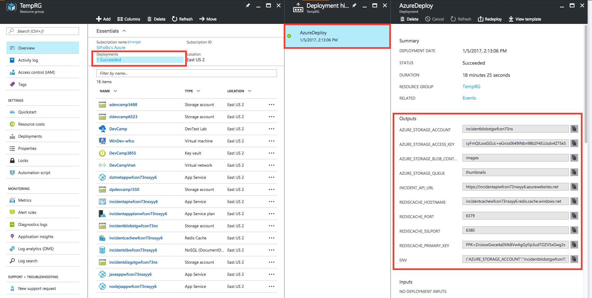
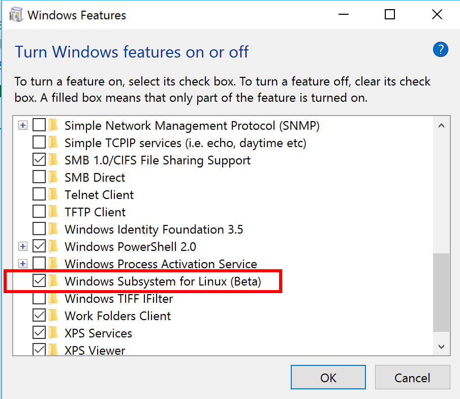
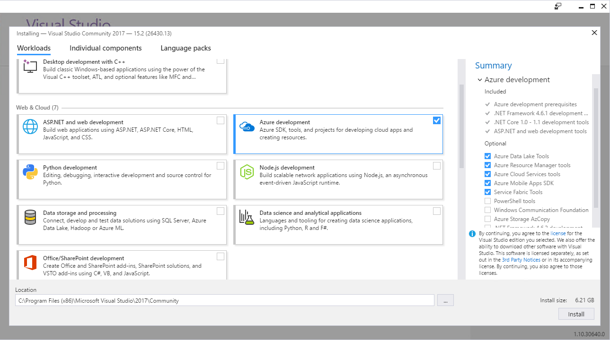
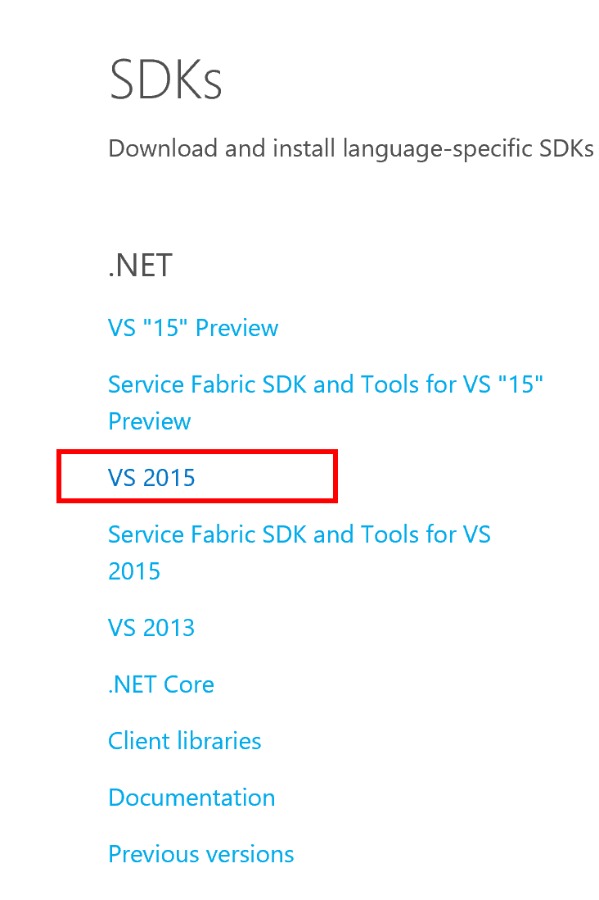
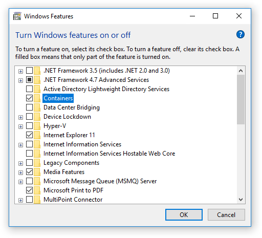

# DevCamp
These guide will help instructors when delivering this course. There are some speaker notes in each deck, but this will provide a broader view of how the course was put together.

The Developer bootcamp is a collection of lectures, content and hands on labs that is intended to provide developers with a jumpstart to Azure development. There is an emphasis on the Platform as a Services (PAAS) offerings in Azure but there are some IaaS related topics as well.

The concept of "1-app, 3 ways" was born from the idea that developers want to see the whole picture, not just pieces. In previous training courses, they are focused on individual modules and learning objectives. For this bootcamp, we took the approach of a single application and functionality is added over the 2 days (Develop, deploy, monitor, scale). We also realized that developers may want to see the same functionality developed in different languages, so they can compare and contrast approaches.

The application is very simple; a CRUD based form with as few moving parts as possible, all while being industry/vertical agnostic. The application can be re-imagined in several ways with minimal impact to the session content and HOLs.
* Education - A science fair idea board
* Manufacturing - Process improvement
* E-Commerce - Item review/feedback


## Getting prepared to deliver ##
* It is recommended that the instructor works through the Hands-On-Labs for all three languages before the session.  Each one will take 
approximately 3 hours, and will help you be ready to assist the attendees with any issues or language-specific questions.  The hands-on-labs are
all done in the cloud, so all that is required for this part of the preparation is a laptop or workstation that can run Remote Desktop and access the
Internet.

* Azure subscription: 
    To run the demos and perform the hands-on-labs, an Azure subscription is necessary.  You can sign up for a free trial (as the students do in the first lab), or you can use a paid subscription.  Keep in mind that all the resources deployed for the hands-on-labs consume approx $10 of resources per day, so you will want to shut down virtual machines, etc. when not in use.

    Install the DevCamp Resource Group template, and deploy one of the `end` applications to one of the App services. 

    The application depends on a series of Environment Variables to be set. As a jumpstart, the ARM Template's Outputs section provides individual variables and an all-up object with all variables related to the services that were provisioned.  Note that you may need to add variables specific to the labs, such as AzureAD information, in addition to the ARM Template related variables provided.

    

    ***CAUTION***
    Make sure you test the content in the region you are presenting in. Azure may have blocked certain services from the region if there are capacity issues. This restriction applies for MSDN, BizSpark Base, BizSpark+, and Free Trials. 
    The following regions may be used as alterantives when using free/trial accounts:
  
        ​- Europe North
        - APAC South East
        - Brazil South
        - China East
        - China North
        - Europe West
        - Germany Central
        - India Central
        - Japan East
        - Korea Central
        - Korea South
        - UK South
        - US Central
        - US East
        - US North Central
        - US South Central
        - US West 2
        - US West Central

    Set up monitoring in AppInsights, so there will be some monitoring data by the time you show this feature

    Create an OMS portal - you can set up a trial here: `https://www.microsoft.com/en-us/cloud-platform/operations-management-suite-trial`

* Workstation configuration: 
    You can either use your local laptop/workstation for development and demo tasks, or you can use a Virtual Machine in 
    Azure. These instructions will assume using the local laptop running Windows 10 Anniversary edition. This will allow 
    you to show bash on Windows.
    1. You will need PowerPoint installed to show the presentation slides. If you don't have PowerPoint, you can
    use the free PowerPoint viewer available here: `https://www.microsoft.com/en-us/download/details.aspx?id=13`

    1. Install `Windows Subsystem for Linux`, which supplies the bash command processor on windows.  
    Go to `control panel/software/Turn Windows Features on or off`, and select `Windows Subsystem for Linux`:

        

    1. Install Visual Studio community edition from here: `https://www.visualstudio.com/vs/`.  
	
		
	
    1. If you did not install the Azure SDK during the installation of Visual Studio community edition install the Azure SDK from here: `https://azure.microsoft.com/en-us/downloads/`

        

    1. Install Azure Storage Explorer from `http://storageexplorer.com`.  Connect it to your azure subscription so you can show Azure Blobs and queues.

    1. Prep Docker demo
        * On Windows
            * Make sure you have the Anniversary edition
            * Activate the containers feature in Windows
            * Download [Docker for Windows](https://docs.docker.com/docker-for-windows/) from the stable channel
			
		


---
## Module 0 - Introduction, roadmap and course overview ###
In this session, we will provide a brief history of Azure, a quick overview of the capabilities available and 
introduction to the 2-day interactive workshop.

[View PowerPoint](Presentation/Module00-Overview.pptx?raw=true)

**Goal:** This deck is marketing focused and is designed to provide a high-level overview of Azure. It is geared towards newcomers to the Microsoft cloud offerings.

**Demos:** 
* You can show the Azure portals
    * [US Azure](http://portal.azure.com)
    * [China (Mooncake) playbook](http://mncplaybook.azurewebsites.net/)
* Show the DevCamp application
* Show the trust centers 
    * [US Trust Center](https://www.trustcenter.com/)
    * [Trust Center Downloads](http://aka.ms/stp) **Must be a global admin**
    * [China Trust Center](https://www.trustcenter.cn/zh-cn/compliance/)

**Session prep tips:** 
* Review the latest Azure features.  Explain that there may be Azure changes since this content has been created.
* Ensure that you are familiar with the roadmap sites on [Azure.com](https://azure.microsoft.com/en-us/updates/) and [Microsoft.com](https://www.microsoft.com/en-us/server-cloud/roadmap/) 
* Create the DevCamp resource group and deploy one or more of the sample applications to it.

**Key takeaways:** 
* Ensure that the audience is prepared for 2 days of hands on development. If they are not developers, it may be difficult for them to understand the content 

**Common questions:**
* Will you be covering IaaS and/or Azure Stack? No.
* Will this cover competitive platforms? No.
* Will this cover how to program in (.NET, Java, Node)?  No.
* Will this have a tutorial on how to use my favorite IDE?  No.

**Watch out for:** Timing. This session is only 30 mins and is meant to level set the audience.

### HOL Proctoring ###
There is no HOL for this module

**Tasks to complete**
* nothing

**Exit criteria**
* none

**Possible issues**
* none


---

## Module 1 - Tools and Developer Environment Setup Overview ####
We will provide an overview of the developer tools available for developing on your platform, and set up the development resources for the DevCamp.

[View PowerPoint](Presentation/Module01-DevTools.pptx?raw=true)

**Goal:** Provides an overview into the different development approaches, introduction to the SDKs, tools and frameworks for cross platform development.

**Possible demos:** 
* Demo 1: Visual Studio and Azure
    1. show ARM template
    1. create a simple MVC application, show the Azure publishing wizard
    1. show cloud explorer
    1. show git integration

* Demo 2: Azure CLI (on Windows 10 Bash, but it is also available on Docker, Linux/OSX etc.)
    Start Azure CLI, here are some commands you can show
    ```CMD
    azure config mode ARM
    azure login
    azure location list
    azure group list
    azure group show DevCamp
    azure vm list
    azure vm start
    ```

**Session prep tips:** 
    Have visual studio ready with an ARM template and template MVC web app

**Key takeaways:**  
* There are lots of tools for making development in Azure easier.  Also, we don't force you to use our tools - you can use the technologies that you like.

**Common questions:** 
* Can I do development on my local machine?  Of course, we're just using an Azure based machine for convenience and consistency.  If you would like to install the development components on your machine, that is fine.

**Watch out for:** 
* Make sure all attendee development environments are set up


### HOL Proctoring ###
* Potential subscription setup issues - order of steps is important
* If there are problems, we can use the azure passes we've allocated
* If the attendee wants to use their own Azure subscription, that's ok but be aware of potential issues with O365 integration (they must be a Global Admin)

**Tasks to complete**
* Set up development environment

**Exit criteria**
* It can take up to 20 minutes or more to deploy the resource group for development.

**Possible issues**
* No cell phone and/or Credit card for verification - these are required for trial subscriptions.  If the attendee doesn't have them, let them use one of the Azure Passes.
* If trials have already been created using that phone or credit card, the process may fail.  If so, give them an azure pass. 
* If they have an existing subscription they'd like to use, that's fine but there may be issues with connectivity to O365.

**If you have an issue setting the Azure Pass or trial, but some students are working, have that user set up a new user(s) account. Make the test user accounts Global Admin. Also grant the user account access to Azure to the subscription.**

> The ARM Template may not deploy successfully in all regions due to a lack of CosmosDB or a VM Size deployed in that region. As of 5 Jan 2017 the following regions will fail: westindia. Please have attendees select one of the other Azure regions.

----
##  Module 2 - Modern Cloud Apps Overview ####
We will provide an overview of some common cloud technologies, patterns and Azure features (Polyglot, scalability, app insights, Redis, patterns, traffic manager, global scale, blob, CDNs) and introduce you to the sample application. It is written 3-ways (.NET, Node.js and Java) so you can pick your platform of choice.

[View PowerPoint](Presentation/Module02-ModernCloudApps.pptx?raw=true)

**Goal:** High level understanding of application architecture for Azure.

**Demos:** 
    There are no predefined demos in this section, but feel free to
1. Show off the structure of the `start` code 
1. Pull up the `end` code and explain it

**Session prep tips:**
    Run through the lab and understand the code

**Key takeaways:**  
* Design of modern cloud apps for scalability
* Integration with Azure APIs using libraries or REST calls

**Common questions:** 
* How does redis cache work?

**Watch out for:** 
* Environment variables need to be set up

### HOL Proctoring ###

**Tasks to complete**
* Load project into your IDE of choice

**Exit criteria**
* Integration of storage and cache into our application

**Possible issues**
* As always, if there is not enough time to create the lab, feel free to jump to `end`
* In the hands-on-labs you will be using Visual Studio Solutions. Please do not update the NuGet packages to the latest available, as we have not tested the labs with every potential combination of packages. 

---

##  Module 3 - Identity and Office365 APIs Overview ##
We will provide an overview of Azure AD, and discuss areas for integration with the Office 365 APIs.

[View PowerPoint](Presentation/Module03-Identity-0365Apis.pptxx?raw=true)

**Goal:** 
* Explain the process of authentication with Azure AD

**Demos:** 
* oauth sandbox - https://oauthplay.azurewebsites.net/ 
    show the steps of the authentication process
* graph explorer - https://graphexplorer2.azurewebsites.net/
    show usage of graphexplorer
    
**Session prep tips:**
* Make sure you have an ID that you can use for the demo
* Familiarize yourself with oauthplay
* Familiarize yourself with graphexplorer

**Key takeaways:**
* Authentication via AAD is easy to add to your application

**Common questions:**
* questions about the authentication dance. You should be familiar with this, because it's central to this module.

**Watch out for:** 
* Do not use the initial wizard in `apps.dev.microsoft.com` portal.  Cancel out of the wizard, and then add the application.
* When you register the application via `apps.dev.microsoft.com`, you cannot edit it within the Azure portal.  You need to 
stick with the `apps.dev.microsoft.com` portal for those tasks.

### HOL Proctoring ###

**Tasks to complete**
* Create application in the apps.dev.microsoft.com portal.
* Add AAD support to the application
* Retrive information from the graph API


**Exit criteria**
* Application is authenticated via Azure active directory, profile retrieval works, and sending email works.

**Possible issues**
* The java application does not have mail sending right now, due to it using the v1.6 api

----

## Module 4 - DevOps Overview ####
We will provide an overview of Visual Studio Team Services (VSTS), DevOps concepts, build tasks, release environments, integration with Azure and Git/GitHub and Azure to create a cross-platform build, integration and release pipelines.

[View PowerPoint](Presentation/Module04-DevOps.pptx?raw=true)

**Goal:** 
* Explain VSTS devops setup

**Demos:** 
1. Create new project in VSTS with git version con
1. Use link to open project in Visual Studio
1. Create C# MVC web app solution in Visual Studio
1. Commit & push
1. Show code in VSTS portal
1. Create build and publish steps
1. Show the application running in Azure
1. For extra credit: make a change to the application, commit & push, and show the change (a few minutes later) running in the portal.

**Session prep tips:**
* Create an Azure web app to deploy the application to in the demo

**Key takeaways:**  
* Using a continuous integration/deployment methodology can make your organization more efficient

**Common questions:** 
* Do I have to use VSTS?  No, you can use whatever CI tools that you like.  

**Watch out for:** 
* It's easy to make mistakes in the build pipelines
* Changes are being made to VSTS frequently, so you may see some differences with the documentation

### HOL Proctoring ###

**Tasks to complete**
* Create project/repo
* Push code to repo
* Create build and publish pipeline

**Exit criteria**
* Applications are running in Azure web apps

**Possible issues**
* Be aware that the portal might not be exactly the same as our screenshots - changes are made to VSTS (and Azure) on a regular basis
* Variables not set properly in the build/publish process
* Wrong publish steps used - make sure you are using the ARM one

---

## Module 5 - Infrastructure as code ####
Intro to Azure Resource manager and infrastructure as code.

[View PowerPoint](Presentation/Module05-ARM-IAC.pptx?raw=true)

**Goal:** 
* Describe how Azure infrastructure can be managed just like program code.

**Demos:** 
1. In Azure portal, show resource group, navigate to the template reverse engineering feature

1. Within Visual Studio:
    * Create a resource group template
    * Add a virtual machine
    * Show JSON syntax
    * Show how you can deploy the resource group template
    
1. Within Visual Studio, with template created above
    * Add DSC to the virtual machine 
    * Show DSC template
    * Uncomment the web server sample code
    * Run the template if you'd like

**Session prep tips:**
* Have Azure and Visual Studio resources handy.

**Key takeaways:**  
* Resource group templates as code
* Extensive capabilities of templates + DSC

**Common questions:** 
* What are capabilities of templates and DSC

**Watch out for:** 
* Syntax errors can trip you up 

### HOL Proctoring ###

**Tasks to complete**
* Create a RG template
* Deploy it to Azure

**Exit criteria**
* This lab is independent of the others.

**Possible issues**
* Syntax issues and debugging of such

---
## Module 6 - Monitoring ####
We will introduce you to the monitoring capabilities in Azure and show you how you can use them in your application.

[View PowerPoint](Presentation/Module06-Monitoring.pptxx?raw=true)

**Goal:** 
* show Azure application monitoring capabilities

**Demos:** 
* Azure Monitor
1. Open azure portal
1. Show metrics
1. Show audit logs
1. Show export to storage, event hubs, web hooks

* Application insights
1. Show app insights resource
1. Show .NET with live site capabilities
1. Show  web test

*OMS
1. Open OMS
1. Show dashboard
1. Add VM to OMS
1. Show the solution packs
1. Show the search experience


**Session prep tips:**
* Have your application running in Azure, and have AppInsights running.  Generate some traffic to your application 
* Keep in mind that it takes a bit of time for things to show up in the portal
* Create an OMS portal


**Key takeaways:**  
* Azure + Application Insights provides comprehensive monitoring and alerting for your application

**Common questions:** 
* Can I have custom logged items - yes, there is an API for doing that
* What is the load on traffic, my site, etc?  You wouldn't have to instrument every browser - we have features to control that

**Watch out for:** 
* Need to create everything ahead of time, to make the demo look nice.

### HOL Proctoring ###

**Tasks to complete**
* create AppInsights deployment
* add AppInsights tooling to your application
* run the application & see AppInsights
* create custom logged items
* create a web availability test 

**Exit criteria**
* Application is in Azure, and has monitoring and metrics

**Possible issues**
* It takes some time (~5 minutes) for the telemetry to show up in the portal, making it difficult to know if things are working properly.

---
## Module 7 - Docker ####
In this module, we will provide an overview of Docker and introduce you to the Azure capabilities available for developers.

[View PowerPoint](Presentation/Module07-Containers.pptx?raw=true)

**Goal:** 
* Introduce audience to Docker
* Show Docker tools and integration with Azure and Windows

**Demos:** 
* Pulling an image, running a container
* Docker tools for Windows (Use the beta tools to switch from Windows and Linux on Windows 10)
* Docker tools for Visual Studio-preview
* App migration with Windows containers 
* Creating a Docker file

### Docker snippets reference ###
Search Docker for Microsoft Images
```
docker search microsoft
```

Pull a Docker image from Docker Hub (Linux Containers)
```
docker pull nginx
```

Pull a Docker image from Docker Hub (Windows Containers)
>**Warning, these take long to pull**
```
docker pull microsoft/aspnet
```

Docker run a container interactive
```
docker run -it -p 8000:8000 nginx bash

root@CONTAINERID:/# dir
root@CONTAINERID:/# exit

```
Docker view running containers
```
docker ps
```
Docker attach to running container
```
docker attach nginx
```
Docker stop a running container
```
docker stop nginx
```

Docker file

```
# The `FROM` instruction specifies the base image. You are
# extending the `microsoft/aspnet` image.
 
FROM microsoft/aspnet
 
# Next, this Dockerfile creates a directory for your application
RUN mkdir C:\app
 
# configure the new site in IIS.
RUN powershell -NoProfile -Command \
    Import-module IISAdministration; \
    New-IISSite -Name "ASPNET" -PhysicalPath C:\app -BindingInformation "*:8000:"
 
# This instruction tells the container to listen on port 8000. 
EXPOSE 8000
 
# The final instruction copies the site you published earlier into the container.
ADD bin/PublishOutput /app
```

> Create 25 NGINX containers (CMD/POSH)

```
for i in {1..25}; do docker run -p 80 -d nginx; done
```

> Delete all containers (BASH)

```
docker rm -f `docker ps --no-trunc -aq`
```

**Session prep tips:**
* https://github.com/harbur/docker-workshop
* https://github.com/RainBirdAi/docker-workshop
* On Windows
    * make sure you have the Anniversary edition
    * Activate the containers feature in Windows
    * Download the beta tools [Windows](https://docs.docker.com/docker-for-windows/)
* On MacOSX
    * Download the beta tools [MacOSX](https://docs.docker.com/docker-for-mac/)

**Key takeaways:**  
* Ensure the audience understands the difference between containers and Hyper-V virtualization
* Understand the difference between Linux and Windows containers
* Understand the container life-cycle process

**Common questions:** 
* How do I manage large container farms?
    * Azure container service, Docker Swarm, Mesosphere-DCOS, Kubernetes 

**Watch out for:** 
* Time to pull images. Do this ahead of time
* If you are demoing on a laptop, make sure you have enough space and resources. An 8 GB machine may not perform well if you have a lot of open applications running.

### HOL Proctoring ###
N/A No lab for this session

---
## Module 8 - Azure features and APIs ####
We will provide a quick lap around the various APIs, features and services available for developers.

[View PowerPoint](Presentation/Module08-Azure Features.pptx?raw=true)

**Goal:** 
To introduce the audience to a subset of the developer Azure platform features

**Demos:** 
* Cognitive Services
* Bot framework

**Session prep tips:**

**Key takeaways:**  

**Common questions:** 

**Watch out for:**
* Since this is the last segment, folks may need to leave early
* Don't forget to ask for the evals to be completed

### HOL Proctoring ###

N/A No lab for this session